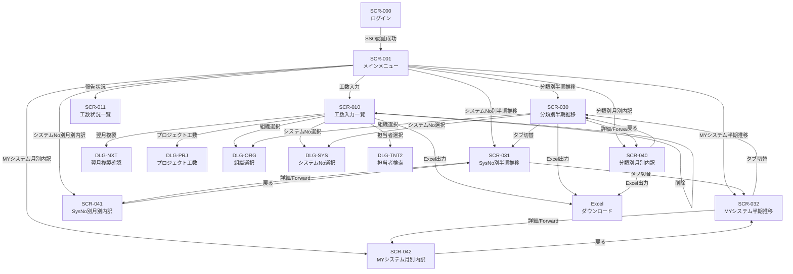

# CZシステム（保有資源管理システム）ソースコード分析レポート

> **分析対象:** irpmng_czConsv
> **現行技術スタック:** Java MPA / JSP / JavaScript(Ajax) / Oracle Database
> **移行先技術スタック:** SPA / PostgreSQL / AWS (ALB + ECS Fargate + RDS) / Okta (OIDC)

---

## 1. アクター定義

### 1.1 アプリケーションコンテキスト別アクター

| アクターID | アクター名 | デプロイパス | アプリID | システムタイトル | 説明 |
|-----------|-----------|-------------|---------|----------------|------|
| ACT-ENT | 人事担当者（Enterprise User） | `/czEnt/` | CZAPP002 | 保有資源報告登録システム | 保守工数の報告・登録を行う一般利用者 |
| ACT-MGR | 管理者（Manager） | `/czMgr/` | CZAPP001 | 保有資源管理システム | 報告の承認・集計・管理を行う管理者 |

### 1.2 組織階層別スタッフロール

| ロールコード | ロール名 | 組織レベル | 説明 |
|------------|---------|-----------|------|
| 931 | 全社スタッフ | 全社 | 全社横断の管理権限 |
| 932 | 事業スタッフ | 事業本部 | 事業本部レベルの管理権限 |
| 933 | 本社スタッフ | 本社 | 本社レベルの管理権限 |
| 934 | 局スタッフ | 局 | 局レベルの管理権限 |
| 935 | 局スタッフ（総務管理者） | 局 | 総務管理者としての局レベル権限 |
| 936 | 局スタッフ（営業） | 局 | 営業部門としての局レベル権限 |

### 1.3 雇用形態別ロール

| ロールコード | ロール名 | TYPE値 | 説明 |
|------------|---------|--------|------|
| - | 正社員 | 0 | 通常の正社員 |
| 900 | 臨時職員1 | 1 | 臨時職員カテゴリ1 |
| 901 | 臨時職員2 | 2 | 臨時職員カテゴリ2 |
| 902 | 外部契約者 | 3 | 外部委託先の契約者 |

### 1.4 機能別権限（ビットベース制御）

| 権限カテゴリ | ビット位置 | 権限名 | 説明 |
|------------|-----------|--------|------|
| TAB 010 | Bit 0 | 報告担当グループ | 報告入力・状況閲覧・集計閲覧 |
| TAB 010 | Bit 1 | 報告管理担当グループ | 報告入力・状況閲覧・集計締め |
| TAB 010 | Bit 2 | 報告・人事グループ | 報告入力のみ |
| TAB 011 | Bit 0 | 報告入力許可 | 報告の入力権限 |
| TAB 011 | Bit 1 | 状況閲覧・集計許可 | 報告状況の閲覧と集計の実行権限 |
| TAB 012 | Bit 0 | 集計データ入力 | 集計データの入力権限 |
| TAB 012 | Bit 1 | 集計サマリ | 集計のサマリ表示権限 |

### 1.5 データアクセス権限（相対権限モデル）

| コード | 権限名 | 組織レベル | 備考 |
|-------|--------|-----------|------|
| 201 | 相対権限（参照） | 階層制限付き | データ参照のみ |
| 202 | 相対権限（登録） | 階層制限付き | データ登録可能 |
| 211 | 相対権限（更新） | 階層制限付き | データ更新可能 |

**アクセス階層レベル:**

| レベル名 | コード値 | 組織 |
|---------|---------|------|
| RELATIVE_ZENSYA | 9999999 | 全社 |
| RELATIVE_EIGYOSHO | 127 | 営業所 |
| RELATIVE_HONBU | 63 | 本部 |
| RELATIVE_KYOKU | 31 | 局 |
| RELATIVE_SHITSU | 15 | 室 |
| RELATIVE_BU | 7 | 部 |
| RELATIVE_KA | 3 | 課 |

---

## 2. ユーザーストーリー

| ストーリーID | アクター | 目的 | 機能 | 対応画面 |
|-------------|---------|------|------|---------|
| US-001 | 人事担当者 | 保守作業の実績を記録する | 保守工数を入力・登録する | FORM_010（工数入力） |
| US-002 | 人事担当者 | 登録済みの工数を再利用する | 既存の工数レコードをコピーする | FORM_010（工数入力） |
| US-003 | 人事担当者 | 翌月も同様の作業を記録する | 工数データを翌月へ複製する | FORM_010（翌月複製ダイアログ） |
| US-004 | 人事担当者 | 誤った工数データを修正する | 工数レコードを削除する | FORM_010（工数入力） |
| US-005 | 人事担当者 | プロジェクト単位の工数を管理する | プロジェクト別工数を入力する | FORM_010（プロジェクト工数ダイアログ） |
| US-006 | 人事担当者 | 半期の工数推移を把握する | 分類別の半期推移を閲覧する | FORM_030（半期推移） |
| US-007 | 人事担当者 | よく使うシステムに素早くアクセスする | MYシステムに登録・解除する | FORM_030/031/032 |
| US-008 | 人事担当者 | 月別の請求内容を確認する | 月別内訳を閲覧する | FORM_040（月別内訳） |
| US-009 | 人事担当者 | システム管理No別に工数を確認する | システム管理No別の半期推移を閲覧する | FORM_031 |
| US-010 | 人事担当者 | MYシステムの工数を確認する | MYシステム別の半期推移を閲覧する | FORM_032 |
| US-011 | 人事担当者 | 工数データを報告書として出力する | Excel形式で帳票を出力する | FORM_030/040（Excel出力） |
| US-012 | 管理者 | 報告の進捗を把握する | 報告状況一覧を閲覧する | 状況一覧画面 |
| US-013 | 管理者 | 報告内容を承認する | 工数レコードのステータスを確認に変更する | 状況一覧画面 |
| US-014 | 管理者 | 月次の集計を確定する | ステータスを確定に変更し集計を締める | 状況一覧画面 |
| US-015 | 管理者 | 管理用の詳細帳票を出力する | 管理用月別内訳Excelを出力する | 管理者用出力画面 |
| US-016 | 管理者 | 月次処理の制御を行う | コントロールマスタを更新する | コントロール画面 |
| US-017 | 全アクター | 対象組織を選択する | 組織選択ダイアログで組織を検索・選択する | 組織選択ダイアログ |
| US-018 | 全アクター | 対象システムを選択する | システムNo選択ダイアログで検索・選択する | システムNo選択ダイアログ |
| US-019 | 全アクター | 担当者を選択する | 担当者選択ダイアログで検索・選択する | 担当者選択ダイアログ |

---

## 3. 画面一覧・遷移図

### 3.1 画面一覧

| 画面ID | 画面名称 | フォームキー | URL/パス | 種別 | 備考 |
|--------|---------|------------|----------|------|------|
| SCR-000 | ログイン | - | `/cfjsp/EsqLogin.jsp` | 認証 | SSO連携（現行） |
| SCR-001 | メインメニュー | - | `main_menu_panel.jsp` | メニュー | Enterprise/Manager共通 |
| SCR-010 | 工数入力一覧 | FORM_010 | `jsp/list/insert/` | 一覧/入力 | CRUDオペレーション |
| SCR-011 | 工数状況一覧 | FORM_011 | `jsp/list/insert_jokyo/` | 一覧 | ページネーション付き |
| SCR-030 | 分類別半期推移 | FORM_030 | `jsp/list/half_suii/` | 一覧/閲覧 | 管理者モード用 |
| SCR-031 | システム管理No別半期推移 | FORM_031 | `jsp/list/half_suii/` | 一覧/閲覧 | タブ切替 |
| SCR-032 | MYシステム別半期推移 | FORM_032 | `jsp/list/half_suii/` | 一覧/閲覧 | タブ切替 |
| SCR-040 | 分類別月別内訳 | FORM_040 | `jsp/list/month_utiwake/` | 一覧/閲覧 | FORM_030と対応 |
| SCR-041 | システム管理No別月別内訳 | FORM_041 | `jsp/list/month_utiwake/` | 一覧/閲覧 | FORM_031と対応 |
| SCR-042 | MYシステム別月別内訳 | FORM_042 | `jsp/list/month_utiwake/` | 一覧/閲覧 | FORM_032と対応 |
| DLG-SEC | セキュリティ（パスワード変更） | - | `jsp/init/dialogSecurity/` | ダイアログ | モーダル |
| DLG-TNT | 担当者選択 | - | `jsp/init/dialogSecureTanto/` | ダイアログ | 組織階層ツリー |
| DLG-ORG | 組織選択 | - | `jsp/dialog/org/` | ダイアログ | コード/名称検索 |
| DLG-ORG-M | 組織選択（複数） | - | `jsp/dialog/org_multi/` | ダイアログ | 複数選択 |
| DLG-SYS | システムNo選択 | - | `jsp/dialog/sysno/` | ダイアログ | 単一選択 |
| DLG-SYS-M | システムNo選択（複数） | - | `jsp/dialog/sysno_multi/` | ダイアログ | 複数選択 |
| DLG-TNT2 | 担当者検索 | - | `jsp/dialog/tnt/` | ダイアログ | Ajax検索 |
| DLG-PRJ | プロジェクト工数入力 | - | （モーダル） | ダイアログ | FORM_010から起動 |
| DLG-NXT | 翌月複製確認 | - | （モーダル） | ダイアログ | FORM_010から起動 |
| DLG-CNR | 同時編集通知 | - | `jsp/init/concurrent.jsp` | ダイアログ | 排他制御 |

### 3.2 画面遷移図



### 3.3 フレーム構造（現行）

```
ap_main_frame.jsp
├── ap_header.jsp (34px)       ← 戻る/ヘルプ/閉じるボタン
├── main_menu_frame.jsp (*)
│   ├── ap_history.jsp (28px)  ← ログインユーザー/履歴リンク
│   └── main_menu_panel.jsp(*) ← メニュー or 業務画面
├── ap_reload.jsp (0px)        ← セッション維持（hidden）
└── ap_dummy.jsp (0px)         ← ファイルDL/ダイアログ戻り先（hidden）
```

---

## 4. ワイヤーフレーム構成案

### 4.1 SCR-010: 工数入力一覧

**画面ID: SCR-010（工数入力一覧）**

| 項目種別 | 項目名 | HTML要素 | データ型 | 必須 | 備考 |
|---------|--------|---------|---------|------|------|
| 入力 | 対象年月 | SELECT | YYYYMM | Yes | 前月/翌月ボタン付き |
| 表示 | 工数一覧テーブル | TABLE | - | - | チェックボックス付きリスト |
| 表示 | 連番 | TD | CHAR(12) | - | 自動採番 |
| 表示 | 分類コード | TD | CHAR(2) | - | |
| 表示 | 保守作業者名 | TD | VARCHAR(40) | - | |
| 表示 | 作業日 | TD | YYYYMMDD | - | |
| 表示 | 対象システム名 | TD | VARCHAR | - | |
| 表示 | 保守カテゴリ | TD | CHAR(4) | - | |
| 表示 | 件名 | TD | VARCHAR(128) | - | |
| 表示 | 工数 | TD | NUMERIC(7,2) | - | 時間単位 |
| 表示 | ステータス | TD | CHAR(1) | - | 0:作成中 / 1:確認 / 2:確定 |
| 操作 | 追加 | BUTTON | - | - | MODE_INS |
| 操作 | コピー | BUTTON | - | - | MODE_RECYCLE（チェック行を複製） |
| 操作 | 翌月へ複製 | BUTTON | - | - | 確認ダイアログ表示 |
| 操作 | 削除 | BUTTON | - | - | MODE_DEL（チェック行を削除） |
| 操作 | プロジェクト工数 | BUTTON | - | - | モーダルダイアログ |
| 操作 | Excel出力 | BUTTON | - | - | 確認後ダウンロード |

### 4.2 SCR-030: 分類別半期推移

**画面ID: SCR-030（分類別半期推移）**

| 項目種別 | 項目名 | HTML要素 | データ型 | 必須 | 備考 |
|---------|--------|---------|---------|------|------|
| 入力 | 検索条件エリア | FORM | - | - | 136px固定高 |
| 入力 | 対象組織 | TEXT+BUTTON | - | Yes | 組織選択ダイアログ起動 |
| 入力 | 対象期間 | SELECT | YYYYX | Yes | 半期指定 |
| 表示 | タブ | DIV | - | - | 分類別/SysNo別/MYシステム タブ切替 |
| 表示 | サブタイトル | DIV | - | - | 現在の選択条件表示 |
| 表示 | 左側固定列（チェックボックス） | TABLE | - | - | 行選択用 |
| 表示 | 左側固定列（分類名等） | TABLE | - | - | 横スクロール固定 |
| 表示 | 右側スクロール列（月別データ） | TABLE | NUMERIC | - | 横スクロール対応 |
| 表示 | 合計行 | TABLE | NUMERIC | - | 右側下部固定 |
| 操作 | 全選択 | BUTTON | - | - | 全行チェック |
| 操作 | 選択解除 | BUTTON | - | - | 全行チェック解除 |
| 操作 | 表示/非表示 | BUTTON | - | - | 選択行の表示切替 |
| 操作 | システム/サブシステム切替 | BUTTON | - | - | 表示粒度切替 |
| 操作 | 工数/コスト切替 | BUTTON | - | - | 表示値切替 |
| 操作 | MYシステム登録/解除 | IMAGE | - | - | 行ごとのトグル |

### 4.3 SCR-040: 月別内訳

**画面ID: SCR-040（分類別月別内訳）**

| 項目種別 | 項目名 | HTML要素 | データ型 | 必須 | 備考 |
|---------|--------|---------|---------|------|------|
| 入力 | 検索条件エリア | FORM | - | - | SCR-030と同一構造 |
| 表示 | タブ | DIV | - | - | SCR-030と同様のタブ |
| 表示 | 月別内訳テーブル | TABLE | - | - | 左固定+右スクロール構造 |
| 表示 | 合計行 | TABLE | NUMERIC | - | 下部固定 |
| 操作 | ソート | LINK | - | - | 列ヘッダークリック |
| 操作 | 戻る（半期推移へ） | LINK | - | - | FORM_030へ遷移 |

### 4.4 DLG-ORG: 組織選択ダイアログ

**画面ID: DLG-ORG（組織選択ダイアログ）**

| 項目種別 | 項目名 | HTML要素 | データ型 | 必須 | 備考 |
|---------|--------|---------|---------|------|------|
| 入力 | タブ切替（組織コード/組織名） | TAB | - | - | 2タブ |
| 入力 | 組織階層コンボ（本部/局/室/部/課） | SELECT×4 | - | - | カスケード連動 |
| 入力 | 組織名カナ | TEXT | VARCHAR(20) | - | カナ検索用 |
| 表示 | 検索結果リスト | TABLE | - | - | ラジオボタン選択 |
| 操作 | 検索 | BUTTON | - | - | |
| 操作 | OK | BUTTON | - | - | 選択確定 |
| 操作 | キャンセル | BUTTON | - | - | ダイアログ閉じ |
| 操作 | リセット | BUTTON | - | - | 条件クリア |

### 4.5 DLG-TNT2: 担当者検索ダイアログ

**画面ID: DLG-TNT2（担当者検索ダイアログ）**

| 項目種別 | 項目名 | HTML要素 | データ型 | 必須 | 備考 |
|---------|--------|---------|---------|------|------|
| 入力 | タブ切替（ツリー/リスト） | TAB | - | - | |
| 入力 | 組織ツリー | TREE | - | - | Ajax展開 |
| 入力 | 担当者名検索 | TEXT | - | - | |
| 表示 | 担当者リスト | TABLE | - | - | |
| 操作 | 検索 | BUTTON | - | - | Ajax通信 |
| 操作 | OK | BUTTON | - | - | 選択確定（Ajax） |
| 操作 | キャンセル | BUTTON | - | - | |

---

## 5. データベーステーブル一覧

### 5.1 トランザクションテーブル

| テーブル名 | 日本語名 | 主キー | 説明 |
|-----------|---------|--------|------|
| TCZ01HOSYUKOUSUU | 保守工数 | SEQNO + SKBTCD | メイン業務テーブル。保守作業の工数データ |
| TCZ13SUBSYSSUMTBL | サブシステム集計 | - | バッチ集計結果の格納テーブル |
| TCZ14GRPKEYTBL | グループキー | - | グルーピング集計テーブル |
| TCZ19MYSYSTBL | MYシステム | TNTESQID + SKNNO | ユーザーのお気に入りシステム |

### 5.2 マスタテーブル

| テーブル名 | 日本語名 | 主キー | 説明 |
|-----------|---------|--------|------|
| MCZ02HOSYUKATEGORIMST | 保守カテゴリマスタ | HSKATEGORI + YUKOUKAISHIKI + YUKOUSYURYOKI | 保守区分の定義。有効期間付き |
| MCZ04CTRLMST | コントロールマスタ | SYSID + YYYYMM | 月次処理制御（オンラインフラグ等） |
| TBMAV01_SKNNO | システム管理Noマスタ | SKNNO | システムの基本情報 |
| TBMCZ24_TANKAMST | 単価マスタ | - | 工数の単価情報 |
| TBMCZ21_KANRITAISYO | 管理対象マスタ | - | 管理対象の定義 |
| TBMCZ15_TSSYSNOMST | 対象システムNoマスタ | - | 対象システムの定義 |
| TBMAV03_SUBSYSTEMNO | サブシステムNoマスタ | - | サブシステムの定義 |

### 5.3 主要テーブル TCZ01HOSYUKOUSUU カラム定義

| カラム名 | 論理名 | データ型 | PK | 説明 |
|---------|--------|---------|----|----|
| TCZ01_SEQNO | 連番 | CHAR(12) | PK | 自動採番 |
| TCZ01_SKBTCD | 識別コード | CHAR(2) | PK | '01'=ISID |
| TCZ01_HSSGYTNTESQID | 保守作業担当者ESQID | CHAR(6) | - | 作業者の社員ID |
| TCZ01_HSSGYTNTNAME | 保守作業担当者名 | VARCHAR(40) | - | |
| TCZ01_YEARHALF | 年度半期 | CHAR(5) | - | YYYYX (X=0:上期/1:下期) |
| TCZ01_SGYYMD | 作業年月日 | CHAR(8) | - | YYYYMMDD |
| TCZ01_SYSKBN | システム区分 | CHAR(1) | - | |
| TCZ01_TAISYOSKNNO | 対象システム管理No | CHAR(8) | - | FK→TBMAV01 |
| TCZ01_TAISYOSUBSYSNO | 対象サブシステムNo | CHAR(8) | - | FK→TBMAV03 |
| TCZ01_CAUSESYSNO | 原因システムNo | CHAR(8) | - | |
| TCZ01_CAUSESUBSYSNO | 原因サブシステムNo | CHAR(8) | - | |
| TCZ01_KENMEI | 件名 | VARCHAR(128) | - | |
| TCZ01_HSKATEGORI | 保守カテゴリ | CHAR(4) | - | FK→MCZ02 |
| TCZ01_HSSYUBETU | 保守種別 | CHAR(1) | - | 0/2 |
| TCZ01_HSUNYOUKUBUN | 保守運用区分 | CHAR(1) | - | |
| TCZ01_STATUS | ステータス | CHAR(1) | - | 0:作成中/1:確認/2:確定 |
| TCZ01_KOUSUU | 工数 | NUMERIC(7,2) | - | 時間単位 |
| TCZ01_INITNT | 作成者 | CHAR(6) | - | 監査列 |
| TCZ01_INIDATE | 作成日 | DATE | - | 監査列 |
| TCZ01_UPDTNT | 更新者 | CHAR(6) | - | 監査列 |
| TCZ01_UPDDATE | 更新日 | DATE | - | 監査列 |
| TCZ01_DELFLG | 削除フラグ | CHAR(1) | - | 論理削除 |

### 5.4 データフロー図

```
[画面入力] → Controller(Command) → Delegate → Manager → DAO → [DB]

具体的フロー:
  JSP Form Submit
    → ApServlet (Front Controller)
      → Unit (画面制御)
        → Delegate.findXXX() / storeData()
          → CommandInvoker.execute(XXXCmd)
            → XXXManager.getInstance()
              → XXXDao.findByCondition() / storeData()
                → Oracle DB (TCZ01, MCZ02, MCZ04...)

バッチフロー:
  [SQL Scripts] → Oracle Stored Procedures
    → TCZ01HOSYUKOUSUU (読込)
    → TCZ13SUBSYSSUMTBL (集計書込)
    → TCZ14GRPKEYTBL (グルーピング書込)
    → MCZ04CTRLMST (制御フラグ更新)
```

---

## 6. 新旧差異一覧（Gap Analysis）

### 6.1 アーキテクチャ変更

| 差異ID | 区分 | 現行仕様 | 新仕様 | 変更理由 | 影響範囲 |
|--------|------|---------|--------|---------|---------|
| GAP-A01 | 変更 | Java MPA (JSP + Servlet) | SPA (フロントエンドフレームワーク) | モダンUI/UX、開発効率向上 | 全画面 |
| GAP-A02 | 変更 | フレームセット（FRAMESET）によるレイアウト | SPAコンポーネントベースのレイアウト | FRAMESET廃止、モダンブラウザ対応 | 全画面 |
| GAP-A03 | 変更 | Oracle Database | PostgreSQL | コスト削減、AWS RDS対応 | 全SQL、全DAO |
| GAP-A04 | 変更 | SSO (SsoCertificateProc) | ALB + Okta (OIDC連携) | 認証基盤のモダン化 | 認証フロー全体 |
| GAP-A05 | 変更 | WebLogic + Tomcat | AWS ECS (Fargate) + ALB | クラウドネイティブ化 | デプロイ・インフラ |
| GAP-A06 | 変更 | Windows-31J (Shift-JIS) | UTF-8 | 文字コード標準化 | 全データ入出力 |
| GAP-A07 | 変更 | Command/Delegate/Manager/DAOパターン | REST API + Service + Repository パターン | フレームワーク標準化 | バックエンド全体 |
| GAP-A08 | 追加 | （なし） | Docker + .devcontainer 開発環境 | DX向上 | 開発環境 |
| GAP-A09 | 追加 | （なし） | 認証モック（開発環境用） | 開発効率向上 | 開発環境の認証 |
| GAP-A10 | 追加 | （なし） | CI/CD パイプライン（Production + Staging 2系統） | デプロイ自動化 | ビルド・デプロイ |

### 6.2 画面・UX変更

| 差異ID | 区分 | 現行仕様 | 新仕様 | 変更理由 | 影響範囲 |
|--------|------|---------|--------|---------|---------|
| GAP-U01 | 削除 | フレーム間スクロール同期（JavaScript） | SPAコンポーネントのネイティブスクロール | フレーム廃止、CSS Grid/Flexbox活用 | SCR-030/040 |
| GAP-U02 | 削除 | ap_reload.jsp（セッション維持用hidden frame） | SPA側のトークンリフレッシュ | SPA化により不要 | 全画面 |
| GAP-U03 | 削除 | ap_dummy.jsp（ファイルDL/ダイアログ戻り用hidden frame） | Fetch API + Blob ダウンロード | SPA化により不要 | Excel出力・ダイアログ |
| GAP-U04 | 変更 | window.open() によるモーダルダイアログ | SPAモーダルコンポーネント | UX向上（ページ遷移なし） | 全ダイアログ |
| GAP-U05 | 変更 | ページ全体リロードによるデータ更新 | API呼び出し + 部分レンダリング | SPA化によるUX向上 | 全データ更新操作 |
| GAP-U06 | 提案 | ブラウザ戻るボタン非対応（フレーム構造） | SPAルーティングによるブラウザ履歴対応 | UX向上 | 全画面遷移 |
| GAP-U07 | 提案 | カナ検索のみ（組織名検索） | インクリメンタルサーチ（かな/漢字/ローマ字） | UX向上 | DLG-ORG, DLG-TNT2 |
| GAP-U08 | 提案 | （なし） | レスポンシブデザイン対応 | タブレット等からのアクセス | 全画面 |
| GAP-U09 | 提案 | GIF画像によるMYシステムトグル | アイコンボタンによるトグル | UI近代化 | SCR-030/031/032 |

### 6.3 データ・ロジック変更

| 差異ID | 区分 | 現行仕様 | 新仕様 | 変更理由 | 影響範囲 |
|--------|------|---------|--------|---------|---------|
| GAP-D01 | 変更 | Oracle固有SQL（ORA-xxxxx エラー処理） | PostgreSQL準拠SQL | DB移行 | 全DAO/SQL |
| GAP-D02 | 変更 | CHAR型固定長カラム（パディング付き） | VARCHAR型可変長カラム | PostgreSQL最適化 | 全テーブル設計 |
| GAP-D03 | 変更 | 論理削除（DELFLG） | 論理削除を維持（ビジネス要件） | 既存踏襲 | 全テーブル |
| GAP-D04 | 変更 | SaibanMst（採番マスタ）による連番生成 | PostgreSQL SEQUENCE / SERIAL | DB標準機能活用 | TCZ01_SEQNO |
| GAP-D05 | 変更 | YYYYX形式の半期表現 | DATE型 + 半期区分カラム | データ型の正規化 | 半期関連カラム |
| GAP-D06 | 変更 | YYYYMMDD文字列の日付 | DATE型 | データ型の正規化 | 日付関連カラム |
| GAP-D07 | 変更 | POI 3.0 RC4 (2007年版) によるExcel生成 | 最新のExcelライブラリ | セキュリティ・機能更新 | Excel出力全体 |
| GAP-D08 | 変更 | JMS (WebLogic) によるパラメータリフレッシュ | イベント駆動またはポーリング | WebLogic依存排除 | パラメータ管理 |
| GAP-D09 | 変更 | DataDirect Oracle JDBC ドライバ | PostgreSQL JDBC ドライバ | DB移行 | DB接続設定 |
| GAP-D10 | 維持 | ステータス管理（0:作成中→1:確認→2:確定） | 同一ワークフロー維持 | 既存踏襲（ビジネスロジック） | ステータス管理 |
| GAP-D11 | 維持 | ビットベース機能権限制御 | 同等のRBAC実装 | 既存踏襲（セキュリティ要件） | 権限制御 |
| GAP-D12 | 維持 | 組織階層（全社→本部→局→室→部→課）の相対権限 | 同等の階層権限実装 | 既存踏襲（セキュリティ要件） | データアクセス制御 |

### 6.4 バッチ処理変更

| 差異ID | 区分 | 現行仕様 | 新仕様 | 変更理由 | 影響範囲 |
|--------|------|---------|--------|---------|---------|
| GAP-B01 | 変更 | Oracle PL/SQL バッチ（13 SQLファイル） | PostgreSQL関数 or アプリケーション層バッチ | DB移行 | 全バッチ処理 |
| GAP-B02 | 変更 | オンライン/オフライン切替（MCZ04CTRLMST） | 同等の制御をアプリケーション層で実装 | 既存踏襲 | 月次処理制御 |
| GAP-B03 | 提案 | バッチ実行によるサブシステム集計 | リアルタイム集計 or キャッシュ+バッチ | SPA化によるリアルタイム性向上 | 集計処理 |

---

## 7. 技術統計

| 項目 | 現行値 |
|------|-------|
| Java ファイル数 | 569 |
| JSP ファイル数 | 139 |
| JavaScript ファイル数 | 12 (284KB) |
| XML 設定ファイル数 | 36 |
| SQL ファイル数 | 13 (174KB) |
| JAR ライブラリ数 | 21 (14.1MB) |
| Java パッケージ数 | 173 |
| DB テーブル（トランザクション） | 4+ |
| DB テーブル（マスタ） | 7+ |
| DB ビュー | 2+ |
