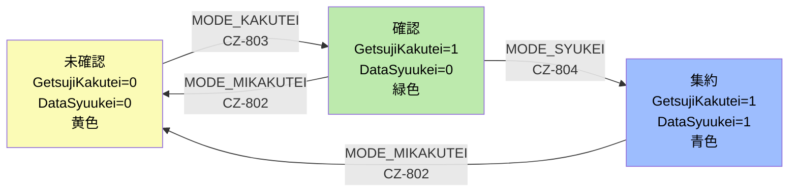

# ユーザーストーリー・ビジネスルール定義書 - CZシステム（保有資源管理システム）

> **ソースコードから復元したユーザーストーリーと業務ルールの完全版**
> 分析対象: irpmng_czConsv
> 分析根拠: JSP / Java (Proc/JspBean/Delegate/DAO) / JavaScript (ApCheck.js) / XML (ApParameter.xml, ApMessage.xml)

---

## 目次

1. [ユーザーストーリー一覧（機能別）](#1-ユーザーストーリー一覧機能別)
   - 1.1 [工数入力（FORM_010）](#11-工数入力form_010)
   - 1.2 [工数状況一覧（FORM_020）](#12-工数状況一覧form_020)
   - 1.3 [半期推移（FORM_030-032）](#13-半期推移form_030-032)
   - 1.4 [月別内訳（FORM_040-042）](#14-月別内訳form_040-042)
   - 1.5 [共通機能](#15-共通機能)
2. [ビジネスルール一覧](#2-ビジネスルール一覧)
   - 2.1 [時間・工数制約](#21-時間工数制約)
   - 2.2 [ステータス制御マトリクス](#22-ステータス制御マトリクス)
   - 2.3 [バリデーションルール](#23-バリデーションルール)
   - 2.4 [年度・期間ルール](#24-年度期間ルール)
   - 2.5 [禁止ワード・文字制約](#25-禁止ワード文字制約)
3. [エラーメッセージカタログ](#3-エラーメッセージカタログ)
4. [新旧差異一覧（Gap Analysis）](#4-新旧差異一覧gap-analysis)

---

## 1. ユーザーストーリー一覧（機能別）

### 凡例

- **アクターID**: `02_actor_definition.md` のアクター定義に準拠
- **形式**: 「[アクター]として、[業務目的]のために、[操作]をして、[結果]を得る」
- **根拠**: ソースコードのファイルパス・行番号

---

### 1.1 工数入力（FORM_010）

> **画面概要**: 保守担当者が日々の保守工数を入力・管理する画面。Ajaxインライン編集方式。
> **主要ソース**: `InsertListJspBean.java`, `InsertListMaintenanceProc.java`, `InsertListAjaxSetProc.java`, `InsertListSearchProc.java`, `insert_list_body.jsp`

#### US-010: 工数レコードの新規登録

| 項目 | 内容 |
|------|------|
| **ストーリーID** | US-010 |
| **アクター** | ACT-01（報告担当者）/ ACT-05（人事モードユーザー） |
| **ストーリー** | **報告担当者**として、**日々の保守作業実績を記録する**ために、**工数入力画面で新規行を追加（MODE_INS）し、対象サブシステム・原因サブシステム・保守カテゴリ・作業日・工数・件名を入力**して、**保守工数レコードがSTATUS_0（作成中）として登録される**結果を得る |
| **前提条件** | ステータス制御テーブル（MCZ04CTRLMST）が存在し、追加操作が許可されていること（`isSts_tan_ins_btn = 1`） |
| **入力項目** | 作業日(YYYY/MM/DD)、対象サブシステム（ダイアログ選択）、原因サブシステム（ダイアログ選択）、保守カテゴリ（ドロップダウン）、件名（128文字以内）、工数（HH:MM形式、15分単位）、TMR番号（5文字）、作業依頼書No（7文字固定）、作業依頼者名（40文字） |
| **根拠** | `InsertListMaintenanceProc.java` MODE_INS処理、`InsertListAjaxSetProc.java` isInputCheck() |

#### US-011: Ajaxインライン編集

| 項目 | 内容 |
|------|------|
| **ストーリーID** | US-011 |
| **アクター** | ACT-01（報告担当者） |
| **ストーリー** | **報告担当者**として、**入力効率を高める**ために、**一覧上のセルを直接クリックして値を変更（TdMaskオーバーレイ表示）**し、**Ajax非同期通信でサーバーに即時保存される**結果を得る |
| **制約** | STATUS_0（作成中）のレコードのみ編集可能。STATUS_1/2のレコードはセルクリック不可（className='input_cell_off'）。ただしステータス項目自体はいつでも変更可能 |
| **Ajax項目** | P_S_01_STATUS, P_D_01_SGYYMD, P_S_01_HSKATEGORI, P_S_01_KENMEI, P_S_01_KOUSUU, P_S_01_TMRNO, P_S_01_SGYIRAISYONO, P_S_01_SGYIRAISYAESQID |
| **根拠** | `InsertListAjaxSetProc.java` 全Ajax処理、`insert_list_body.jsp` TdMask制御 |

#### US-012: レコードのコピー

| 項目 | 内容 |
|------|------|
| **ストーリーID** | US-012 |
| **アクター** | ACT-01（報告担当者） |
| **ストーリー** | **報告担当者**として、**類似作業の入力を効率化する**ために、**既存レコードをチェックボックスで選択しコピー（MODE_RECYCLE）**して、**同一内容のレコードがSTATUS_0で新規作成される**結果を得る |
| **コピー内容** | 全フィールド値を保持。STATUS→STATUS_0にリセット、SEQNO→新規採番、登録者・更新者→現在のユーザーに設定 |
| **制約** | `isSts_tan_cpy_btn`/`isSts_man_cpy_btn` が1のステータス組み合わせでのみボタン表示 |
| **根拠** | `InsertListMaintenanceProc.java` MODE_RECYCLE処理 |

#### US-013: 翌月以降への転写

| 項目 | 内容 |
|------|------|
| **ストーリーID** | US-013 |
| **アクター** | ACT-01（報告担当者） |
| **ストーリー** | **報告担当者**として、**定常作業を翌月以降にまとめて登録する**ために、**レコードを選択し「翌月以降へ転写」ダイアログ（MODE_NEXT_MON_COPY, 320x200px）で対象月を指定**して、**指定した将来月にレコードが一括コピーされる**結果を得る |
| **特記** | カテゴリが対象年度に存在しない場合はカテゴリ項目がブランクになる（エラーではなく空白化） |
| **根拠** | `InsertListMaintenanceProc.java` MODE_NEXT_MON_COPY処理、`InsertNextMonthUnit` |

#### US-014: レコードの削除

| 項目 | 内容 |
|------|------|
| **ストーリーID** | US-014 |
| **アクター** | ACT-01（報告担当者） |
| **ストーリー** | **報告担当者**として、**誤って登録したレコードを取り消す**ために、**チェックボックスで対象レコードを選択し削除（MODE_DEL）を実行**して、**確認ダイアログ（CZ-506）承諾後にレコードが削除される**結果を得る |
| **制約** | `isSts_tan_del_btn = 1` のステータスでのみ可能。STATUS_2（確定）は担当者系列では削除不可 |
| **根拠** | `InsertListMaintenanceProc.java` MODE_DEL処理 |

#### US-015: 一括確認（ステータス一括変更）

| 項目 | 内容 |
|------|------|
| **ストーリーID** | US-015 |
| **アクター** | ACT-01（報告担当者） |
| **ストーリー** | **報告担当者**として、**月次の工数報告を完了させる**ために、**「一括確認」ボタン（MODE_IKKATSU_KAKUTEI）を押下**して、**全てのSTATUS_0レコードがSTATUS_1（確認）に一括変更される**結果を得る |
| **前提条件** | `ApParameter.isIkkatsuKakutei() = true` の場合のみボタン表示 |
| **バリデーション** | 各レコードに対しisInputCheck()を実行。最初のバリデーションエラーで処理中断し、該当行にスクロール＆フォーカス |
| **確認ダイアログ** | CZ-505:「作成中の状態を全て確認に変更します。よろしいですか？」 |
| **根拠** | `InsertListMaintenanceProc.java` MODE_IKKATSU_KAKUTEI処理 |

#### US-016: 一括作成中戻し

| 項目 | 内容 |
|------|------|
| **ストーリーID** | US-016 |
| **アクター** | ACT-01（報告担当者） |
| **ストーリー** | **報告担当者**として、**確認済みレコードを再編集する**ために、**「一括作成中」ボタン（MODE_IKKATSU_SAKUSEITYUU）を押下**して、**全てのSTATUS_1レコードがSTATUS_0（作成中）に一括戻される**結果を得る |
| **確認ダイアログ** | CZ-518:「確認の状態を全て作成中に変更します。よろしいですか？」 |
| **根拠** | `InsertListMaintenanceProc.java` MODE_IKKATSU_SAKUSEITYUU処理 |

#### US-017: 月の切り替えとナビゲーション

| 項目 | 内容 |
|------|------|
| **ストーリーID** | US-017 |
| **アクター** | ACT-01（報告担当者） |
| **ストーリー** | **報告担当者**として、**過去・未来月の工数を確認・入力する**ために、**月コンボボックスまたは<</>ボタンで対象月を切り替え（MODE_DATECHG）**して、**指定月のレコード一覧が表示される**結果を得る |
| **範囲** | 現在月から±12ヶ月（設定可能）。年度が変わるとカテゴリリストが更新される |
| **根拠** | `InsertListSearchProc.java` MODE_DATECHG処理 |

#### US-018: サブシステム選択ダイアログ

| 項目 | 内容 |
|------|------|
| **ストーリーID** | US-018 |
| **アクター** | ACT-01（報告担当者） |
| **ストーリー** | **報告担当者**として、**正確なサブシステムを指定する**ために、**対象/原因サブシステム名セルをクリックしてダイアログ（SysnoSearchInitUnit）を開き、検索・選択**して、**選択結果がセルに反映される**結果を得る |
| **ダイアログ仕様** | V_TYPE_010_02（対象）/ V_TYPE_010_03（原因）の2モード。VAL_SYS_KBN_1の場合は「◆」マーカー表示 |
| **根拠** | `insert_list_body.jsp` sCommit()関数、`SysnoSearchInitUnit` |

#### US-019: プロジェクト別工数参照

| 項目 | 内容 |
|------|------|
| **ストーリーID** | US-019 |
| **アクター** | ACT-01（報告担当者） |
| **ストーリー** | **報告担当者**として、**プロジェクト単位の工数配分を確認する**ために、**「プロジェクト別工数」ボタンを押下**して、**500x500pxのダイアログ（InsertProjectKousuuUnit）でプロジェクト別の工数内訳が参照できる**結果を得る |
| **制約** | 参照のみ（読み取り専用） |
| **根拠** | `insert_list_head_top.jsp` excelOut()周辺 |

#### US-01A: Excel出力

| 項目 | 内容 |
|------|------|
| **ストーリーID** | US-01A |
| **アクター** | ACT-01（報告担当者） |
| **ストーリー** | **報告担当者**として、**工数実績を外部資料として保存する**ために、**「Excel出力」ボタンを押下し確認ダイアログ（CZ-516）を承諾**して、**現在表示中のレコードがExcelファイルとしてダウンロードされる**結果を得る |
| **根拠** | `InsertListDetailOutputUnit`、`insert_list_head_top.jsp` excelOut() |

#### US-01B: ソート操作

| 項目 | 内容 |
|------|------|
| **ストーリーID** | US-01B |
| **アクター** | ACT-01（報告担当者） |
| **ストーリー** | **報告担当者**として、**データを見やすく整理する**ために、**列ヘッダーをクリックして昇順/降順ソート**して、**指定列基準でレコードが並び替えられる**結果を得る |
| **ソート対象列** | ステータス、作業日、保守担当所属、保守担当者名、対象サブシステムNo、対象サブシステム名、原因サブシステムNo、原因サブシステム名、保守カテゴリ、件名、工数、TMR番号、作業依頼書No、作業依頼者名（計14列） |
| **デフォルト** | 作業日昇順 → ステータス順 |
| **根拠** | `InsertListSortProc.java` |

#### US-01C: 代行入力

| 項目 | 内容 |
|------|------|
| **ストーリーID** | US-01C |
| **アクター** | ACT-02（報告管理者）/ ACT-03（全権管理者） |
| **ストーリー** | **報告管理者**として、**部下の代わりに工数を入力する**ために、**代行モード（MODE_DAIKO_SELECT）で対象者を選択**して、**選択した担当者の工数入力画面に切り替わる**結果を得る |
| **特記** | 外部契約者（ACT-09）の代行時は、登録者IDに特殊処理が適用される |
| **根拠** | `InsertListSearchProc.java` MODE_DAIKO_SELECT処理 |

#### US-01D: 管理者による全ステータス操作

| 項目 | 内容 |
|------|------|
| **ストーリーID** | US-01D |
| **アクター** | ACT-04（管理モードユーザー）/ ACT-03（全権管理者） |
| **ストーリー** | **管理モードユーザー**として、**部下の報告内容を管理する**ために、**管理者系列（man）のボタン権限でレコードの閲覧・編集・コピー・削除・ステータス変更を行い**、**担当者系列よりも広い権限でデータを操作できる**結果を得る |
| **権限差異** | 管理者系列はSTATUS_2でも編集・コピー可能（担当者系列は不可）。sts_man_upd_btn は全ステータスで有効 |
| **根拠** | `InsertListJspBean.java` 担当者/管理者系列の分岐、ApParameter sts_man_* / sts_tan_* |

---

### 1.2 工数状況一覧（FORM_020）

> **画面概要**: 月次の工数報告ステータスを一覧表示し、月次確認・集約処理を行う管理画面。
> **主要ソース**: `InsertJokyoListJspBean.java`, `InsertJokyoListMaintenanceProc.java`, `InsertJokyoListAjaxSetProc.java`, `insert_jokyo_list_head_top.jsp`, `insert_jokyo_list_body_l.jsp`

#### US-020: 月次ステータスの一覧表示

| 項目 | 内容 |
|------|------|
| **ストーリーID** | US-020 |
| **アクター** | ACT-04（管理モードユーザー） |
| **ストーリー** | **管理モードユーザー**として、**配下の担当者の工数報告状況を把握する**ために、**工数状況一覧画面を開き、月・組織で絞り込み検索**して、**各担当者のステータス（作成中/確認/確定）がカラーコード付きで一覧表示される**結果を得る |
| **カラーコード** | STATUS_0: #FBFBB6（黄）、STATUS_1: #BDEAAD（緑）、STATUS_2: #9DBDFE（青）、無効: #5D5D5D（灰） |
| **デフォルト表示** | STATUS_1（確認）とSTATUS_2（確定）のみ表示。STATUS_0（作成中）はチェックボックスで追加可能 |
| **根拠** | `InsertJokyoListSearchProc.java`、`InsertJokyoListJspBean.java` outMonthStatusBtn() |

#### US-021: 月次未確認（未確認に戻す）

| 項目 | 内容 |
|------|------|
| **ストーリーID** | US-021 |
| **アクター** | ACT-04（管理モードユーザー） |
| **ストーリー** | **管理モードユーザー**として、**確認済みの月次データを再編集可能にする**ために、**「未確認」ボタン（MODE_MIKAKUTEI, 黄色#FBFBB6）を押下し確認ダイアログ（CZ-802）を承諾**して、**MCZ04CTRLMSTのGetsujiKakuteiFlg=0, DataSyuukeiFlg=0に更新され、データ編集が再開可能になる**結果を得る |
| **ボタン表示条件** | `canUseSbt012_0bit() = true` または両ビット未設定 |
| **根拠** | `InsertJokyoListMaintenanceProc.java` MODE_MIKAKUTEI処理、`InsertJokyoListJspBean.java:184-217` |

#### US-022: 月次確認

| 項目 | 内容 |
|------|------|
| **ストーリーID** | US-022 |
| **アクター** | ACT-04（管理モードユーザー）/ ACT-05（人事モードユーザー） |
| **ストーリー** | **管理モードユーザー**として、**月次工数データの入力完了を確定する**ために、**「確認」ボタン（MODE_KAKUTEI, 緑色#BDEAAD）を押下し確認ダイアログ（CZ-803）を承諾**して、**MCZ04CTRLMSTのGetsujiKakuteiFlg=1, DataSyuukeiFlg=0に更新され、STATUS_0のレコード編集がロックされる**結果を得る |
| **ボタン表示条件** | `canUseSbt012_0bit() = true` の場合のみ表示 |
| **根拠** | `InsertJokyoListMaintenanceProc.java` MODE_KAKUTEI処理 |

#### US-023: 月次集約

| 項目 | 内容 |
|------|------|
| **ストーリーID** | US-023 |
| **アクター** | ACT-04（管理モードユーザー） |
| **ストーリー** | **管理モードユーザー**として、**月次データを集計対象としてマークする**ために、**「集約」ボタン（MODE_SYUKEI, 青色#9DBDFE）を押下し確認ダイアログ（CZ-804）を承諾**して、**MCZ04CTRLMSTのGetsujiKakuteiFlg=1, DataSyuukeiFlg=1に更新され、半期推移・月別内訳への集計対象となる**結果を得る |
| **ボタン表示条件** | `canUseSbt012_1bit() = true` の場合のみ表示 |
| **根拠** | `InsertJokyoListMaintenanceProc.java` MODE_SYUKEI処理 |

#### US-024: レコード単位の承認

| 項目 | 内容 |
|------|------|
| **ストーリーID** | US-024 |
| **アクター** | ACT-02（報告管理者）/ ACT-04（管理モードユーザー） |
| **ストーリー** | **報告管理者**として、**個別レコードの内容を承認する**ために、**チェックボックスで対象レコードを選択し「承認」（MODE_SYONIN）を実行し確認ダイアログ（CZ-508）を承諾**して、**選択レコードのSTATUSがSTATUS_1→STATUS_2に変更される**結果を得る |
| **根拠** | `InsertJokyoListMaintenanceProc.java` MODE_SYONIN処理 |

#### US-025: 承認の取り消し（戻す）

| 項目 | 内容 |
|------|------|
| **ストーリーID** | US-025 |
| **アクター** | ACT-02（報告管理者）/ ACT-04（管理モードユーザー） |
| **ストーリー** | **報告管理者**として、**承認済みレコードを再確認状態に戻す**ために、**チェックボックスで対象レコードを選択し「戻す」（MODE_MODOSI）を実行し確認ダイアログ（CZ-507）を承諾**して、**選択レコードのSTATUSがSTATUS_2→STATUS_1に変更される**結果を得る |
| **根拠** | `InsertJokyoListMaintenanceProc.java` MODE_MODOSI処理 |

#### US-026: インライン工数編集（Ajax）

| 項目 | 内容 |
|------|------|
| **ストーリーID** | US-026 |
| **アクター** | ACT-04（管理モードユーザー） |
| **ストーリー** | **管理モードユーザー**として、**一覧上から直接工数値を修正する**ために、**工数セルをクリックしてインライン編集（TdMask表示）し値を入力**して、**Ajax通信（P_S_01_KOUSUU）で即時保存される**結果を得る |
| **入力バリデーション** | 空値→"00:00"に自動変換、HH:MM/HH形式受付、15分単位、最大24:00 |
| **編集可否** | `isSts_man_j_upd()` が true の場合のみ編集可能 |
| **根拠** | `InsertJokyoListAjaxSetProc.java`、`insert_jokyo_list_body_l.jsp:163-251` |

#### US-027: ページネーション

| 項目 | 内容 |
|------|------|
| **ストーリーID** | US-027 |
| **アクター** | ACT-04（管理モードユーザー） |
| **ストーリー** | **管理モードユーザー**として、**大量のレコードを効率的に閲覧する**ために、**ページ送り（<<ページ / ページ>> / 最初 / 最後 / ページ番号指定）**して、**指定ページのレコードが表示される**結果を得る |
| **ページサイズ** | `ApParameter.getJissekiPageCount()` で設定 |
| **根拠** | `InsertJokyoListPageProc.java` V_PAGE_NEXT/PREV/FAST/LAST/SET |

---

### 1.3 半期推移（FORM_030-032）

> **画面概要**: 半期（6ヶ月）の工数推移を分類別→システム別→サブシステム別の3階層で閲覧する分析画面。
> **主要ソース**: `HalfSuiiJspBean.java`, `HalfSuiiSelectCond.java`, `HalfSuiiFirstStepProc.java`, `HalfSuiiSearchProc.java`, `HalfSuiiDoMyProc.java`, `HalfSuiiOutputCmd.java`, `half_main.jsp`

#### US-030: 分類別集計の閲覧（STEP_0）

| 項目 | 内容 |
|------|------|
| **ストーリーID** | US-030 |
| **アクター** | ACT-02（報告管理者）/ ACT-04（管理モードユーザー）/ ACT-10〜15（スタッフ） |
| **ストーリー** | **報告管理者**として、**半期の保守工数全体像を把握する**ために、**半期推移画面（FORM_030）で年度・半期を選択し分類1/分類2レベルの集計**を閲覧して、**分類別の月別工数推移が表形式で表示される**結果を得る |
| **左フレーム幅** | 分類2選択時: `160px × 2 + 3`、分類1のみ: `160px + 2` |
| **根拠** | `HalfSuiiFirstStepProc.java`、`HalfSuiiJspBean.java` getLeftFrameSize() |

#### US-031: システム別ドリルダウン（STEP_1）

| 項目 | 内容 |
|------|------|
| **ストーリーID** | US-031 |
| **アクター** | ACT-02（報告管理者）/ ACT-04（管理モードユーザー） |
| **ストーリー** | **報告管理者**として、**特定分類の内訳を調べる**ために、**分類行をクリックしてシステム別画面（FORM_031）にドリルダウン（goDetail()）**して、**選択分類に属するシステム別の月別推移が表示される**結果を得る |
| **表示項目** | MYシステム星マーク、システムNo、システム名、月別データ（M1-M6）、合計 |
| **根拠** | `half_main.jsp` goDetail()、`HalfSuiiSysSubSysProc.java` |

#### US-032: サブシステム別ドリルダウン（STEP_2）

| 項目 | 内容 |
|------|------|
| **ストーリーID** | US-032 |
| **アクター** | ACT-02（報告管理者）/ ACT-04（管理モードユーザー） |
| **ストーリー** | **報告管理者**として、**特定システムの詳細内訳を調べる**ために、**システム行をクリックしてサブシステム別画面（FORM_032）にドリルダウン**して、**選択システムに属するサブシステム別の月別推移が表示される**結果を得る |
| **表示項目** | MYシステム星マーク、システムNo+名、サブシステムNo+名、月別データ |
| **根拠** | `half_main.jsp` goSysSubSys()、`HalfSuiiSysSubSysSearchProc.java` |

#### US-033: MYシステム登録/解除

| 項目 | 内容 |
|------|------|
| **ストーリーID** | US-033 |
| **アクター** | ACT-01〜05（全ユーザー） |
| **ストーリー** | **ユーザー**として、**よく参照するシステムに素早くアクセスする**ために、**システム行の星マーク（MYアイコン）をクリックしてMYシステムの登録（INSERT）/解除（DELETE）を切り替え**て、**MySysDelegate経由でDB登録/削除され、ラジオボタン「MY」選択時にフィルタリング対象となる**結果を得る |
| **ラジオフラグ** | FLAG_0=全部表示、FLAG_1=指定システム、FLAG_2=MYシステムのみ |
| **根拠** | `HalfSuiiDoMyProc.java` INSERT/DELETE処理、`half_main.jsp` myChg() |

#### US-034: 半期推移のExcel出力

| 項目 | 内容 |
|------|------|
| **ストーリーID** | US-034 |
| **アクター** | ACT-02（報告管理者）/ ACT-04（管理モードユーザー） |
| **ストーリー** | **報告管理者**として、**半期データを報告書として出力する**ために、**「Excel出力」ボタンを押下**して、**テンプレート（tmp_HalfSuii.xls）に基づくExcelファイルがダウンロードされる**結果を得る |
| **出力内容** | タイトル（年度・半期・フィルタ条件）、左列（分類/システム/サブシステム名）、右ヘッダー（月名）、合計行、データ行。印刷ヘッダー繰り返し設定あり |
| **根拠** | `HalfSuiiOutputCmd.java`、`HalfSuiiExcelReportCreator.java` |

#### US-035: 半期推移のソート

| 項目 | 内容 |
|------|------|
| **ストーリーID** | US-035 |
| **アクター** | ACT-02（報告管理者） |
| **ストーリー** | **報告管理者**として、**データを比較しやすく並び替える**ために、**列ヘッダーをクリックして昇順/降順ソート**して、**選択列基準で行が並び替えられる**結果を得る |
| **ソートキー** | BUNRUI1, BUNRUI2, SYS_NO, SYS_NAME, SUB_SYS_NO, SUB_SYS_NAME, BR_SORTNO |
| **根拠** | `HalfSuiiSortProc.java`、`HalfSuiiConst.java` |

#### US-036: 分類別画面への戻り

| 項目 | 内容 |
|------|------|
| **ストーリーID** | US-036 |
| **アクター** | ACT-02（報告管理者） |
| **ストーリー** | **報告管理者**として、**上位階層に戻って全体像を確認する**ために、**「分類別表示」ボタン（goStepFirst()）を押下**して、**STEP_0（分類別集計画面）に戻り、検索条件が保持された状態で表示される**結果を得る |
| **根拠** | `half_main.jsp` goStepFirst() |

---

### 1.4 月別内訳（FORM_040-042）

> **画面概要**: 特定月の工数内訳を分類別→システム別→サブシステム別の3階層で閲覧する分析画面。半期推移とタブ切り替えで連携。
> **主要ソース**: `MonthUtiwakeJspBean.java`, `MonthUtiwakeSelectCond.java`, `MonthUtiwakeDoMyProc.java`, `MonthUtiwakeOutputCmd.java`, `month_main.jsp`

#### US-040: 月別内訳の分類別閲覧（STEP_0）

| 項目 | 内容 |
|------|------|
| **ストーリーID** | US-040 |
| **アクター** | ACT-02（報告管理者）/ ACT-04（管理モードユーザー） |
| **ストーリー** | **報告管理者**として、**特定月の保守カテゴリ別工数を把握する**ために、**月別内訳画面（FORM_040）で年度・半期・月を選択し分類別集計**を閲覧して、**保守種別×運用区分のカテゴリ別工数が表示される**結果を得る |
| **根拠** | `MonthUtiwakeFirstStepProc.java`、`month_main.jsp` |

#### US-041: 月別内訳のシステム別ドリルダウン

| 項目 | 内容 |
|------|------|
| **ストーリーID** | US-041 |
| **アクター** | ACT-02（報告管理者） |
| **ストーリー** | **報告管理者**として、**特定分類の月別詳細を調べる**ために、**分類行をクリックしてシステム別画面（FORM_041）にドリルダウン**して、**選択分類に属するシステム別の月別内訳が表示される**結果を得る |
| **根拠** | `month_main.jsp` goDetail() |

#### US-042: 月別内訳のサブシステム別ドリルダウン

| 項目 | 内容 |
|------|------|
| **ストーリーID** | US-042 |
| **アクター** | ACT-02（報告管理者） |
| **ストーリー** | **報告管理者**として、**特定システムの月別明細を調べる**ために、**システム行をクリックしてサブシステム別画面（FORM_042）にドリルダウン**して、**選択システムに属するサブシステム別の月別内訳が表示される**結果を得る |
| **根拠** | `month_main.jsp` goSysSubSys() |

#### US-043: 月別内訳のExcel出力（4種類）

| 項目 | 内容 |
|------|------|
| **ストーリーID** | US-043 |
| **アクター** | ACT-02（報告管理者）/ ACT-04（管理モードユーザー） |
| **ストーリー** | **報告管理者**として、**月別データを報告・分析資料として出力する**ために、**「Excel出力」ボタンを押下**して、**目的に応じた4種類のテンプレートのいずれかでExcelファイルがダウンロードされる**結果を得る |
| **テンプレート一覧** | ①`tmp_MonthUtiwake.xls`（月別内訳標準）、②`tmp_Kanri_MonthUtiwake.xls`（管理用月別）、③`tmp_KanriDetail_MonthUtiwake.xls`（管理用月別詳細）、④`tmp_HalfSuii.xls`（半期推移） |
| **根拠** | `MonthUtiwakeOutputCmd.java`、`MonthUtiwakeDetailOutputCmd.java`、`MonthUtiwakeKanriDetailOutputCmd.java` |

#### US-044: 半期推移↔月別内訳のタブ切り替え

| 項目 | 内容 |
|------|------|
| **ストーリーID** | US-044 |
| **アクター** | ACT-02（報告管理者） |
| **ストーリー** | **報告管理者**として、**同じ検索条件で異なる切り口のデータを閲覧する**ために、**タブ（half_tab.jsp / month_tab.jsp）をクリックして半期推移⇔月別内訳を切り替え**て、**ドリルダウン階層が維持されたまま（FORM_030⇔040, 031⇔041, 032⇔042）、検索条件がセッションから復元され表示が切り替わる**結果を得る |
| **条件保持** | セッション上の `HalfSuiiSelectCond` / `MonthUtiwakeSelectCond` に検索状態を保存。タブ遷移時にApMenuControlUnitが `P_CURRENT_FORM_KEY` / `P_NEXT_FORM_KEY` を使って遷移先フォームを決定 |
| **根拠** | `half_frame.jsp` MonthUtiwakeTransition()、`month_frame.jsp` HalfSuiiTransition() |

#### US-045: MYシステム登録/解除（月別内訳）

| 項目 | 内容 |
|------|------|
| **ストーリーID** | US-045 |
| **アクター** | ACT-01〜05（全ユーザー） |
| **ストーリー** | **ユーザー**として、**月別内訳でもMYシステムフィルタを使う**ために、**US-033と同様に星マークでMYシステムの登録/解除**して、**半期推移と共有のMYシステムリストが更新される**結果を得る |
| **根拠** | `MonthUtiwakeDoMyProc.java` INSERT/DELETE処理 |

---

### 1.5 共通機能

#### US-050: SSO認証ログイン

| 項目 | 内容 |
|------|------|
| **ストーリーID** | US-050 |
| **アクター** | 全アクター |
| **ストーリー** | **ユーザー**として、**システムにアクセスする**ために、**SSOログイン（SsoCertificateProc → InitSecurityRoleProc → LoginProc → AccessLogProc）を経由**して、**セキュリティロール情報がセッションに設定され、メインメニューが表示される**結果を得る |
| **認証フロー** | web.xml: UseSsoModule=true → SsoLoginUserCond → SsoCertificateProc → SecurityRoleInfo設定 |
| **根拠** | `web.xml:57-75`、`InitSecurityRoleProc.java`、`LoginProc.java` |

#### US-051: サービス時間外制御

| 項目 | 内容 |
|------|------|
| **ストーリーID** | US-051 |
| **アクター** | 全アクター |
| **ストーリー** | **ユーザー**として、**サービス提供時間外にアクセスした場合**、**CZ-102エラーメッセージ「サービス提供時間は6:00から23:30まで」が表示され**、**操作がブロックされる**結果となる |
| **根拠** | `ApMessage.xml` CZ-102 |

#### US-052: 緊急停止制御

| 項目 | 内容 |
|------|------|
| **ストーリーID** | US-052 |
| **アクター** | 全アクター |
| **ストーリー** | **ユーザー**として、**システムが緊急停止中の場合**、**statusStop.jspで停止メッセージ（CZ-104/CZ-105）が表示され**、**全操作がブロックされる**結果となる |
| **モード分岐** | 人事モード: CZ-104（保有登録・管理システム停止中）、管理モード: CZ-105（保有業・管理システム停止中） |
| **根拠** | `statusStop.jsp`、`ApMessage.xml` CZ-104/CZ-105 |

#### US-053: 同時編集検知

| 項目 | 内容 |
|------|------|
| **ストーリーID** | US-053 |
| **アクター** | 全アクター |
| **ストーリー** | **ユーザー**として、**他ユーザーが同時に同じデータを編集した場合**、**CZ-101エラーメッセージ「別ユーザーにより更新が行われたため操作不可」が表示され**、**データの不整合が防止される**結果となる |
| **検知方式** | concurrent.jsp でJinjiMode分岐付きの同時編集通知を表示 |
| **根拠** | `concurrent.jsp`、`ApMessage.xml` CZ-101 |

#### US-054: メインメニュー（FORM_000）

| 項目 | 内容 |
|------|------|
| **ストーリーID** | US-054 |
| **アクター** | 全アクター |
| **ストーリー** | **ユーザー**として、**各機能にアクセスする**ために、**メインメニュー画面でFRAMESETベースのナビゲーション（左：メニュー、右：コンテンツ）を使い**、**権限に応じたメニュー項目から各画面に遷移できる**結果を得る |
| **フレーム構成** | ap_main_frame.jsp: FRAMESET[左メニュー(main_menu_frame.jsp) + 右コンテンツ]。JinjiModeでメニュー構成が切り替わる |
| **根拠** | `ap_main_frame.jsp`、`main_menu_frame.jsp` |

---

## 2. ビジネスルール一覧

### 2.1 時間・工数制約

| ルールID | ルール名 | 制約内容 | エラーコード | 根拠 |
|---------|---------|---------|-------------|------|
| BR-001 | サービス提供時間 | 6:00〜23:30のみ操作可能 | CZ-102 | ApMessage.xml |
| BR-002 | 工数入力単位 | 15分単位（00/15/30/45分）のみ | CZ-147 | ApCheck.js, InsertListAjaxSetProc |
| BR-003 | 日次上限 | 1日の合計工数は24時間（1440分）以下 | CZ-146 | InsertListAjaxSetProc isInputCheck() |
| BR-004 | 月次基準工数 | 160時間/人月 | - | ApParameter costHours_value=160 |
| BR-005 | 日次基準工数 | 8時間/人日 | - | ApParameter hourPersonDay_value=8 |
| BR-006 | 工数入力形式 | HH:MM形式（HHのみ入力時は自動でHH:00に変換） | CZ-125 | insert_jokyo_list_body_l.jsp:190-242 |
| BR-007 | 工数最小値 | 0:15（15分）以上 | CZ-129 | InsertListAjaxSetProc |

### 2.2 ステータス制御マトリクス

#### 2.2.1 ステータス値の定義

| ステータス | 値 | 表示名 | カラーコード | 意味 |
|-----------|---|--------|-------------|------|
| STATUS_0 | "0" | 作成中 | #FBFBB6（黄） | 編集可能状態 |
| STATUS_1 | "1" | 確認 | #BDEAAD（緑） | 確認済み・編集ロック |
| STATUS_2 | "2" | 確定 | #9DBDFE（青） | 最終確定・管理者のみ操作可 |
| STATUS_9 | "9" | - | #5D5D5D（灰） | 非表示/緊急停止 |

#### 2.2.2 12状態ステータスマトリクス

`ApParameter.xml` の `sts_base_key` による12状態の組み合わせ:

```
sts_base_key:    000, 010, 011, 100, 110, 111, 200, 210, 211, 900, 910, 911
sts_data_status:  0,   0,   0,   1,   1,   1,   2,   2,   2,   9,   9,   9
sts_inset_limit:  0,   1,   1,   0,   1,   1,   0,   1,   1,   0,   1,   1
sts_data_sum:     0,   0,   1,   0,   0,   1,   0,   0,   1,   0,   0,   1
```

意味: `[データステータス][月次確認フラグ][データ集約フラグ]`

#### 2.2.3 担当者系列（tan）ボタン制御

| 操作 | 000 | 010 | 011 | 100 | 110 | 111 | 200 | 210 | 211 | 900 | 910 | 911 |
|------|-----|-----|-----|-----|-----|-----|-----|-----|-----|-----|-----|-----|
| 追加(ins) | **9** | **9** | **9** | **9** | **9** | **9** | **9** | **9** | **9** | 1 | 0 | 0 |
| コピー(cpy) | 1 | 0 | 0 | 1 | 0 | 0 | 1 | 0 | 0 | **9** | **9** | **9** |
| 削除(del) | 1 | 0 | 0 | 1 | 0 | 0 | 0 | 0 | 0 | **9** | **9** | **9** |
| 編集(upd) | 1 | 0 | 0 | 1 | 0 | 0 | **9** | **9** | **9** | **9** | **9** | **9** |
| 閲覧(view) | 1 | 1 | 1 | 1 | 1 | 1 | 1 | 1 | 1 | **9** | **9** | **9** |

> **凡例**: 0=無効(グレー), 1=有効, **9**=非表示

#### 2.2.4 管理者系列（man）ボタン制御

| 操作 | 000 | 010 | 011 | 100 | 110 | 111 | 200 | 210 | 211 | 900 | 910 | 911 |
|------|-----|-----|-----|-----|-----|-----|-----|-----|-----|-----|-----|-----|
| 追加(ins) | **9** | **9** | **9** | **9** | **9** | **9** | **9** | **9** | **9** | 1 | 1 | 1 |
| コピー(cpy) | 1 | 1 | 1 | 1 | 1 | 1 | 1 | 1 | 1 | **9** | **9** | **9** |
| 削除(del) | 1 | 1 | 1 | 1 | 1 | 1 | 0 | 0 | 0 | **9** | **9** | **9** |
| 編集(upd) | 1 | 1 | 1 | 1 | 1 | 1 | 1 | 1 | 1 | **9** | **9** | **9** |
| 閲覧(view) | 1 | 1 | 1 | 1 | 1 | 1 | 1 | 1 | 1 | **9** | **9** | **9** |
| ステータス変更(j_upd) | 0 | 0 | 0 | 1 | 1 | 1 | 1 | 1 | 1 | **9** | **9** | **9** |
| ステータス閲覧(j_view) | 1 | 1 | 1 | 1 | 1 | 1 | 1 | 1 | 1 | **9** | **9** | **9** |

> **担当者 vs 管理者の主な差異**: 管理者は月次確認/集約済み状態でもコピー・編集が可能。担当者はSTATUS_2で編集不可。

#### 2.2.5 月次制御フラグの遷移



### 2.3 バリデーションルール

#### 2.3.1 工数入力画面（FORM_010）の必須チェック

> STATUS_0以外に変更する際に実行（`isInputCheck()`）

| ルールID | 対象項目 | 制約 | エラーコード |
|---------|---------|------|-------------|
| VR-001 | 作業日 | 必須。YYYY/MM/DD形式 | CZ-126 |
| VR-002 | 作業日 | 選択月の範囲内であること | CZ-144 |
| VR-003 | 対象サブシステム | 必須。ダイアログから選択 | CZ-126 |
| VR-004 | 原因サブシステム | 必須。ダイアログから選択 | CZ-126 |
| VR-005 | 保守カテゴリ | 必須。ドロップダウンから選択 | CZ-126 |
| VR-006 | 件名 | 必須。128文字（バイト長）以内 | CZ-126 |
| VR-007 | 件名 | 禁止ワードを含まないこと（HOSYU_SYUBETU_0の場合） | CZ-141 |
| VR-008 | 工数 | 必須。0より大きいこと | CZ-126 |
| VR-009 | 工数 | HH:MM形式。15分単位 | CZ-125, CZ-147 |
| VR-010 | 工数 | 日次合計24時間以下（STATUS_0以外の合計） | CZ-146 |
| VR-011 | TMR番号 | 5文字以内。半角英数字 | chkChara 10111 |
| VR-012 | 作業依頼書No | 空 or 7文字固定（1〜6文字はエラー） | CZ-137 |
| VR-013 | 作業依頼者名 | 40文字以内。全角可 | chkChara 00000 |
| VR-014 | 作業依頼関連 | 特定カテゴリ（`getSagyoiraiInputChkNumber()`）の場合、依頼書Noと依頼者名の両方必須 | CZ-142 |
| VR-015 | カテゴリ重複 | 同一サブシステム＋同一件名で異なるカテゴリは不可 | CZ-132 |

#### 2.3.2 文字種バリデーション（chkChara 5桁モード）

`ApCheck.js` の `chkChara(obj, required, leng, mode, name)` で使用される5桁モードパターン:

```
mode[0]: 半角英字     (0=許可, 1=禁止)
mode[1]: 半角数字     (0=許可, 1=禁止)
mode[2]: 半角カタカナ  (0=許可, 1=禁止)
mode[3]: 特殊文字     (0=引用符&<>制限, 1=全記号許可, 2=特殊文字禁止)
mode[4]: 全角文字     (0=許可, 1=禁止)
```

| 適用場面 | モード | 説明 |
|---------|--------|------|
| TMR番号 | 10111 | 半角数字のみ |
| 作業依頼書No | 10111 | 半角数字のみ |
| 件名 | 00000 | 制限なし（引用符制限あり） |
| 作業依頼者名 | 00000 | 制限なし（IMEオン） |
| 工数 | chkChara6 | 時間専用バリデーション |

#### 2.3.3 バイト長計算ルール

| 文字種 | バイト数 |
|--------|---------|
| 全角文字 | 2バイト |
| 半角文字 | 1バイト |
| 半角カタカナ | 2バイト（特殊） |
| MAC改行コード(0x000d) | 2バイト |

### 2.4 年度・期間ルール

#### 2.4.1 年度半期の定義

| 適用期間 | 上期（FIRST_HALF） | 下期（SECOND_HALF） |
|---------|-------------------|-------------------|
| **2014年度以前** | 4月〜9月（旧来の日本会計年度） | 10月〜3月 |
| **2015年度（移行年度）** | 4月〜9月 | 10月〜12月（**3ヶ月のみ**） |
| **2016年度以降** | 1月〜6月（暦年ベース） | 7月〜12月 |

> **根拠**: `HalfSuiiUtility.selectTntHalfMstStdDate()`、`month_search_condition.jsp` setMonthItem()

#### 2.4.2 年度半期基準日

| 適用期間 | 上期基準日 | 下期基準日 |
|---------|-----------|-----------|
| 2014年度以前 | YYYY/09/30 | (YYYY+1)/03/31 |
| 2015年度 | 2015/09/30 | 2016/03/31 |
| 2016年度以降 | パラメータ設定値/年 | パラメータ設定値/(年+1) |

#### 2.4.3 年度半期月選択の生成ルール

```
2015年度以前:
  上期 → ["04","05","06","07","08","09"]  (6ヶ月)
  下期 → ["10","11","12","01","02","03"]  (6ヶ月, 暦年跨ぎ)

2015年度（特殊）:
  上期 → ["04","05","06","07","08","09"]  (6ヶ月)
  下期 → ["10","11","12"]                 (3ヶ月のみ)

2016年度以降:
  上期 → ["01","02","03","04","05","06"]  (6ヶ月)
  下期 → ["07","08","09","10","11","12"]  (6ヶ月)
```

### 2.5 禁止ワード・文字制約

#### 2.5.1 件名禁止ワード

`ApParameter.getInputChkKenmeiNgWord()` で定義（HOSYU_SYUBETU_0の場合のみ適用）:

| 禁止ワード |
|-----------|
| カ層 |
| @機能別1 |
| 連絡器 |
| （相談 |
| （課程 |
| ・限定 |
| ・共存作成 |
| 取得 |
| 賃金 |
| 導入 |
| 経理 |
| 実績演算 |

> **エラー**: CZ-141 「{禁止ワード}は業務概要としても定義されているため、記述できません」

#### 2.5.2 件名改行処理

件名入力時の改行コード（`\r\n`, `\n`）は自動除去。表示時は30文字ごとに`<BR>`タグで折り返し。

---

## 3. エラーメッセージカタログ

### 3.1 操作成功メッセージ（CZ-000〜099）

| コード | メッセージ | 用途 |
|--------|-----------|------|
| CZ-000 | 成功完了 | 汎用成功 |
| CZ-001 | 登録終了 | データ登録成功 |
| CZ-002 | 登録済み | 既登録通知 |
| CZ-003 | 保有済み | 既保有通知 |

### 3.2 警告メッセージ（CZ-100〜299）

| コード | メッセージ | 発生条件 |
|--------|-----------|---------|
| CZ-100 | 当地にデータが登録されています | 重複登録警告 |
| CZ-101 | 別ユーザーにより更新が行われたため操作不可 | 同時編集競合 |
| CZ-102 | サービス提供時間外（6:00〜23:30） | 時間外アクセス |
| CZ-103 | 確認・承認変更が生じています | 他者操作中 |
| CZ-104 | 保有登録・管理システムは緊急停止中 | 人事モード緊急停止 |
| CZ-105 | 保有業・管理システムは緊急停止中 | 管理モード緊急停止 |
| CZ-106 | ステータス不正のため追加・更新不可 | ステータス違反 |
| CZ-107 | ステータス不正のため削除不可 | ステータス違反 |
| CZ-108 | ステータス不正のためコピー不可 | ステータス違反 |
| CZ-109 | ステータス不正のため確認不可 | ステータス違反 |
| CZ-110 | ステータス不正のため戻す不可 | ステータス違反 |
| CZ-120 | {0}は範囲外 | 値域チェック |
| CZ-121 | {0}のマイナス値は不可 | 負値チェック |
| CZ-122 | {0}は整数値のみ入力可 | 整数チェック |
| CZ-125 | {0}はHH:MM形式で入力 | 時間形式チェック |
| CZ-126 | {0}は必須項目 | 必須チェック |
| CZ-127 | {0}は数値で入力 | 数値チェック |
| CZ-128 | {0}を超える入力あり | 上限チェック |
| CZ-130 | {0}を超えています | 限度チェック |
| CZ-132 | 確認・承認状態相違で異カテゴリ不可 | カテゴリ重複 |
| CZ-136 | システム管理Noは9文字 | 文字数チェック |
| CZ-137 | 業務識別Noは7文字 | 文字数チェック |
| CZ-140 | 変更対象なし | 選択なしエラー |
| CZ-141 | {0}は業務概要としても定義のため記述不可 | 禁止ワード |
| CZ-142 | 業務要素選択時は識別Noまたは名称入力必須 | 条件付き必須 |
| CZ-143 | ステータス「作成中」以外は変更不可 | 編集制限 |
| CZ-144 | 既存の範囲は不可 | 月外日付 |
| CZ-146 | 日次合計24時間超過 | 日次上限 |
| CZ-147 | 15分単位で入力 | 時間単位 |

### 3.3 システムエラー（CZ-300〜499）

| コード | メッセージ | 発生条件 |
|--------|-----------|---------|
| CZ-300 | Server側で入力処理エラー確認不可 | サーバーエラー |
| CZ-301 | データベースエラー | DB接続エラー |
| CZ-302 | データベース情報取得失敗 | DB読み取りエラー |
| CZ-303 | データベース更新失敗 | DB書き込みエラー |
| CZ-304 | トランザクション開始失敗 | TX開始エラー |
| CZ-305 | トランザクションコミット失敗 | TXコミットエラー |
| CZ-306 | トランザクションロールバック失敗 | TXロールバックエラー |
| CZ-307 | セキュリティ情報取得不可 | 認証エラー |
| CZ-309 | ログイン処理エラー | ログインエラー |
| CZ-310 | データ表示処理エラー | 表示エラー |
| CZ-311 | データ更新処理エラー | 更新エラー |
| CZ-312 | データ削除処理エラー | 削除エラー |
| CZ-313 | ソート処理エラー | ソートエラー |
| CZ-314 | 画面切り替えエラー | 遷移エラー |
| CZ-315 | ダウンロード失敗 | DLエラー |
| CZ-317 | Excel出力失敗 | Excel生成エラー |
| CZ-321 | {0}の情報にエラー発生 | 汎用処理エラー |
| CZ-327 | Jsonデータ取得不可 | Ajax応答エラー |
| CZ-328 | ステータスを{0}に確認不可 | ステータス遷移エラー |
| CZ-329 | ステータスを{0}に戻す不可 | ステータス戻しエラー |
| CZ-330 | 別ステータス変更のためデータ編集不可 | 制御テーブル不整合 |

### 3.4 確認ダイアログ（CZ-500〜799）

| コード | メッセージ | トリガー操作 |
|--------|-----------|-------------|
| CZ-500 | システムを終了します。よろしいですか？ | ログアウト |
| CZ-505 | 「作成中」を全て「確認」に変更。よろしいですか？ | 一括確認 |
| CZ-506 | 対象を削除します。よろしいですか？ | レコード削除 |
| CZ-507 | 対象のステータスを「確認」に戻します | 承認取消 |
| CZ-508 | 対象のステータスを「承認」に変更します | レコード承認 |
| CZ-509 | 「記入可能」に戻します | 未確認戻し |
| CZ-510 | 「登録確認」に変更します | 月次確認 |
| CZ-511 | 「データ承認」に変更します | 月次集約 |
| CZ-512 | 画面移動します。未保存データは失われます | 画面遷移警告 |
| CZ-514 | 「作成中」のステータスが存在します | 未完了レコード警告 |
| CZ-516 | Excel出力します。時間がかかる場合があります | Excel出力確認 |
| CZ-518 | 「確認」を全て「作成中」に変更。よろしいですか？ | 一括作成中戻し |

### 3.5 情報メッセージ（CZ-800〜999）

| コード | メッセージ | 用途 |
|--------|-----------|------|
| CZ-800 | 対象を確認に戻しました | 戻し完了通知 |
| CZ-801 | 対象を承認しました | 承認完了通知 |
| CZ-802 | 入力可能に戻しました | 月次未確認完了 |
| CZ-803 | 確認しました | 月次確認完了 |
| CZ-804 | データ承認に変更しました | 月次集約完了 |

---

## 4. 新旧差異一覧（Gap Analysis）

### 4.1 UI/UXの差異

| 差異ID | 区分 | 現行仕様 | 新仕様（SPA提案） | 変更理由 | 影響範囲 |
|--------|------|---------|------------------|---------|---------|
| GAP-U01 | 削除 | FRAMESETベースの4フレーム構成（header/menu/body_l/body_r） | SPAの単一ページコンポーネント構成 | HTML FRAMESETは廃止技術。モダンブラウザ対応 | 全画面 |
| GAP-U02 | 変更 | TdMaskオーバーレイによるAjaxインライン編集 | React/Vueベースのインライン編集コンポーネント | フレームワーク標準のインライン編集に置換 | FORM_010, FORM_020 |
| GAP-U03 | 変更 | JSPサーバーサイドレンダリング | SPA クライアントサイドレンダリング（REST API経由） | SPA化によるUX向上 | 全画面 |
| GAP-U04 | 追加 | なし | リアルタイム入力バリデーション（フィールド離脱時） | SPA化によるUX向上。現行はAjax送信後にサーバーバリデーション | FORM_010 |
| GAP-U05 | 追加 | なし | 未保存変更のブラウザ離脱警告（beforeunload） | SPA化に伴い、FRAMESETの暗黙的な状態保持が失われるため | FORM_010 |
| GAP-U06 | 削除 | ポップアップウィンドウ（window.open 320x200px等） | SPAモーダルダイアログ | ポップアップブロッカー対策。モダンUI | ダイアログ全般 |
| GAP-U07 | 変更 | ページネーション（最初/前/次/最後/ページ番号指定） | 無限スクロール or ページネーション（選択可） | SPA標準のUXパターン | FORM_020 |
| GAP-U08 | 追加 | なし | ダークモード対応 | モダンUIの標準機能 | 全画面 |

### 4.2 認証・セキュリティの差異

| 差異ID | 区分 | 現行仕様 | 新仕様 | 変更理由 | 影響範囲 |
|--------|------|---------|--------|---------|---------|
| GAP-S01 | 変更 | SSO（SsoCertificateProc, WebLogic連携） | ALB + Okta OIDC認証 | AWS構成への移行 | 認証フロー全体 |
| GAP-S02 | 変更 | dummySecurity.xml（開発用ロールデータ） | 認証モックサーバー + UI上のアクター切り替え | 開発環境の柔軟性向上。**本番環境への混入は絶対不可** | 開発環境 |
| GAP-S03 | 変更 | web.xmlのJinjiModeパラメータでアプリ分離 | URLパス or 環境変数でのモード切り替え | コンテナベースの構成に対応 | モード制御 |
| GAP-S04 | 変更 | ビットベース権限（canUseSbt010_0bit等） | RBAC（ロールベースアクセス制御）+ ポリシーエンジン | 権限管理の簡素化・可読性向上 | 権限制御全体 |
| GAP-S05 | 変更 | セッションベースCookie（CZENTSESSIONID, Windows-31J） | JWTトークン（UTF-8） | ステートレスAPI対応 | セッション管理 |

### 4.3 データ・バックエンドの差異

| 差異ID | 区分 | 現行仕様 | 新仕様 | 変更理由 | 影響範囲 |
|--------|------|---------|--------|---------|---------|
| GAP-D01 | 変更 | Oracle Database | PostgreSQL | コスト削減・OSS化 | DB全体 |
| GAP-D02 | 変更 | Windows-31J（Shift_JIS系）エンコーディング | UTF-8 | 国際標準対応。文字化けリスク解消 | 全データ |
| GAP-D03 | 変更 | Command/Delegate/Manager/DAOパターン | RESTful API + サービス層 | モダンアーキテクチャ | バックエンド全体 |
| GAP-D04 | 変更 | Apache POI（HSSFWorkbook, .xls形式） | OpenXML（.xlsx形式）or サーバーサイドExcel生成ライブラリ | .xls形式は2003以前の古い形式 | Excel出力 |
| GAP-D05 | 変更 | WebLogic JMS（Topic/Factory）によるパラメータ更新通知 | Redis Pub/Sub or WebSocket | WebLogic依存の排除 | パラメータ更新 |
| GAP-D06 | 変更 | バッチSQL（13ファイル）による一括処理 | マイグレーションジョブ or スケジューラ（ECS Task） | コンテナベースの運用 | バッチ処理 |

### 4.4 業務ロジックの差異

| 差異ID | 区分 | 現行仕様 | 新仕様 | 変更理由 | 影響範囲 |
|--------|------|---------|--------|---------|---------|
| GAP-B01 | 提案(追加) | なし | 工数入力のドラフト自動保存（定期自動保存） | SPA化に伴いFRAMESET内の暗黙保存が失われるため | FORM_010 |
| GAP-B02 | 提案(追加) | なし | 工数入力のキーボードショートカット（Tab/Enter遷移） | 入力効率のUX向上 | FORM_010 |
| GAP-B03 | 削除 | 2015年度特殊処理（上期6ヶ月/下期3ヶ月） | 2016年度以降のルール統一。2015年度以前は読み取り専用アーカイブ | 移行後に過去年度のデータ新規入力は不要 | 年度処理 |
| GAP-B04 | 提案(変更) | 12状態ステータスマトリクス（sts_base_key 12パターン） | ステータス × 月次確認 × 集約の3フラグ独立管理 | マトリクスの可読性・保守性向上。ロジックは同等 | ステータス制御 |
| GAP-B05 | 提案(追加) | なし | 操作履歴（監査ログ）のUI表示 | 現行はAccessLogProcで記録のみ。管理者による追跡性向上 | 管理機能 |
| GAP-B06 | 提案(追加) | なし | 月次レポートのダッシュボード（グラフ可視化） | 半期推移・月別内訳のデータをリアルタイムグラフ化 | FORM_030-042 |
| GAP-B07 | 削除 | concurrent.jspによる同時編集通知（ポーリングなし、遷移時検知） | 楽観的ロック + WebSocketリアルタイム通知 | 現行は遷移時にしか競合検知できない。リアルタイム化 | 同時編集制御 |

---

## 付録A: ユーザーストーリー × アクター マトリクス

| ストーリーID | ACT-01 報告担当者 | ACT-02 報告管理者 | ACT-03 全権管理者 | ACT-04 管理モード | ACT-05 人事モード | ACT-10〜15 スタッフ |
|-------------|:-:|:-:|:-:|:-:|:-:|:-:|
| US-010 工数新規登録 | ● | ● | ● | - | ● | - |
| US-011 インライン編集 | ● | ● | ● | - | ● | - |
| US-012 レコードコピー | ● | ● | ● | - | ● | - |
| US-013 翌月転写 | ● | ● | ● | - | ● | - |
| US-014 レコード削除 | ● | ● | ● | - | ● | - |
| US-015 一括確認 | ● | ● | ● | - | ● | - |
| US-016 一括作成中戻し | ● | ● | ● | - | ● | - |
| US-017 月切り替え | ● | ● | ● | ● | ● | ● |
| US-018 サブシステム選択 | ● | ● | ● | - | ● | - |
| US-019 プロジェクト工数参照 | ● | ● | ● | ● | ● | - |
| US-01A Excel出力 | ● | ● | ● | ● | ● | - |
| US-01B ソート | ● | ● | ● | ● | ● | ● |
| US-01C 代行入力 | - | ● | ● | - | - | - |
| US-01D 管理者操作 | - | - | ● | ● | - | - |
| US-020 状況一覧表示 | - | ● | ● | ● | - | - |
| US-021 月次未確認 | - | ● | ● | ● | - | - |
| US-022 月次確認 | - | ● | ● | ● | ● | - |
| US-023 月次集約 | - | - | ● | ● | - | - |
| US-024 レコード承認 | - | ● | ● | ● | - | - |
| US-025 承認取消 | - | ● | ● | ● | - | - |
| US-026 インライン工数編集 | - | - | ● | ● | - | - |
| US-027 ページネーション | - | ● | ● | ● | - | - |
| US-030 分類別集計 | - | ● | ● | ● | - | ● |
| US-031 システム別ドリル | - | ● | ● | ● | - | ● |
| US-032 サブシステム別ドリル | - | ● | ● | ● | - | ● |
| US-033 MYシステム登録 | ● | ● | ● | ● | ● | ● |
| US-034 半期Excel出力 | - | ● | ● | ● | - | ● |
| US-035 半期ソート | - | ● | ● | ● | - | ● |
| US-040 月別分類別 | - | ● | ● | ● | - | ● |
| US-041 月別システム別 | - | ● | ● | ● | - | ● |
| US-042 月別サブシステム別 | - | ● | ● | ● | - | ● |
| US-043 月別Excel出力(4種) | - | ● | ● | ● | - | ● |
| US-044 タブ切り替え | - | ● | ● | ● | - | ● |
| US-050 SSOログイン | ● | ● | ● | ● | ● | ● |
| US-051 時間外制御 | ● | ● | ● | ● | ● | ● |
| US-052 緊急停止 | ● | ● | ● | ● | ● | ● |
| US-053 同時編集検知 | ● | ● | ● | ● | ● | ● |
| US-054 メインメニュー | ● | ● | ● | ● | ● | ● |

> **凡例**: ●=利用可能, -=利用不可/非該当

---

## 付録B: 画面別ビジネスルール適用マトリクス

| ルールID | ルール概要 | FORM_010 | FORM_020 | FORM_030-032 | FORM_040-042 |
|---------|-----------|:--------:|:--------:|:------------:|:------------:|
| BR-001 | サービス時間(6:00-23:30) | ● | ● | ● | ● |
| BR-002 | 15分単位入力 | ● | ● | - | - |
| BR-003 | 日次24時間上限 | ● | ● | - | - |
| BR-004 | 月次160h基準 | ● | ● | ● | ● |
| BR-005 | 日次8h基準 | ● | - | - | - |
| BR-006 | HH:MM形式 | ● | ● | - | - |
| BR-007 | 最小15分 | ● | ● | - | - |
| VR-001〜015 | 入力バリデーション | ● | - | - | - |
| 2.2.3 | 担当者系列ボタン制御 | ● | - | - | - |
| 2.2.4 | 管理者系列ボタン制御 | ● | ● | - | - |
| 2.2.5 | 月次制御フラグ遷移 | - | ● | - | - |
| 2.4 | 年度半期ルール | ● | ● | ● | ● |
| 2.5 | 禁止ワード | ● | - | - | - |
