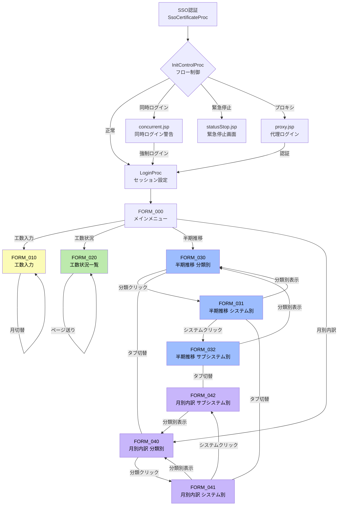
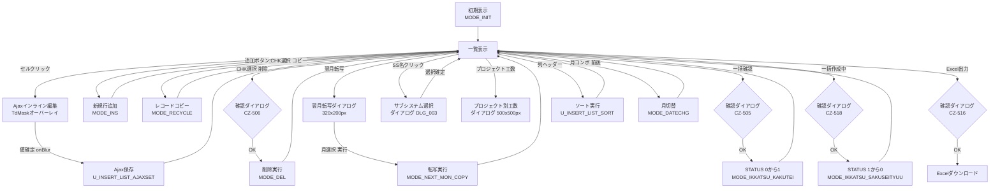
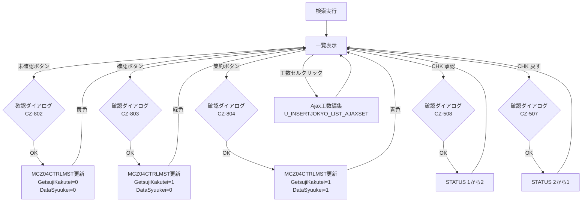
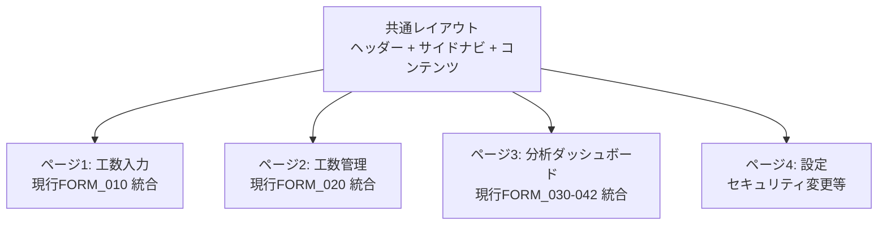

# 画面一覧・遷移図・ワイヤーフレーム構成定義書 - CZシステム（保有資源管理システム）

> **現行MPA画面構造の完全マッピングとSPA化モダナイズ提案**
> 分析対象: irpmng_czConsv（JSP 139ファイル / Unit 88クラス / JS 12ファイル）

---

## 目次

1. [現行画面一覧表](#1-現行画面一覧表)
2. [現行フレーム構造](#2-現行フレーム構造)
3. [画面遷移図](#3-画面遷移図)
4. [Ajax通信マップ](#4-ajax通信マップ)
5. [画面構成要素リスト（ワイヤーフレーム）](#5-画面構成要素リストワイヤーフレーム)
6. [ダイアログ一覧と構成](#6-ダイアログ一覧と構成)
7. [SPA化ページ統合提案](#7-spa化ページ統合提案)
8. [新旧画面マッピング](#8-新旧画面マッピング)

---

## 1. 現行画面一覧表

### 1.1 メイン画面（FORM定義）

| 画面ID   | 画面名称                   | URL(UNIT_KEY)                       | フレーム構成JSP                    | 機能概要                                   |
| -------- | -------------------------- | ----------------------------------- | ---------------------------------- | ------------------------------------------ |
| FORM_000 | メインメニュー             | `U_AP_MAIN`                         | `main_menu_frame.jsp`              | システムメニュー。JinjiModeで構成切替      |
| FORM_010 | 工数入力                   | `U_INSERT_LIST_SEARCH`              | `insert_list_main_frame.jsp`       | 保守工数の入力・編集（Ajaxインライン編集） |
| FORM_020 | 工数状況一覧               | `U_INSERTJOKYO_LIST_SEARCH`         | `insert_jokyo_list_main_frame.jsp` | 月次ステータス管理・承認ワークフロー       |
| FORM_030 | 半期推移（分類別）         | `U_HALF_SUII_INIT`                  | `half_frame.jsp`                   | 半期推移データの分類別集計表示             |
| FORM_031 | 半期推移（システム別）     | `U_HALF_SUII_SYS_SUBSYS`            | `half_frame.jsp`                   | 半期推移のシステム別ドリルダウン           |
| FORM_032 | 半期推移（サブシステム別） | `U_HALF_SUII_SYS_SUBSYS_SEARCH`     | `half_frame.jsp`                   | 半期推移のサブシステム別ドリルダウン       |
| FORM_040 | 月別内訳（分類別）         | `U_MONTH_UTIWAKE_INIT`              | `month_frame.jsp`                  | 月別工数内訳の分類別集計表示               |
| FORM_041 | 月別内訳（システム別）     | `U_MONTH_UTIWAKE_SYS_SUBSYS`        | `month_frame.jsp`                  | 月別内訳のシステム別ドリルダウン           |
| FORM_042 | 月別内訳（サブシステム別） | `U_MONTH_UTIWAKE_SYS_SUBSYS_SEARCH` | `month_frame.jsp`                  | 月別内訳のサブシステム別ドリルダウン       |

### 1.2 初期化・認証画面

| 画面ID   | 画面名称         | URL(UNIT_KEY)        | JSPパス               | 機能概要                              |
| -------- | ---------------- | -------------------- | --------------------- | ------------------------------------- |
| INIT_001 | ログイン制御     | `U_INIT_CONTROL`     | `index_control.jsp`   | 初期フロー制御（SSO認証後の振り分け） |
| INIT_002 | ログイン処理     | `U_INIT`             | `main_menu_frame.jsp` | LoginProc → ApMainProcの実行          |
| INIT_003 | プロキシログイン | `U_INIT_PROXY`       | `proxy.jsp`           | 代理ログイン画面                      |
| INIT_004 | 同時ログイン警告 | `U_INIT_CONNCURRENT` | `concurrent.jsp`      | 同時セッション検知時の警告表示        |
| INIT_005 | 緊急停止         | -                    | `statusStop.jsp`      | システム緊急停止時の表示              |

### 1.3 ダイアログ画面

| 画面ID  | 画面名称               | URL(UNIT_KEY)                    | JSPパス                                   | 機能概要                                  |
| ------- | ---------------------- | -------------------------------- | ----------------------------------------- | ----------------------------------------- |
| DLG_001 | 組織選択（単一）       | `U_ORG_INIT`                     | `org/org_main.jsp`                        | 組織をツリー/検索から1つ選択              |
| DLG_002 | 組織選択（複数）       | `U_ORG_MULTI_INIT`               | `org_multi/org_multi_main.jsp`            | 複数組織を選択リスト形式で選択            |
| DLG_003 | システムNo選択（単一） | `U_SYSNO_INIT`                   | `sysno/sysno_main.jsp`                    | サブシステムを検索・1つ選択               |
| DLG_004 | システムNo選択（複数） | `U_SYSNO_MULTI_INIT`             | `sysno_multi/sysno_multi_main.jsp`        | 複数サブシステムを選択                    |
| DLG_005 | 担当者選択             | `U_TNT_SEARCH_INIT`              | `tnt/tnt_search_frame.jsp`                | 組織ツリーから担当者を検索・選択          |
| DLG_006 | セキュリティ変更       | `U_SECURITY_INIT`                | `dialogSecurity/f_dialogSecurityMain.jsp` | セキュリティロール変更                    |
| DLG_007 | セキュリティ担当者     | `U_SECURETANTO_SHOW`             | `dialogSecureTanto/securetanto_main.jsp`  | セキュリティ変更対象の担当者選択          |
| DLG_008 | プロジェクト別工数     | `U_INSERT_PROJECT_KOUSUU`        | (動的JSP)                                 | プロジェクト別工数の参照（500x500px）     |
| DLG_009 | 翌月転写               | `U_INSERT_NEXT_MONTH`            | (動的JSP)                                 | 翌月以降へのレコード転写設定（320x200px） |
| DLG_010 | 月別内訳詳細           | `U_MONTH_UTIWAKE_DETAIL_DISPLAY` | `detail_disp_frame.jsp`                   | 月別内訳の明細表示                        |

### 1.4 Unit一覧（機能別 全88クラス）

#### 初期化・認証（8 Unit）

| UNIT_KEY                   | Unitクラス           | Procチェーン                     | 用途                 |
| -------------------------- | -------------------- | -------------------------------- | -------------------- |
| `U_SESSIONTRACKING`        | SessionTrackingUnit  | SessionTrackingProc              | セッション追跡       |
| `U_INIT`                   | InitUnit             | LoginProc → ApMainProc           | ログイン処理         |
| `U_INIT_PROXY`             | ProxyUnit            | -                                | プロキシログイン表示 |
| `U_INIT_PROXY_LOGIN`       | ProxyLoginUnit       | ProxyLoginProc → ApMainProc      | プロキシログイン実行 |
| `U_INIT_PROXY_CONTROL`     | InitProxyControlUnit | InitProxyControlProc             | プロキシ制御フロー   |
| `U_INIT_CONNCURRENT`       | ConcurrentUnit       | -                                | 同時ログイン警告     |
| `U_INIT_CONNCURRENT_LOGIN` | ConcurrentLoginUnit  | ConcurrentLoginProc → ApMainProc | 同時ログイン強制     |
| `U_INIT_CONTROL`           | InitControlUnit      | InitControlProc                  | 初期フロー制御       |

#### メニュー・ナビゲーション（2 Unit）

| UNIT_KEY         | Unitクラス        | Procチェーン      | 用途               |
| ---------------- | ----------------- | ----------------- | ------------------ |
| `U_AP_MAIN`      | ApMainUnit        | ApMainProc        | メインメニュー表示 |
| `U_MENU_CONTROL` | ApMenuControlUnit | ApMenuControlProc | 画面間遷移制御     |

#### セキュリティダイアログ（6 Unit）

| UNIT_KEY                 | Unitクラス              | 用途                             |
| ------------------------ | ----------------------- | -------------------------------- |
| `U_SECURITY_INIT`        | SecurityInitUnit        | セキュリティ変更ダイアログ初期化 |
| `U_SECURITY_SELECT`      | SecuritySelectUnit      | セキュリティオプション選択       |
| `U_SECURITY_CHANGE`      | SecurityChangeUnit      | セキュリティ変更実行             |
| `U_SECURETANTO_SHOW`     | SecureTantoShowUnit     | 担当者選択ダイアログ表示         |
| `U_SECURETANTO_SEARCH`   | SecureTantoSearchUnit   | 担当者検索                       |
| `U_SECURETANTO_SETTANTO` | SecureTantoTantoSetUnit | 担当者設定                       |

#### 工数入力 FORM_010（7 Unit）

| UNIT_KEY                     | Unitクラス                 | 用途                         |
| ---------------------------- | -------------------------- | ---------------------------- |
| `U_INSERT_LIST_SEARCH`       | InsertListSearchUnit       | 検索・月切替・初期表示       |
| `U_INSERT_LIST_SORT`         | InsertListSortUnit         | ソート実行                   |
| `U_INSERT_LIST_MAINTENANCE`  | InsertListMaintenanceUnit  | 追加/コピー/削除/一括確認    |
| `U_INSERT_LIST_AJAXSET`      | InsertListAjaxSetUnit      | Ajaxインライン編集           |
| `U_INSERT_PROJECT_KOUSUU`    | InsertProjectKousuuUnit    | プロジェクト別工数ダイアログ |
| `U_INSERT_NEXT_MONTH`        | InsertNextMonthUnit        | 翌月転写ダイアログ           |
| `U_INSERT_LIST_DETAILOUTPUT` | InsertListDetailOutputUnit | Excel出力                    |

#### 工数状況一覧 FORM_020（6 Unit）

| UNIT_KEY                         | Unitクラス                     | 用途                    |
| -------------------------------- | ------------------------------ | ----------------------- |
| `U_INSERTJOKYO_LIST_SEARCH`      | InsertJokyoListSearchUnit      | 検索・月切替            |
| `U_INSERTJOKYO_LIST_SORT`        | InsertJokyoListSortUnit        | ソート実行              |
| `U_INSERTJOKYO_LIST_PAGE`        | InsertJokyoListPageUnit        | ページネーション        |
| `U_INSERTJOKYO_LIST_MAINTENANCE` | InsertJokyoListMaintenanceUnit | 月次確認/集約/承認/戻し |
| `U_INSERTJOKYO_LIST_AJAXSET`     | InsertJokyoListAjaxSetUnit     | Ajaxインライン工数編集  |
| `U_INSERTJOKYO_LIST_OUTPUT`      | InsertJokyoListOutputUnit      | Excel出力               |

#### 半期推移 FORM_030-032（11 Unit）

| UNIT_KEY                        | Unitクラス                  | 用途                         |
| ------------------------------- | --------------------------- | ---------------------------- |
| `U_HALF_SUII_INIT`              | HalfSuiiInitUnit            | 初期表示                     |
| `U_HALF_SUII_SEARCH`            | HalfSuiiSearchUnit          | 検索実行                     |
| `U_HALF_SUII_FIRST_STEP`        | HalfSuiiFirstStepUnit       | 分類別集計（STEP_0）         |
| `U_HALF_SUII_SYS_SUBSYS`        | HalfSuiiSysSubSysUnit       | システム別表示（STEP_1）     |
| `U_HALF_SUII_SYS_SUBSYS_SEARCH` | HalfSuiiSysSubSysSearchUnit | サブシステム別表示（STEP_2） |
| `U_HALF_SUII_KOUSUU_COST`       | HalfSuiiKousuuCostUnit      | 工数/コスト表示切替          |
| `U_HALF_SUII_HIDDEN_SHOW`       | HalfSuiiHiddenShowUnit      | 列表示/非表示切替            |
| `U_HALF_SUII_SORT`              | HalfSuiiSortUnit            | ソート実行                   |
| `U_HALF_SUII_SEL_RSET_CHK`      | HalfSuiiDoCheckUnit         | 全選択/解除                  |
| `U_HALF_SUII_MY`                | HalfSuiiDoMyUnit            | MYシステム登録/解除          |
| `U_HALF_SUII_OUTPUT`            | HalfSuiiOutputUnit          | Excel出力                    |

#### 月別内訳 FORM_040-042（13 Unit）

| UNIT_KEY                            | Unitクラス                      | 用途                         |
| ----------------------------------- | ------------------------------- | ---------------------------- |
| `U_MONTH_UTIWAKE_INIT`              | MonthUtiwakeInitUnit            | 初期表示                     |
| `U_MONTH_UTIWAKE_SEARCH`            | MonthUtiwakeSearchUnit          | 検索実行                     |
| `U_MONTH_UTIWAKE_FIRST_STEP`        | MonthUtiwakeFirstStepUnit       | 分類別集計（STEP_0）         |
| `U_MONTH_UTIWAKE_SYS_SUBSYS`        | MonthUtiwakeSysSubSysUnit       | システム別表示（STEP_1）     |
| `U_MONTH_UTIWAKE_SYS_SUBSYS_SEARCH` | MonthUtiwakeSysSubSysSearchUnit | サブシステム別表示（STEP_2） |
| `U_MONTH_UTIWAKE_KOUSUU_COST`       | MonthUtiwakeKousuuCostUnit      | 工数/コスト表示切替          |
| `U_MONTH_UTIWAKE_HIDDEN_SHOW`       | MonthUtiwakeHiddenShowUnit      | 列表示/非表示切替            |
| `U_MONTH_UTIWAKE_SORT`              | MonthUtiwakeSortUnit            | ソート実行                   |
| `U_MONTH_UTIWAKE_SEL_RSET_CHK`      | MonthUtiwakeDoCheckUnit         | 全選択/解除                  |
| `U_MONTH_UTIWAKE_MY`                | MonthUtiwakeDoMyUnit            | MYシステム登録/解除          |
| `U_MONTH_UTIWAKE_OUTPUT`            | MonthUtiwakeOutputUnit          | Excel出力                    |
| `U_MONTH_UTIWAKE_DETAIL_OUTPUT`     | MonthUtiwakeDetailOutputUnit    | 詳細Excel出力                |
| `U_MONTH_UTIWAKE_DETAIL_DISPLAY`    | MonthUtiwakeDetailDisplayUnit   | 詳細表示ダイアログ           |

#### 組織選択ダイアログ（13 Unit）

| UNIT_KEY                                                                                                                                                                 | 用途                   |
| ------------------------------------------------------------------------------------------------------------------------------------------------------------------------ | ---------------------- |
| `U_ORG_INIT` / `U_ORG_SET_COMBO` / `U_ORG_SEARCH_ORG` / `U_ORG_SEARCH_NAME` / `U_ORG_OK_BUTTON` / `U_ORG_COMMIT`                                                         | 単一組織選択（6 Unit） |
| `U_ORG_MULTI_INIT` / `U_ORG_MULTI_SET_COMBO` / `U_ORG_MULTI_SEARCH_ORG` / `U_ORG_MULTI_SEARCH_NAME` / `U_ORG_MULTI_BUTTON` / `U_ORG_MULTI_SELECT` / `U_ORG_MULTI_COMMIT` | 複数組織選択（7 Unit） |

#### システムNo選択ダイアログ（11 Unit）

| UNIT_KEY                                                                                                                                                 | 用途               |
| -------------------------------------------------------------------------------------------------------------------------------------------------------- | ------------------ |
| `U_SYSNO_INIT` / `U_SYSNO_SET_COMBO` / `U_SYSNO_SEARCH_ORG` / `U_SYSNO_BUTTON` / `U_SYSNO_COMMIT`                                                        | 単一選択（5 Unit） |
| `U_SYSNO_MULTI_INIT` / `U_SYSNO_MULTI_SET_COMBO` / `U_SYSNO_MULTI_SEARCH_ORG` / `U_SYSNO_MULTI_BUTTON` / `U_SYSNO_MULTI_SELECT` / `U_SYSNO_MULTI_COMMIT` | 複数選択（6 Unit） |

#### 担当者選択ダイアログ（5 Unit）

| UNIT_KEY                    | 用途                       |
| --------------------------- | -------------------------- |
| `U_TNT_SEARCH_INIT`         | 担当者検索ダイアログ初期化 |
| `U_TNT_SEARCH_RETRIEVAL`    | 担当者データ取得           |
| `U_TNT_SEARCH_BUSYO_SELECT` | 部署ツリー選択             |
| `U_TNT_SEARCH_OK_BUTTON`    | 選択確定                   |
| `U_TNT_SEARCH_COMMIT`       | コミット処理               |

---

## 2. 現行フレーム構造

### 2.1 アプリケーション全体のフレーム構造

```
┌─────────────────────────────────────────────────────┐
│ ap_main_frame.jsp - FRAMESET rows="34, *, 32, 32"   │
├─────────────────────────────────────────────────────┤
│ T_INIT_HEADER (ap_header.jsp)           [34px]      │
│   戻る | ヘルプ | 閉じる | タイトルメッセージ        │
├─────────────────────────────────────────────────────┤
│ T_INIT_MAIN (main_menu_frame.jsp)       [残り]      │
│   ┌─────────┬───────────────────────────┐           │
│   │メニュー  │    コンテンツ領域          │           │
│   │(JinjiMode│    (FORM_010〜042)        │           │
│   │ で切替)  │                           │           │
│   └─────────┴───────────────────────────┘           │
├─────────────────────────────────────────────────────┤
│ T_INIT_RELOAD (ap_reload.jsp)           [32px]      │
│   セッション維持（SessionTrackingUnit）               │
├─────────────────────────────────────────────────────┤
│ T_INIT_DUMMY (ap_dummy.jsp)             [32px]      │
│   ファイルDL用非表示フレーム                          │
└─────────────────────────────────────────────────────┘
```

### 2.2 工数入力（FORM_010）のフレーム構造

```
insert_list_main_frame.jsp  rows="28, 80, *"
┌─────────────────────────────────────────────────────┐
│ T_INIT_HISTORY (ap_history.jsp)          [28px]     │
│   パンくずリスト / 履歴ナビゲーション                  │
├─────────────────────────────────────────────────────┤
│ T_INSERT_LIST_PANEL (insert_list_panel.jsp) [80px]  │
│   担当者選択 | 検索ボタン | リセット | 表示モード切替  │
├─────────────────────────────────────────────────────┤
│ insert_list_main.jsp  rows="32, 48, *, 60"          │
│ ┌───────────────────────────────────────────────┐   │
│ │ T_INSERT_LIST_HEAD_TOP (head_top.jsp)  [32px] │   │
│ │  月コンボ | <<>> | 追加|コピー|翌月|削除|Excel │   │
│ ├───────────────────────────────────────────────┤   │
│ │ T_INSERT_LIST_HEAD (head.jsp)          [48px] │   │
│ │  CHK|ステータス|作業日|対象SS|原因SS|カテゴリ...│   │
│ ├───────────────────────────────────────────────┤   │
│ │ T_INSERT_LIST_BODY (body.jsp)          [残り] │   │
│ │  ✓ |作成中|2025/02/25|SS001|SS002|保守1|..    │   │
│ │  ✓ |確認 |2025/02/24|SS003|SS003|保守2|..    │   │
│ │  （Ajaxインライン編集: TdMaskオーバーレイ）    │   │
│ ├───────────────────────────────────────────────┤   │
│ │ T_INSERT_LIST_FOOD (food.jsp)          [60px] │   │
│ │  一括確認|一括作成中 | STATUS_0:3 1:5 2:10    │   │
│ └───────────────────────────────────────────────┘   │
└─────────────────────────────────────────────────────┘
```

### 2.3 工数状況一覧（FORM_020）のフレーム構造

```
insert_jokyo_list_main_frame.jsp  rows="28, 140, *"
┌─────────────────────────────────────────────────────┐
│ T_INIT_HISTORY                            [28px]    │
├─────────────────────────────────────────────────────┤
│ T_INSERT_JOKYO_LIST_PANEL                 [140px]   │
│  組織|担当者|月選択|ステータスCHK|検索|リセット       │
├─────────────────────────────────────────────────────┤
│ insert_jokyo_list_main.jsp  rows="80, 48+48, *"    │
│ ┌───────────────────────────────────────────────┐   │
│ │ HEAD_TOP                               [80px] │   │
│ │  月ステータス: [未確認][確認][集約]              │   │
│ │  全選択/解除 | 戻す | 承認 | ページ送り          │   │
│ ├──────────────┬────────────────────────────┤   │
│ │ HEAD_L [427px]│ HEAD_R [残り]             │   │
│ │ CHK|STS|日付  │ 原因SS|カテゴリ|件名|工数.. │   │
│ ├──────────────┼────────────────────────────┤   │
│ │ BODY_L       │ BODY_R  (水平スクロール同期)│   │
│ │ ✓|確認|02/25 │ SS002|保守1|作業A|03:30.. │   │
│ │              │ (インライン工数編集可)       │   │
│ └──────────────┴────────────────────────────┘   │
└─────────────────────────────────────────────────────┘
```

### 2.4 半期推移 / 月別内訳（FORM_030-042）のフレーム構造

```
half_frame.jsp / month_frame.jsp  rows="28, 30, 136, *, 0"
┌─────────────────────────────────────────────────────┐
│ T_INIT_HISTORY                            [28px]    │
├─────────────────────────────────────────────────────┤
│ T_HALF_TAB / T_MONTH_TAB                  [30px]    │
│  [半期推移] | [月別内訳]  ← タブ切替                  │
├─────────────────────────────────────────────────────┤
│ T_SEARCH_CONDITION                        [136px]   │
│  年度半期 | ○集計 ○システム ○MYシステム              │
│  分類1/2 | 工数/コスト | 検索 | クリア               │
├─────────────────────────────────────────────────────┤
│ half_main.jsp / month_main.jsp（9フレーム構成）      │
│ ┌────────────────────────────────────────────┐      │
│ │ SUB_TITLE       | BUTTON                   │      │
│ │ "分類別 保守工数" | 全選択|部分表示|Excel出力  │      │
│ ├───┬─────────────┬─────────────────────┤      │
│ │CHK│ LEFT_HEADER  │ RIGHT_HEADER         │      │
│ │ H │ 分類名/SS名  │ M1|M2|M3|M4|M5|M6|計 │      │
│ ├───┼─────────────┼─────────────────────┤      │
│ │   │              │ RIGHT_SUM_DATA       │      │
│ │   │              │ (合計行: スクロール同期)│      │
│ ├───┼─────────────┼─────────────────────┤      │
│ │CHK│ LEFT_DATA    │ RIGHT_DATA           │      │
│ │☆ │ 保守1        │ 120|130|...|780      │      │
│ │☆ │ 保守2        │ 80|90|...|520        │      │
│ │   │(クリックで    │ (水平スクロール同期)   │      │
│ │   │ ドリルダウン)  │                      │      │
│ └───┴─────────────┴─────────────────────┘      │
├─────────────────────────────────────────────────────┤
│ T_DUMMY (ap_dummy.jsp)                     [0px]    │
└─────────────────────────────────────────────────────┘
```

---

## 3. 画面遷移図

### 3.1 メイン画面遷移図



### 3.2 工数入力（FORM_010）内部遷移



### 3.3 工数状況一覧（FORM_020）ステータスフロー



---

## 4. Ajax通信マップ

### 4.1 Ajax基盤

| コンポーネント | ファイル                             | 機能                                       |
| -------------- | ------------------------------------ | ------------------------------------------ |
| Asyncクラス    | `ApAccessAjax.js`                    | XMLHttpRequestラッパー。connect()→callback |
| TdMaskクラス   | `ApDynamAjax.js` / `ApTdMaskAjax.js` | インライン編集のオーバーレイ制御           |
| イベントマップ | `ApDynamAjax.js` eventActionMap()    | blur/keydown→Ajax送信のトリガー            |

### 4.2 Ajax通信一覧

| 画面         | トリガー           | Ajax URL (UNIT_KEY)              | リクエストパラメータ                               | レスポンス形式           | UI更新                     |
| ------------ | ------------------ | -------------------------------- | -------------------------------------------------- | ------------------------ | -------------------------- |
| FORM_010     | ステータス変更     | `U_INSERT_LIST_AJAXSET`          | P_MODE=P_S_01_STATUS, P_VALUE, P_KEY               | JSON                     | セル値更新、行カラー変更   |
| FORM_010     | 作業日変更         | `U_INSERT_LIST_AJAXSET`          | P_MODE=P_D_01_SGYYMD, P_VALUE, P_KEY               | JSON                     | セル値更新                 |
| FORM_010     | カテゴリ変更       | `U_INSERT_LIST_AJAXSET`          | P_MODE=P_S_01_HSKATEGORI, P_VALUE, P_KEY           | JSON                     | セル値更新                 |
| FORM_010     | 件名変更           | `U_INSERT_LIST_AJAXSET`          | P_MODE=P_S_01_KENMEI, P_VALUE, P_KEY               | JSON                     | セル値更新（30文字折返し） |
| FORM_010     | 工数変更           | `U_INSERT_LIST_AJAXSET`          | P_MODE=P_S_01_KOUSUU, P_VALUE, P_KEY               | JSON                     | セル値更新、合計再計算     |
| FORM_010     | TMR番号変更        | `U_INSERT_LIST_AJAXSET`          | P_MODE=P_S_01_TMRNO, P_VALUE, P_KEY                | JSON                     | セル値更新                 |
| FORM_010     | 依頼書No変更       | `U_INSERT_LIST_AJAXSET`          | P_MODE=P_S_01_SGYIRAISYONO, P_VALUE, P_KEY         | JSON                     | セル値更新                 |
| FORM_010     | 依頼者変更         | `U_INSERT_LIST_AJAXSET`          | P_MODE=P_S_01_SGYIRAISYAESQID, P_VALUE, P_KEY      | JSON                     | セル値更新                 |
| FORM_010     | 行選択/解除        | `U_INSERT_LIST_AJAXSET`          | P_MODE=V_SELECT, P_KEY                             | JSON                     | ボタン有効/無効切替        |
| FORM_020     | 工数編集           | `U_INSERTJOKYO_LIST_AJAXSET`     | P_MODE=P_S_01_KOUSUU, P_VALUE, P_KEY               | JSON                     | セル値更新                 |
| FORM_020     | 月次ステータス変更 | `U_INSERTJOKYO_LIST_MAINTENANCE` | P*MODE=MODE*\*                                     | JSON (via list_json.jsp) | ボタンカラー変更           |
| FORM_030-032 | MYシステム切替     | `U_HALF_SUII_MY`                 | P_HALF_ACTION_MY=INSERT/DELETE, P_HALF_SYSTEM_NO   | -                        | MYアイコン切替             |
| FORM_030-032 | 全選択/解除        | `U_HALF_SUII_SEL_RSET_CHK`       | フラグ                                             | HTML (data_renewal.jsp)  | チェックボックス更新       |
| FORM_040-042 | MYシステム切替     | `U_MONTH_UTIWAKE_MY`             | P_MONTH_ACTION_MY=INSERT/DELETE, P_MONTH_SYSTEM_NO | -                        | MYアイコン切替             |
| FORM_040-042 | 全選択/解除        | `U_MONTH_UTIWAKE_SEL_RSET_CHK`   | フラグ                                             | HTML (data_renewal.jsp)  | チェックボックス更新       |

### 4.3 Ajax処理フロー

```
ユーザー操作
  ↓
onFocus: focusInput_Xxx() → 背景色ハイライト、テキスト選択
  ↓
値入力/変更
  ↓
onKeyDown: keyEventChk() → Enterキーでblurトリガー
  ↓
onBlur: blurInput_Xxx() → フォーマット/バリデーション
  ↓
mskOnblur() → eventActionMap(obj) → Ajax送信判定
  ↓
Async.connect() → POST(UNIT_KEY + パラメータ)
  ↓
サーバー処理: Unit → Proc → Delegate → DAO → DB
  ↓
JSONレスポンス: {P_RETURN: "0", P_VALUE: "...", P_MESSAGE: "..."}
  ↓
callBackFunc():
  P_RETURN="0" → セル値更新、背景色復元
  P_RETURN≠"0" → エラーメッセージ表示、元の値に復元
```

---

## 5. 画面構成要素リスト（ワイヤーフレーム）

### 5.1 SCR-010: 工数入力画面（FORM_010）

#### 検索パネル領域

| 項目種別 | 項目名         | HTML要素                    | データ型 | 必須 | 備考                                              |
| -------- | -------------- | --------------------------- | -------- | ---- | ------------------------------------------------- |
| 入力     | 担当者         | TEXT(readonly) + ダイアログ | 文字列   | ○    | TNTダイアログ(DLG_005)から選択。P_S_00_SOSIKINAME |
| 操作     | 検索           | BUTTON                      | -        | -    | フォーム送信                                      |
| 操作     | リセット       | BUTTON                      | -        | -    | 条件クリア                                        |
| 操作     | 表示モード切替 | IMAGE_BUTTON                | -        | -    | 編集/参照モードトグル                             |

#### ツールバー領域

| 項目種別 | 項目名             | HTML要素       | データ型 | 必須 | 備考                              |
| -------- | ------------------ | -------------- | -------- | ---- | --------------------------------- |
| 入力     | 年月               | SELECT         | YYYYMM   | ○    | ±12ヶ月の範囲。chgDate(9)で月切替 |
| 操作     | <<（前月）         | BUTTON         | -        | -    | MODE_DATECHG                      |
| 操作     | >>（翌月）         | BUTTON         | -        | -    | MODE_DATECHG                      |
| 操作     | 追加               | BUTTON         | -        | -    | MODE*INS。sts*\*\_ins_btn制御     |
| 操作     | コピー             | BUTTON         | -        | -    | MODE_RECYCLE。CHK選択時有効化     |
| 操作     | 翌月以降へ転写     | BUTTON         | -        | -    | MODE_NEXT_MON_COPY。DLG_009起動   |
| 操作     | 削除               | BUTTON         | -        | -    | MODE_DEL。CHK選択時有効化         |
| 表示     | 合計工数           | TEXT(readonly) | HH:MM    | -    | T_P_S_01_KOUSUU                   |
| 操作     | プロジェクト別工数 | BUTTON         | -        | -    | DLG_008起動(500x500px)            |
| 操作     | Excel出力          | BUTTON         | -        | -    | CZ-516確認→DL                     |

#### 一覧ヘッダー（ソート可能14列）

| 列No | 列名         | ソートキー                | 幅目安 |
| ---- | ------------ | ------------------------- | ------ |
| 1    | CHK          | -                         | 30px   |
| 2    | ステータス   | P_S_01_STATUS             | 70px   |
| 3    | 作業日       | P_D_01_SGYYMD             | 90px   |
| 4    | 保守担当所属 | P_S_09_HSTNTSG_SYOZOKU    | 120px  |
| 5    | 保守担当者名 | P_S_06_HSTNTSG_SIMEIKANJI | 100px  |
| 6    | 対象SSNo     | P_S_01_TAISYOSUBSYSNO     | 60px   |
| 7    | 対象SS名     | P_S_01_TS_SUBSYSMEI       | 150px  |
| 8    | 原因SSNo     | P_S_01_CAUSESUBSYSNO      | 60px   |
| 9    | 原因SS名     | P_S_01_GI_SUBSYSMEI       | 150px  |
| 10   | 保守カテゴリ | P_S_01_HSKATEGORI         | 150px  |
| 11   | 件名         | P_S_01_KENMEI             | 200px  |
| 12   | 工数         | P_S_01_KOUSUU             | 60px   |
| 13   | TMR番号      | P_S_01_TMRNO              | 60px   |
| 14   | 作業依頼書No | P_S_01_SGYIRAISYONO       | 80px   |

#### 一覧本体（Ajaxインライン編集）

| 項目名       | 編集方式                    | データ型   | バリデーション          | 編集条件                 |
| ------------ | --------------------------- | ---------- | ----------------------- | ------------------------ |
| CHK          | CHECKBOX                    | boolean    | -                       | sts\_\*\_del/cpy_btn制御 |
| ステータス   | SELECT(ドロップダウン)      | 0/1/2      | 必須                    | **常時編集可**           |
| 作業日       | TEXT + カレンダー           | YYYY/MM/DD | 必須、月内日付          | STATUS_0のみ             |
| 対象SS       | TEXT(readonly) + ダイアログ | コード     | 必須(DLG_003)           | STATUS_0のみ             |
| 原因SS       | TEXT(readonly) + ダイアログ | コード     | 必須(DLG_003)           | STATUS_0のみ             |
| 保守カテゴリ | SELECT(ドロップダウン)      | コード     | 必須                    | STATUS_0のみ             |
| 件名         | TEXTAREA(128文字)           | 文字列     | 必須、禁止ワード        | STATUS_0のみ             |
| 工数         | TEXT(HH:MM)                 | 時間       | 必須、15分単位、≤24h/日 | STATUS_0のみ             |
| TMR番号      | TEXT(5文字)                 | 半角英数   | 5文字以内               | STATUS_0のみ             |
| 依頼書No     | TEXT(7文字)                 | 半角数字   | 空or7文字固定           | STATUS_0のみ             |
| 依頼者名     | TEXT(40文字)                | 文字列     | 条件付き必須            | STATUS_0のみ             |

#### フッター領域

| 項目種別 | 項目名     | HTML要素     | 備考                                        |
| -------- | ---------- | ------------ | ------------------------------------------- |
| 操作     | 一括確認   | BUTTON       | STATUS_0→1。isIkkatsuKakutei=true時のみ表示 |
| 操作     | 一括作成中 | BUTTON       | STATUS_1→0                                  |
| 表示     | 作成中件数 | SPAN(赤文字) | >0のとき赤色警告                            |
| 表示     | 確認件数   | SPAN         | -                                           |
| 表示     | 確定件数   | SPAN         | -                                           |
| 表示     | メッセージ | SPAN(赤文字) | エラー/警告メッセージ                       |

---

### 5.2 SCR-020: 工数状況一覧画面（FORM_020）

#### 検索パネル領域

| 項目種別 | 項目名             | HTML要素                    | データ型 | 備考                       |
| -------- | ------------------ | --------------------------- | -------- | -------------------------- |
| 入力     | 組織               | TEXT(readonly) + ダイアログ | コード   | DLG_001/002                |
| 入力     | 担当者             | TEXT(readonly) + ダイアログ | コード   | DLG_005                    |
| 入力     | 年月               | SELECT                      | YYYYMM   | 月選択コンボ               |
| 入力     | ステータスフィルタ | CHECKBOX x3                 | 0/1/2    | 作成中/確認/確定のチェック |
| 操作     | 検索               | BUTTON                      | -        | -                          |
| 操作     | リセット           | BUTTON                      | -        | -                          |

#### 月次ステータス制御領域

| 項目種別 | 項目名 | HTML要素 | 背景色        | 表示条件                            |
| -------- | ------ | -------- | ------------- | ----------------------------------- |
| 操作     | 未確認 | BUTTON   | #FBFBB6（黄） | canUseSbt012_0bit or 両ビット未設定 |
| 操作     | 確認   | BUTTON   | #BDEAAD（緑） | canUseSbt012_0bit のみ              |
| 操作     | 集約   | BUTTON   | #9DBDFE（青） | canUseSbt012_1bit のみ              |

#### レコード操作領域

| 項目種別 | 項目名    | HTML要素 | 備考                     |
| -------- | --------- | -------- | ------------------------ |
| 操作     | 全選択    | LINK     | CheckAll(true)           |
| 操作     | 全解除    | LINK     | CheckAll(false)          |
| 操作     | 承認      | BUTTON   | MODE_SYONIN。CHK選択必須 |
| 操作     | 戻す      | BUTTON   | MODE_MODOSI。CHK選択必須 |
| 操作     | Excel出力 | BUTTON   | -                        |

#### ページネーション

| 項目種別 | 項目名     | HTML要素  | 備考        |
| -------- | ---------- | --------- | ----------- |
| 操作     | <<最初     | BUTTON    | V_PAGE_FAST |
| 操作     | <前ページ  | BUTTON    | V_PAGE_PREV |
| 入力     | ページ番号 | TEXT(3桁) | V_PAGE_SET  |
| 操作     | 次ページ>  | BUTTON    | V_PAGE_NEXT |
| 操作     | 最後>>     | BUTTON    | V_PAGE_LAST |

#### 一覧（左右分割、水平スクロール同期）

| 固定列(LEFT) | 列名         | 編集                                  |
| ------------ | ------------ | ------------------------------------- |
| 1            | CHK          | CHECKBOX（isSts_man_j_upd時のみ表示） |
| 2            | ステータス   | 表示のみ（カラーコード付き）          |
| 3            | 作業日       | 表示のみ                              |
| 4            | 保守担当所属 | 表示のみ                              |
| 5            | 保守担当者名 | 表示のみ                              |
| 6            | 対象SSNo     | 表示のみ                              |
| 7            | 対象SS名     | 表示のみ                              |

| スクロール列(RIGHT) | 列名         | 編集                                               |
| ------------------- | ------------ | -------------------------------------------------- |
| 8                   | 原因SSNo     | 表示のみ                                           |
| 9                   | 原因SS名     | 表示のみ                                           |
| 10                  | 保守カテゴリ | 表示のみ                                           |
| 11                  | 件名         | 表示のみ                                           |
| 12                  | **工数**     | **Ajaxインライン編集可**（isSts_man_j_upd=true時） |
| 13                  | TMR番号      | 表示のみ                                           |
| 14                  | 依頼書No     | 表示のみ                                           |
| 15                  | 依頼者名     | 表示のみ                                           |
| 16                  | 更新日       | 表示のみ                                           |
| 17                  | 更新者名     | 表示のみ                                           |

---

### 5.3 SCR-030: 半期推移画面（FORM_030-032）

#### タブ切替領域

| 項目種別 | 項目名       | HTML要素          | 備考                                       |
| -------- | ------------ | ----------------- | ------------------------------------------ |
| 操作     | 半期推移タブ | TAB(アクティブ)   | 現在の画面                                 |
| 操作     | 月別内訳タブ | TAB(非アクティブ) | FORM_040-042へ遷移。検索条件セッション保持 |

#### 検索条件領域

| 項目種別 | 項目名          | HTML要素                    | データ型   | 備考                                      |
| -------- | --------------- | --------------------------- | ---------- | ----------------------------------------- |
| 入力     | 年度半期        | SELECT                      | YYYYH      | getYearHalfOptions()で生成                |
| 入力     | 表示モード      | RADIO x3                    | FLAG_0/1/2 | ○集計 ○システム ○MYシステム               |
| 入力     | システム名      | TEXT(readonly) + ダイアログ | コード     | ラジオ「システム」選択時のみ有効。DLG_003 |
| 入力     | 工数/コスト切替 | RADIO                       | -          | getRadio4Html()で生成                     |
| 操作     | 検索            | BUTTON                      | -          | search()関数                              |
| 操作     | クリア          | BUTTON                      | -          | inputRst()関数                            |

#### データ表示領域（3階層共通構造）

**STEP_0（分類別）**

| 列グループ | 列名    | 備考                                    |
| ---------- | ------- | --------------------------------------- |
| LEFT       | 分類1名 | 幅160px。クリックでSTEP_1へドリルダウン |
| LEFT       | 分類2名 | 幅160px。分類2選択時のみ表示            |
| RIGHT      | M1〜M6  | 月別データ（6列）                       |
| RIGHT      | 合計    | 行合計                                  |

**STEP_1（システム別）**

| 列グループ | 列名               | 備考                                    |
| ---------- | ------------------ | --------------------------------------- |
| CHK        | MYシステム星マーク | クリックでMY登録/解除（Ajax）           |
| LEFT       | システムNo         | 幅75px                                  |
| LEFT       | システム名         | 幅160px。クリックでSTEP_2へドリルダウン |
| RIGHT      | M1〜M6             | 月別データ                              |
| RIGHT      | 合計               | 行合計                                  |

**STEP_2（サブシステム別）**

| 列グループ | 列名                | 備考             |
| ---------- | ------------------- | ---------------- |
| CHK        | MYシステム星マーク  | MYシステム切替   |
| LEFT       | システムNo + 名     | 親システム情報   |
| LEFT       | サブシステムNo + 名 | サブシステム情報 |
| RIGHT      | M1〜M6              | 月別データ       |
| RIGHT      | 合計                | 行合計           |

#### 操作ボタン領域

| 項目種別 | 項目名          | HTML要素 | 備考                            |
| -------- | --------------- | -------- | ------------------------------- |
| 操作     | 全選択/解除     | LINK     | doSelectAllReset(flg)           |
| 操作     | 部分表示/全表示 | BUTTON   | doHiddenShow(flg)               |
| 操作     | 分類別表示      | BUTTON   | goStepFirst()。STEP_1/2から戻る |
| 操作     | 工数/コスト切替 | BUTTON   | goKousuuCost(flg)               |
| 操作     | Excel出力       | BUTTON   | 確認後DL                        |

---

### 5.4 SCR-040: 月別内訳画面（FORM_040-042）

> 構造はSCR-030とほぼ同一。以下が差異点:

#### 検索条件の追加項目

| 項目種別 | 項目名 | HTML要素 | データ型 | 備考                                                  |
| -------- | ------ | -------- | -------- | ----------------------------------------------------- |
| 入力     | **月** | SELECT   | MM       | P_MONTH_MONTH。年度半期選択で動的生成（setMonthItem） |

#### Excel出力（4種類）

| 出力種別             | UNIT_KEY                        | テンプレート                     |
| -------------------- | ------------------------------- | -------------------------------- |
| 月別内訳（標準）     | `U_MONTH_UTIWAKE_OUTPUT`        | tmp_MonthUtiwake.xls             |
| 月別内訳（管理用）   | `U_MONTH_UTIWAKE_OUTPUT`        | tmp_Kanri_MonthUtiwake.xls       |
| 月別内訳（管理詳細） | `U_MONTH_UTIWAKE_DETAIL_OUTPUT` | tmp_KanriDetail_MonthUtiwake.xls |
| 半期推移             | `U_HALF_SUII_OUTPUT`            | tmp_HalfSuii.xls                 |

---

## 6. ダイアログ一覧と構成

### 6.1 DLG_003: サブシステム選択ダイアログ（最頻使用）

```
sysno_main.jsp  別ウィンドウ（window.open）
┌─────────────────────────────────────┐
│ 検索条件                              │
│  組織コンボ: [部署1▼][部署2▼][部署3▼]  │
│  [検索] [リセット]                     │
├─────────────────────────────────────┤
│ 検索結果一覧                          │
│  No | システムNo | サブシステムNo | 名称│
│  1  | SYS001    | SUB001       | XX  │
│  2  | SYS001    | SUB002       | YY  │
│  （行クリックで選択ハイライト）          │
├─────────────────────────────────────┤
│           [OK] [キャンセル]            │
└─────────────────────────────────────┘
```

**遷移パターン**: 親画面のSSセルクリック → window.open → 検索・選択 → OK → sCommit() → 親画面セル値更新

### 6.2 DLG_005: 担当者選択ダイアログ

```
tnt_search_frame.jsp  別ウィンドウ
┌──────────────────────────────────────┐
│ [タブ: 検索 | 組織ツリー]               │
├──────────────────────────────────────┤
│ 検索モード:                            │
│  組織: [本部▼][局▼][室▼][部▼][課▼]    │
│  担当者名: [________]                  │
│  [検索]                               │
│ ────────────────────────────         │
│ 検索結果:                              │
│  No | 社員番号 | 氏名 | 所属           │
│  1  | E001    | 山田太郎 | 開発部      │
│                                      │
│ 組織ツリーモード:                       │
│  ├ 本部                               │
│  │ ├ 局A                             │
│  │ │ ├ 部1 → (担当者一覧)            │
├──────────────────────────────────────┤
│         [OK] [組織選択] [キャンセル]     │
└──────────────────────────────────────┘
```

### 6.3 DLG_001/002: 組織選択ダイアログ

```
org_main.jsp / org_multi_main.jsp
┌──────────────────────────────────────┐
│ [タブ: 組織コード | 組織名検索]          │
├──────────────────────────────────────┤
│ 組織コード検索:                        │
│  [部署レベル1▼][部署レベル2▼]...       │
│ ─── or ───                           │
│ 組織名検索:                            │
│  カナ: [________] ○完全一致 ○部分一致  │
│  [検索]                               │
├──────────────────────────────────────┤
│ 検索結果 (複数選択版: 左右リスト)       │
│  候補リスト    →  選択済みリスト        │
│  [>>追加]          [<<削除]           │
├──────────────────────────────────────┤
│      [組織のみ] [OK] [キャンセル]       │
└──────────────────────────────────────┘
```

---

## 7. SPA化ページ統合提案

### 7.1 統合方針

現行システムは **FRAMESET + 複数JSP** で構成されたMPAだが、SPA化により以下の統合が可能:

```
現行: 139 JSP → 88 Unit → 10 ダイアログウィンドウ
新規: 4 SPA ページ + 5 モーダルコンポーネント + 共通レイアウト
```

### 7.2 SPA ページ構成提案



### 7.3 ページ統合詳細

#### ページ1: 工数入力（現行 FORM_010 の統合）

| 統合元                                 | 統合先コンポーネント       | 統合理由                      |
| -------------------------------------- | -------------------------- | ----------------------------- |
| insert_list_main_frame.jsp (4フレーム) | 単一ページ                 | FRAMESET廃止                  |
| insert_list_panel.jsp                  | SearchBarコンポーネント    | ヘッダー内検索                |
| insert_list_head_top.jsp               | ToolBarコンポーネント      | ボタン群                      |
| insert_list_head.jsp + body.jsp        | DataGridコンポーネント     | ヘッダー固定テーブル          |
| insert_list_food.jsp                   | StatusBarコンポーネント    | フッターバー                  |
| TdMask (Ajax インライン編集)           | EditableCellコンポーネント | React/Vue標準のインライン編集 |
| DLG_008 プロジェクト工数               | ModalDialogコンポーネント  | ポップアップ→モーダル         |
| DLG_009 翌月転写                       | ModalDialogコンポーネント  | ポップアップ→モーダル         |

**新ページのワイヤーフレーム案:**

```
┌──────────────────────────────────────────────────┐
│ [ヘッダー] 保有資源管理 | ユーザー名 | ヘルプ | ログアウト│
├────────┬─────────────────────────────────────────┤
│サイドナビ│ [工数入力]                               │
│         │ ┌────────────────────────────────────┐│
│ 工数入力 │ │ 担当者:[山田太郎▼] 年月:[2025/02▼]  ││
│ 工数管理 │ │ [<<][>>] [追加][コピー][転写][削除]  ││
│ 分析    │ │ 合計: 120:30  [PJ工数][Excel]       ││
│ 設定    │ ├────────────────────────────────────┤│
│         │ │ ☐|STS |日付    |対象SS |原因SS|...  ││
│         │ │ ☐|作成|02/25  |SS001 |SS002|...   ││
│         │ │ ☐|確認|02/24  |SS003 |SS003|...   ││
│         │ │  (インライン編集: セルクリックで即時) ││
│         │ ├────────────────────────────────────┤│
│         │ │ [一括確認][一括作成中] 作成:3 確認:5  ││
│         │ └────────────────────────────────────┘│
└────────┴─────────────────────────────────────────┘
```

#### ページ2: 工数管理（現行 FORM_020 の統合）

| 統合元                                          | 統合先コンポーネント        | 統合理由           |
| ----------------------------------------------- | --------------------------- | ------------------ |
| insert_jokyo_list_main_frame.jsp (複数フレーム) | 単一ページ                  | FRAMESET廃止       |
| 左右フレーム分割 (head_l/r + body_l/r)          | 横スクロール付きDataGrid    | CSSで固定列実現    |
| ページネーション                                | Pagination / 仮想スクロール | モダンUI           |
| 月次ステータスボタン(黄/緑/青)                  | StatusToggleコンポーネント  | ステータスカード型 |

**新ページのワイヤーフレーム案:**

```
┌──────────────────────────────────────────────────┐
│ [ヘッダー]                                        │
├────────┬─────────────────────────────────────────┤
│サイドナビ│ [工数管理]                               │
│         │ ┌────────────────────────────────────┐│
│         │ │ 組織:[開発部▼] 担当者:[全員▼]       ││
│         │ │ 年月:[2025/02▼] ☑作成中 ☑確認 ☑確定 ││
│         │ │ [検索] [リセット]                    ││
│         │ ├────────────────────────────────────┤│
│         │ │ 月次ステータス:                      ││
│         │ │  [■未確認] [□確認] [□集約]          ││
│         │ │ ┌──────┐ ┌──────┐ ┌──────┐        ││
│         │ │ │ 黄色  │ │ 灰色  │ │ 灰色  │        ││
│         │ │ │アクティブ│ │      │ │      │        ││
│         │ │ └──────┘ └──────┘ └──────┘        ││
│         │ ├────────────────────────────────────┤│
│         │ │ [全選択][全解除] [承認][戻す] [Excel] ││
│         │ │                                    ││
│         │ │ ☐|STS |日付  |所属  |担当|対象SS|...││
│         │ │ ☐|確認|02/25|開発部|山田|SS001|...  ││
│         │ │        (工数セルのみインライン編集可)  ││
│         │ ├────────────────────────────────────┤│
│         │ │ < 1 2 3 ... 10 >  全150件          ││
│         │ └────────────────────────────────────┘│
└────────┴─────────────────────────────────────────┘
```

#### ページ3: 分析ダッシュボード（現行 FORM_030-042 の統合）

> **最大の統合効果**: 現行の6画面（030/031/032/040/041/042）+ タブ切替 + 9フレーム構成を **1つのSPAページ** に統合

| 統合元                                                                                                                                   | 統合先コンポーネント              | 統合理由               |
| ---------------------------------------------------------------------------------------------------------------------------------------- | --------------------------------- | ---------------------- |
| half_frame.jsp + month_frame.jsp                                                                                                         | 単一ページ内タブ                  | タブ切替がSPA内遷移に  |
| 9フレーム構成（sub_title/button/left_check_box_header/left_data_header/right_header/right_sum_data/left_check_box/left_data/right_data） | 固定列付きDataGrid + StickyHeader | CSS Grid/Flexboxで実現 |
| STEP_0/1/2 ドリルダウン                                                                                                                  | 3階層Breadcrumb + DataGrid再描画  | SPA内状態遷移          |
| MYシステム星マーク                                                                                                                       | FavoriteToggleコンポーネント      | REST API経由で即時保存 |
| 4種Excel出力                                                                                                                             | ExportMenuコンポーネント          | ドロップダウンメニュー |
| 水平スクロール同期（JS）                                                                                                                 | CSS position:sticky               | ブラウザ標準機能       |

**新ページのワイヤーフレーム案:**

```
┌──────────────────────────────────────────────────┐
│ [ヘッダー]                                        │
├────────┬─────────────────────────────────────────┤
│サイドナビ│ [分析ダッシュボード]                      │
│         │ ┌────────────────────────────────────┐│
│         │ │ [半期推移] | [月別内訳]  ← SPAタブ   ││
│         │ ├────────────────────────────────────┤│
│         │ │ 年度半期:[2025上期▼] 月:[02▼]       ││
│         │ │ ○集計 ○システム:[____] ○MYシステム  ││
│         │ │ ○工数 ○コスト  [検索] [クリア]      ││
│         │ ├────────────────────────────────────┤│
│         │ │ パンくず: 分類別 > システム別 > SS別   ││
│         │ │ [全選択][部分表示][▼Excel出力]        ││
│         │ ├────────────────────────────────────┤│
│         │ │    | 分類名      | 1月 | 2月 |...| 計││
│         │ │ ☆ | 保守1       | 120 | 130 |...| 780│
│         │ │ ☆ | 保守2       |  80 |  90 |...| 520│
│         │ │    |   合計      | 200 | 220 |...|1300│
│         │ │  (行クリックでドリルダウン)            ││
│         │ │                                    ││
│         │ │ ── 提案: グラフ表示追加 ──          ││
│         │ │ [棒グラフ] [折れ線] [テーブル]        ││
│         │ └────────────────────────────────────┘│
└────────┴─────────────────────────────────────────┘
```

#### ページ4: 設定（セキュリティ変更等）

| 統合元                     | 統合先                     | 統合理由              |
| -------------------------- | -------------------------- | --------------------- |
| dialogSecurity/ (6 JSP)    | セキュリティ設定セクション | ダイアログ→ページ内UI |
| dialogSecureTanto/ (7 JSP) | 担当者一覧セクション       | ダイアログ→ページ内UI |

### 7.4 共通コンポーネント（ダイアログ → モーダル変換）

| 現行ダイアログ                 | 新コンポーネント               | 変更理由                         |
| ------------------------------ | ------------------------------ | -------------------------------- |
| DLG_001 組織選択（単一）       | `<OrgSelectModal single />`    | window.open → SPAモーダル        |
| DLG_002 組織選択（複数）       | `<OrgSelectModal multi />`     | 同上。左右リスト → Transfer List |
| DLG_003 システムNo選択（単一） | `<SystemSelectModal single />` | 同上                             |
| DLG_004 システムNo選択（複数） | `<SystemSelectModal multi />`  | 同上                             |
| DLG_005 担当者選択             | `<PersonSelectModal />`        | 同上。ツリー → TreeView          |
| DLG_008 プロジェクト工数       | `<ProjectHoursModal />`        | 参照モーダル                     |
| DLG_009 翌月転写               | `<CopyToNextMonthModal />`     | 設定モーダル                     |
| DLG_010 月別詳細               | `<MonthDetailModal />`         | 参照モーダル                     |
| カレンダー（ApCalendar.js）    | `<DatePicker />`               | ライブラリ標準コンポーネント     |

### 7.5 統合効果サマリー

| 項目                   | 現行（MPA）                                   | 新規（SPA）              | 削減率            |
| ---------------------- | --------------------------------------------- | ------------------------ | ----------------- |
| 画面数（ページ）       | 9 FORM + 5 初期化 + 10 ダイアログ =**24画面** | **4ページ** + 8モーダル  | 83%減（ページ数） |
| JSPファイル数          | **139ファイル**                               | 0（SPAコンポーネント化） | 100%減            |
| フレーム数             | **40+フレーム**（FRAMESET入れ子）             | 0（CSS Grid/Flexbox）    | 100%減            |
| Unit/APIエンドポイント | **88 Unit**                                   | **約20 REST API**        | 77%減             |
| JavaScript             | 12ファイル（独自Ajax/TdMask/カレンダー）      | フレームワーク標準       | ライブラリ標準化  |
| 水平スクロール同期JS   | 手動JS（fMoveWScroll/fMoveVScroll）           | CSS position:sticky      | ブラウザ標準      |

---

## 8. 新旧画面マッピング

### 8.1 画面IDマッピング表

| 現行画面ID | 現行画面名                 | 新ページ          | 新コンポーネント                       | 備考                       |
| ---------- | -------------------------- | ----------------- | -------------------------------------- | -------------------------- |
| FORM_000   | メインメニュー             | 共通レイアウト    | SideNavigation                         | メニューはサイドナビに統合 |
| FORM_010   | 工数入力                   | ページ1: 工数入力 | WorkHoursEntryPage                     | メイン入力画面             |
| FORM_020   | 工数状況一覧               | ページ2: 工数管理 | WorkHoursManagementPage                | ステータス管理             |
| FORM_030   | 半期推移（分類別）         | ページ3: 分析     | AnalyticsDashboard (tab=half, step=0)  | タブ+ドリルダウン状態      |
| FORM_031   | 半期推移（システム別）     | ページ3: 分析     | AnalyticsDashboard (tab=half, step=1)  | 同上                       |
| FORM_032   | 半期推移（サブシステム別） | ページ3: 分析     | AnalyticsDashboard (tab=half, step=2)  | 同上                       |
| FORM_040   | 月別内訳（分類別）         | ページ3: 分析     | AnalyticsDashboard (tab=month, step=0) | 同上                       |
| FORM_041   | 月別内訳（システム別）     | ページ3: 分析     | AnalyticsDashboard (tab=month, step=1) | 同上                       |
| FORM_042   | 月別内訳（サブシステム別） | ページ3: 分析     | AnalyticsDashboard (tab=month, step=2) | 同上                       |
| DLG_001    | 組織選択（単一）           | -                 | OrgSelectModal(single)                 | 共通モーダル               |
| DLG_002    | 組織選択（複数）           | -                 | OrgSelectModal(multi)                  | 共通モーダル               |
| DLG_003    | システムNo選択（単一）     | -                 | SystemSelectModal(single)              | 共通モーダル               |
| DLG_004    | システムNo選択（複数）     | -                 | SystemSelectModal(multi)               | 共通モーダル               |
| DLG_005    | 担当者選択                 | -                 | PersonSelectModal                      | 共通モーダル               |
| DLG_006    | セキュリティ変更           | ページ4: 設定     | SecuritySettingsSection                | ページ内セクション         |
| DLG_008    | プロジェクト別工数         | -                 | ProjectHoursModal                      | 参照モーダル               |
| DLG_009    | 翌月転写                   | -                 | CopyToNextMonthModal                   | 設定モーダル               |

### 8.2 REST API設計方針（Unit → API変換）

| 現行Unit群                                          | 新REST API                            | HTTPメソッド | 備考               |
| --------------------------------------------------- | ------------------------------------- | ------------ | ------------------ |
| InsertListSearch/Sort/Maintenance/AjaxSet           | `GET/POST/PUT/DELETE /api/work-hours` | CRUD         | 工数レコード操作   |
| InsertListDetailOutput                              | `GET /api/work-hours/export`          | GET          | Excel出力          |
| InsertNextMonth                                     | `POST /api/work-hours/copy-to-month`  | POST         | 翌月転写           |
| InsertProjectKousuu                                 | `GET /api/work-hours/by-project`      | GET          | プロジェクト別     |
| InsertJokyoListSearch/Sort/Page/Maintenance/AjaxSet | `GET/PUT /api/work-hours-status`      | CRUD         | 状況一覧           |
| InsertJokyoListOutput                               | `GET /api/work-hours-status/export`   | GET          | Excel出力          |
| HalfSuiiInit/Search/FirstStep/SysSubSys/Sort        | `GET /api/analytics/half-year`        | GET          | 半期推移データ     |
| HalfSuiiOutput                                      | `GET /api/analytics/half-year/export` | GET          | Excel出力          |
| HalfSuiiDoMy                                        | `POST/DELETE /api/my-systems`         | POST/DELETE  | MYシステム         |
| MonthUtiwakeInit/Search/FirstStep/SysSubSys/Sort    | `GET /api/analytics/monthly`          | GET          | 月別内訳データ     |
| MonthUtiwakeOutput/DetailOutput                     | `GET /api/analytics/monthly/export`   | GET          | Excel出力(4種)     |
| MonthUtiwakeDoMy                                    | `POST/DELETE /api/my-systems`         | POST/DELETE  | MYシステム（共有） |
| OrgSearch\*                                         | `GET /api/organizations`              | GET          | 組織検索           |
| SysnoSearch\*                                       | `GET /api/systems`                    | GET          | システム検索       |
| TntSearch\*                                         | `GET /api/employees`                  | GET          | 担当者検索         |
| Security\*                                          | `GET/PUT /api/security-roles`         | GET/PUT      | セキュリティ設定   |
| ApMenuControl                                       | (SPAルーティング)                     | -            | SPA内遷移に置換    |
| SessionTracking                                     | (JWTトークン)                         | -            | ステートレス化     |

### 8.3 新旧差異一覧（Gap Analysis）

| 差異ID  | 区分       | 現行仕様                                | 新仕様                                                         | 変更理由                       | 影響範囲       |
| ------- | ---------- | --------------------------------------- | -------------------------------------------------------------- | ------------------------------ | -------------- |
| GAP-S01 | 削除       | FRAMESET入れ子構造（40+フレーム）       | CSS Grid/Flexbox単一ページ                                     | HTML5標準。FRAMESETは非推奨    | 全画面         |
| GAP-S02 | 変更       | 9フレーム同期スクロール（JS手動）       | CSS position:sticky + overflow-x:auto                          | ブラウザ標準。JS不要           | FORM_030-042   |
| GAP-S03 | 統合       | 6画面(030-042) + タブ切替JSP            | 1ページ内SPAタブ + ドリルダウン状態管理                        | 画面遷移なしのシームレスUX     | 分析機能       |
| GAP-S04 | 変更       | window.open()ダイアログ(10種)           | SPAモーダルコンポーネント(8種)                                 | ポップアップブロッカー対策     | ダイアログ全般 |
| GAP-S05 | 変更       | TdMask + XMLHttpRequestインライン編集   | React/Vue EditableCell + REST API                              | フレームワーク標準化           | FORM_010/020   |
| GAP-S06 | 変更       | 88 Unit → JSP → サーバーレンダリング    | 約20 REST API → JSON → SPA描画                                 | API/UI分離。テスタビリティ向上 | 全API          |
| GAP-S07 | 変更       | JspBeanでのJS動的生成                   | SPAコンポーネントのprops/state                                 | 関心の分離                     | 全画面         |
| GAP-S08 | 変更       | セッションベース状態管理（Cond類）      | URLパラメータ + SPAステート                                    | ブックマーク可能。状態の透明性 | 全画面         |
| GAP-S09 | 追加(提案) | なし                                    | ドリルダウンのURL反映（/analytics?tab=half&step=1&sys=SYS001） | ブックマーク・共有可能         | FORM_030-042   |
| GAP-S10 | 追加(提案) | なし                                    | グラフ可視化（棒グラフ・折れ線）                               | データの視覚的把握             | FORM_030-042   |
| GAP-S11 | 削除       | ap_reload.jsp（セッション維持フレーム） | JWTトークン自動更新                                            | ステートレスAPI                | セッション管理 |
| GAP-S12 | 削除       | ap_dummy.jsp（DL用非表示フレーム）      | Blob + URL.createObjectURL                                     | SPA標準のDL手法                | ファイルDL     |
| GAP-S13 | 変更       | ApCalendar.js（独自カレンダー）         | UIライブラリのDatePicker                                       | 標準コンポーネント             | 日付入力       |
| GAP-S14 | 変更       | ApCheck.js（独自バリデーション91KB）    | Zod/Yup + UIライブラリのForm                                   | 宣言的バリデーション           | 全入力         |
