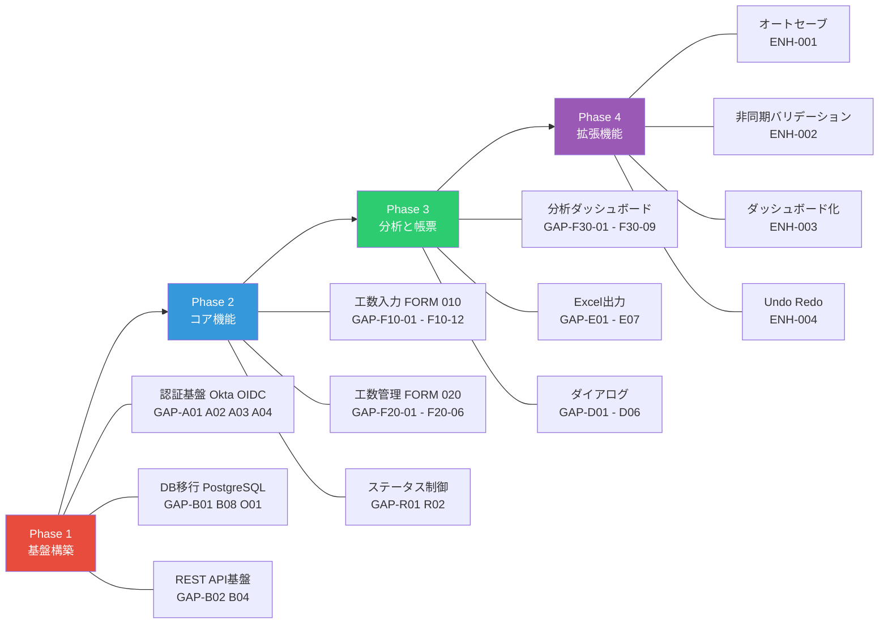

# 新旧機能差異比較表（Gap分析資料） - CZシステム（保有資源管理システム）

> **現行仕様を正とした上で、SPA化によるモダナイズ提案を「踏襲」「改善」「追加」「削除」に分類**
> 分析対象: irpmng_czConsv
> 関連ドキュメント: 01_system_analysis.md / 02_actor_definition.md / 03_user_stories.md / 04_screen_transition.md

---

## 目次

1. [Gap分析の方針と凡例](#1-gap分析の方針と凡例)
2. [機能別 新旧差異比較表](#2-機能別-新旧差異比較表)
   - 2.1 [認証・セッション管理](#21-認証セッション管理)
   - 2.2 [画面構造・ナビゲーション](#22-画面構造ナビゲーション)
   - 2.3 [工数入力（FORM_010）](#23-工数入力form_010)
   - 2.4 [工数状況一覧（FORM_020）](#24-工数状況一覧form_020)
   - 2.5 [分析機能（FORM_030-042）](#25-分析機能form_030-042)
   - 2.6 [ダイアログ・モーダル](#26-ダイアログモーダル)
   - 2.7 [Excel出力・帳票](#27-excel出力帳票)
   - 2.8 [権限・セキュリティ](#28-権限セキュリティ)
   - 2.9 [データ基盤・バックエンド](#29-データ基盤バックエンド)
   - 2.10 [運用・バッチ処理](#210-運用バッチ処理)
3. [SPA化 追加機能提案（Enhancement Proposals）](#3-spa化-追加機能提案enhancement-proposals)
   - 3.1 [オートセーブ機能](#31-オートセーブ機能)
   - 3.2 [非同期バリデーション](#32-非同期バリデーション)
   - 3.3 [ダッシュボード化](#33-ダッシュボード化)
   - 3.4 [Undo/Redo機能](#34-undoredo機能)
   - 3.5 [キーボードショートカット](#35-キーボードショートカット)
   - 3.6 [リアルタイム通知](#36-リアルタイム通知)
   - 3.7 [アクセシビリティ対応](#37-アクセシビリティ対応)
   - 3.8 [オフライン対応](#38-オフライン対応)
4. [踏襲必須のビジネスロジック一覧](#4-踏襲必須のビジネスロジック一覧)
5. [削除対象（レガシー固有仕様）](#5-削除対象レガシー固有仕様)
6. [移行リスク評価](#6-移行リスク評価)
7. [優先度マトリクス](#7-優先度マトリクス)

---

## 1. Gap分析の方針と凡例

### 1.1 分析方針

```
現行仕様（ソースコードから復元） → 正（TRUTH）
  ├── 踏襲（KEEP）    : 現行仕様をそのまま新システムに移行
  ├── 改善（IMPROVE）  : 現行仕様の目的を維持しつつ、技術的に改善
  ├── 追加（ADD）      : SPA化により新たに実現可能になる機能
  └── 削除（REMOVE）   : レガシー固有の不要仕様を除去
```

### 1.2 凡例

| 区分 | 記号 | 意味 |
|------|------|------|
| 踏襲 | KEEP | ビジネスロジック・業務ルールをそのまま移行 |
| 改善 | IMPROVE | 同一目的を技術的に改善して実装 |
| 追加 | ADD | 現行にない新機能を提案 |
| 削除 | REMOVE | レガシー固有で新システムでは不要 |

| 優先度 | 意味 |
|--------|------|
| P0 | 必須（業務継続に不可欠） |
| P1 | 重要（UX大幅向上・工数削減） |
| P2 | 推奨（あれば便利） |
| P3 | 将来検討 |

| リスク | 意味 |
|--------|------|
| HIGH | 業務影響大・要慎重テスト |
| MID | 一部影響あり・標準テスト |
| LOW | 影響軽微・確認テストのみ |

---

## 2. 機能別 新旧差異比較表

### 2.1 認証・セッション管理

| 差異ID | 区分 | 優先度 | 現行仕様 | 新仕様 | 変更理由 | リスク |
|--------|------|--------|---------|--------|---------|--------|
| GAP-A01 | IMPROVE | P0 | SSO認証（SsoCertificateProc → WebLogic連携）。Cookie名: CZENTSESSIONID | ALB + Okta OIDC認証。JWTトークンベース | AWS構成への移行。WebLogic依存排除 | HIGH |
| GAP-A02 | IMPROVE | P0 | セッションベース状態管理（60分タイムアウト, web.xml:141）。Condクラス群でセッション保持 | JWTトークン + SPAステート管理。リフレッシュトークンによる自動更新 | ステートレスAPI対応。ECS Fargateスケーリング対応 | HIGH |
| GAP-A03 | IMPROVE | P0 | web.xmlのJinjiModeパラメータでアプリ分離（/czEnt/ vs /czMgr/） | 環境変数 or URLパス（/ent/ vs /mgr/）でモード切り替え。同一SPAバイナリで動作 | コンテナベース構成。デプロイ簡素化 | MID |
| GAP-A04 | IMPROVE | P0 | dummySecurity.xml（開発用ロールデータ固定値） | 認証モックサーバー + UI上のアクター切替。**本番ビルドから完全排除（CI 2系統パイプラインで保証）** | 開発環境の柔軟性向上。本番混入リスクゼロ | HIGH |
| GAP-A05 | IMPROVE | P1 | 同時ログイン検知（InitControlProc:155-179, PostState.SEPARATE + Profile数>=2で判定） | WebSocket/SSE によるリアルタイム同時編集検知 + 楽観的ロック（更新日時比較） | 検知精度向上。データ競合の根本解決 | MID |
| GAP-A06 | REMOVE | P0 | ap_reload.jsp（セッション維持用の非表示フレーム定期リクエスト） | JWTトークン自動更新（リフレッシュトークン）。非表示フレーム不要 | ステートレスAPI化 | LOW |
| GAP-A07 | IMPROVE | P1 | サービス提供時間制御 6:00-23:30（CZ-102, ApCtrlTBL.isServerWorking()で制御テーブル参照） | 同等のサービス時間制御をAPI層で実装。制御テーブルはPostgreSQLに移行 | 業務要件踏襲 | LOW |
| GAP-A08 | IMPROVE | P1 | 緊急停止（statusStop.jsp, ONLINEFLG制御, CZ-104/105） | API層のヘルスチェック + フロントエンドのメンテナンスモード表示 | 運用方法の改善（ALBヘルスチェック連携） | LOW |

### 2.2 画面構造・ナビゲーション

| 差異ID | 区分 | 優先度 | 現行仕様 | 新仕様 | 変更理由 | リスク |
|--------|------|--------|---------|--------|---------|--------|
| GAP-N01 | IMPROVE | P0 | FRAMESET入れ子構造（40+フレーム）。各画面4-9フレームのネスト | CSS Grid / Flexbox による単一ページ構成 | HTML5標準。FRAMESETは非推奨（HTML5で廃止） | MID |
| GAP-N02 | IMPROVE | P0 | メインメニュー（FORM_000）: FRAMESET[左メニュー + 右コンテンツ] | SPAサイドナビゲーション。常時表示 + レスポンシブ対応 | モダンUI。メニュー遷移がSPA内ルーティングに | LOW |
| GAP-N03 | IMPROVE | P0 | ApMenuControlUnit による画面間遷移制御（P_CURRENT_FORM_KEY → P_NEXT_FORM_KEY） | SPAルーター（React Router / Vue Router）によるクライアントサイドルーティング | サーバー往復なしの即時遷移 | MID |
| GAP-N04 | IMPROVE | P1 | タブ切替（半期推移⇔月別内訳）: サーバーリクエスト + セッション条件復元 | SPAタブコンポーネント。状態はURL params + SPAステートで保持 | 瞬時切り替え。ブックマーク可能 | LOW |
| GAP-N05 | ADD | P2 | なし | パンくずリスト（Breadcrumb）。ドリルダウン階層の可視化と直接遷移 | UX向上。現行の3階層ドリルダウンの操作性改善 | LOW |
| GAP-N06 | ADD | P2 | なし | URLベースの状態管理（例: `/analytics?tab=half&step=1&sys=SYS001`）。ブックマーク・共有対応 | 画面状態の永続化。他者への共有が可能に | LOW |
| GAP-N07 | REMOVE | P0 | ap_dummy.jsp（ファイルDL用の非表示IFRAME） | Blob + URL.createObjectURL によるSPA標準DL手法 | 非表示フレーム不要 | LOW |
| GAP-N08 | IMPROVE | P0 | Windows-31J（Shift_JIS系）エンコーディング。全JSPで `charset=Shift_JIS` | UTF-8統一。全APIレスポンス・画面表示をUTF-8 | 国際標準。文字化けリスク解消。Windows-31J固有文字の移行テスト必要 | MID |

### 2.3 工数入力（FORM_010）

| 差異ID | 区分 | 優先度 | 現行仕様 | 新仕様 | 変更理由 | リスク |
|--------|------|--------|---------|--------|---------|--------|
| GAP-F10-01 | KEEP | P0 | 工数レコードCRUD（新規追加MODE_INS / 編集MODE_UPD / コピーMODE_RECYCLE / 削除MODE_DEL） | REST API `POST/PUT/DELETE /api/work-hours` で同等機能提供 | 業務機能100%踏襲 | LOW |
| GAP-F10-02 | IMPROVE | P0 | TdMask オーバーレイ + XMLHttpRequest によるAjaxインライン編集。セルクリック→オーバーレイ表示→blur時にAjax POST→即時保存 | React/Vue EditableCell コンポーネント + REST API。フレームワーク標準のインライン編集 | TdMask独自実装の廃止。標準コンポーネント化 | MID |
| GAP-F10-03 | IMPROVE | P1 | ユーザー操作（blur）トリガーの1フィールド1Ajax保存。保存失敗時はalert()表示 | **オートセーブ**（デバウンス付き）+ バッチ保存。詳細は 3.1節 | UX大幅向上。保存忘れ防止 | MID |
| GAP-F10-04 | IMPROVE | P1 | サーバーサイドバリデーション（InsertListAjaxSetProc isInputCheck()）+ クライアントサイド（ApCheck.js alert()表示） | **非同期バリデーション**（フィールド離脱時リアルタイム）。詳細は 3.2節 | インライン表示。alert()廃止 | LOW |
| GAP-F10-05 | ADD | P1 | なし | **Undo/Redo 機能**。詳細は 3.4節 | 現行は即時保存で取り消し不可。誤操作対策 | LOW |
| GAP-F10-06 | KEEP | P0 | 翌月転写（MODE_NEXT_MON_COPY, DLG_009: 320x200px ポップアップ） | SPAモーダル内で同等機能。`POST /api/work-hours/copy-to-month` | 業務機能踏襲。ポップアップ→モーダル化 | LOW |
| GAP-F10-07 | KEEP | P0 | 一括確認・一括作成中戻し（CZ-505/518確認ダイアログ） | 同等機能。確認はSPAモーダルダイアログで実装 | 業務機能踏襲 | LOW |
| GAP-F10-08 | KEEP | P0 | プロジェクト別工数参照（DLG_008: 500x500px ポップアップ） | SPAモーダル内で同等機能。`GET /api/work-hours/by-project` | 業務機能踏襲 | LOW |
| GAP-F10-09 | IMPROVE | P1 | ステータス色制御（作成中=#FBFBB6黄 / 確認=#BDEAAD緑 / 確定=#9DBDFE青 / 停止=#5D5D5D灰） | 同一カラースキーム踏襲 + ステータスバッジ表示 + ダークモード対応色 | 視認性向上。カラーコードは踏襲 | LOW |
| GAP-F10-10 | ADD | P2 | なし（CZ-512「未保存データは失われます」確認のみ） | **未保存変更の離脱警告**（beforeunload）+ 変更追跡（dirty state管理） | SPA化に伴いFRAMESETの暗黙的状態保持が失われるため必要 | LOW |
| GAP-F10-11 | IMPROVE | P1 | 検索条件: 担当者ドロップダウン + 年月セレクト + 前月/翌月ボタン | 同等機能 + キーボードショートカット（詳細は 3.5節） | 操作効率向上 | LOW |
| GAP-F10-12 | KEEP | P0 | ソート機能（InsertListSortUnit, 列ヘッダークリック） | 同等のクライアントサイドソート。フレームワーク標準DataGridのソート機能 | 業務機能踏襲 | LOW |

### 2.4 工数状況一覧（FORM_020）

| 差異ID | 区分 | 優先度 | 現行仕様 | 新仕様 | 変更理由 | リスク |
|--------|------|--------|---------|--------|---------|--------|
| GAP-F20-01 | KEEP | P0 | 月次ステータス管理（未確認→確認→集約の3段階。MCZ04CTRLMST制御） | 同等のステータス遷移制御。`PUT /api/work-hours-status` | 業務フロー100%踏襲 | LOW |
| GAP-F20-02 | IMPROVE | P0 | 左右フレーム分割（head_l/r + body_l/r）による固定列 + 水平スクロール同期JS | CSS `position:sticky` + `overflow-x:auto` による固定列付きDataGrid | ブラウザ標準。手動JS同期不要 | LOW |
| GAP-F20-03 | IMPROVE | P1 | ページネーション（最初/前/次/最後/ページ番号。200件/ページ、ApParameter.xml:218） | ページネーション踏襲（件数設定可能）+ 仮想スクロール選択可 | 大量データのUX向上 | LOW |
| GAP-F20-04 | KEEP | P0 | 月次制御フラグ遷移（MODE_KAKUTEI→CZ-803, MODE_SYUKEI→CZ-804, MODE_MIKAKUTEI→CZ-802） | 同等のステータス遷移API。確認ダイアログはSPAモーダル | 業務フロー踏襲 | LOW |
| GAP-F20-05 | IMPROVE | P1 | 工数インライン編集（insert_jokyo_list_body_l.jsp:190-242, HH:MM入力→自動補完） | EditableCellコンポーネント + HH:MM入力マスク + リアルタイムバリデーション | 入力補助の改善 | LOW |
| GAP-F20-06 | KEEP | P0 | 一括選択/解除、承認/戻し操作 | 同等機能。チェックボックス + 一括操作ツールバー | 業務機能踏襲 | LOW |
| GAP-F20-07 | ADD | P2 | なし | フィルタ機能（ステータス別、担当者別のインラインフィルタ） | 大量データの絞り込み効率化 | LOW |
| GAP-F20-08 | ADD | P2 | なし | 列の表示/非表示切替、列幅リサイズ | DataGrid操作性向上 | LOW |

### 2.5 分析機能（FORM_030-042）

| 差異ID | 区分 | 優先度 | 現行仕様 | 新仕様 | 変更理由 | リスク |
|--------|------|--------|---------|--------|---------|--------|
| GAP-F30-01 | IMPROVE | P0 | 6画面構成（030/031/032/040/041/042）+ タブ切替JSP + 各画面9フレーム | **1ページ内SPAタブ + 3階層ドリルダウン**（Breadcrumb状態管理） | 24フレーム→1ページ。シームレスUX | MID |
| GAP-F30-02 | IMPROVE | P0 | 9フレーム同期スクロール（fMoveWScroll/fMoveVScroll手動JS同期） | CSS `position:sticky` + DataGridコンポーネント | ブラウザ標準。60fps保証 | LOW |
| GAP-F30-03 | KEEP | P0 | 3階層ドリルダウン（分類別STEP_0→システム別STEP_1→サブシステム別STEP_2） | 同等の3階層ドリルダウン。Breadcrumb + DataGrid再描画 | 業務機能踏襲 | LOW |
| GAP-F30-04 | KEEP | P0 | MYシステム登録/解除（星マーク。HalfSuiiDoMyProc / MonthUtiwakeDoMyProc） | 同等機能。`POST/DELETE /api/my-systems`。SPAフェイバリットトグル | 業務機能踏襲 | LOW |
| GAP-F30-05 | KEEP | P0 | 4種Excel出力（月別標準/管理用/管理詳細/半期推移） | 同等の4種出力。詳細は 2.7節 | 業務機能踏襲 | LOW |
| GAP-F30-06 | ADD | P1 | なし（テーブル表示のみ。チャート/グラフ未実装） | **グラフ可視化**（棒グラフ/折れ線/円グラフ）。詳細は 3.3節 | データの視覚的把握。ダッシュボード化 | LOW |
| GAP-F30-07 | ADD | P2 | なし | ドリルダウン状態のURL反映（`/analytics?tab=half&step=1&sys=SYS001`） | ブックマーク可能。状態共有 | LOW |
| GAP-F30-08 | ADD | P3 | なし | データの前年同期比較表示 | 分析機能の拡張 | LOW |
| GAP-F30-09 | IMPROVE | P1 | 検索条件: 年度半期セレクト + 月セレクト + 工数/コスト切替 + 組織/MYシステム選択 | 同等検索条件 + 検索条件のURLパラメータ永続化 + 条件プリセット保存 | 操作効率向上 | LOW |

### 2.6 ダイアログ・モーダル

| 差異ID | 区分 | 優先度 | 現行仕様 | 新仕様 | 変更理由 | リスク |
|--------|------|--------|---------|--------|---------|--------|
| GAP-D01 | IMPROVE | P0 | window.open() ポップアップウィンドウ（10種ダイアログ） | SPAモーダルコンポーネント（8種モーダル） | ポップアップブロッカー対策。モダンUI | LOW |
| GAP-D02 | IMPROVE | P1 | 組織選択ダイアログ（DLG_001/002）: 別ウィンドウ。コンボ選択 or カナ検索 | `<OrgSelectModal>`: SPAモーダル。インクリメンタルサーチ追加 | 検索効率向上 | LOW |
| GAP-D03 | IMPROVE | P1 | システムNo選択ダイアログ（DLG_003/004）: 別ウィンドウ。3段コンボ + 検索 | `<SystemSelectModal>`: SPAモーダル。インクリメンタルサーチ追加 | 検索効率向上 | LOW |
| GAP-D04 | IMPROVE | P1 | 担当者選択ダイアログ（DLG_005）: 別ウィンドウ。組織ツリー or 検索タブ | `<PersonSelectModal>`: SPAモーダル。TreeView + インクリメンタルサーチ | 検索効率向上 | LOW |
| GAP-D05 | IMPROVE | P1 | 複数選択（DLG_002/004）: 左右リスト形式。候補→選択済みに追加/削除 | Transfer List コンポーネント。ドラッグ&ドロップ対応 | 操作性向上 | LOW |
| GAP-D06 | IMPROVE | P1 | カレンダー（ApCalendar.js 独自実装） | UIライブラリ標準のDatePickerコンポーネント | 標準化。アクセシビリティ対応 | LOW |

### 2.7 Excel出力・帳票

| 差異ID | 区分 | 優先度 | 現行仕様 | 新仕様 | 変更理由 | リスク |
|--------|------|--------|---------|--------|---------|--------|
| GAP-E01 | IMPROVE | P0 | Apache POI HSSF（.xls形式, Excel 97-2003）。DynamicExcelCreator:1-724でテンプレート操作 | OpenXML（.xlsx形式）。サーバーサイドExcel生成（ExcelJS / Apache POI XSSF等） | .xls形式は2003以前の古い形式。最大行数制限あり | MID |
| GAP-E02 | KEEP | P0 | 4種テンプレート出力（月別標準/管理用/管理詳細/半期推移） | 同等の4種出力。テンプレートは.xlsx形式に移行 | 業務機能踏襲 | LOW |
| GAP-E03 | IMPROVE | P1 | ファイルDL: 非表示IFRAME（ap_dummy.jsp）経由 | `Blob` + `URL.createObjectURL` によるSPA標準DL | モダンDL手法 | LOW |
| GAP-E04 | ADD | P2 | なし（CSVはApUtility.java:1446-1527にユーティリティのみ） | CSV出力オプション追加。BOMつきUTF-8 CSVでExcel直接開き対応 | 軽量出力ニーズ対応 | LOW |
| GAP-E05 | ADD | P3 | なし | PDF出力オプション追加（月別レポート） | 印刷用途。閲覧専用配布 | LOW |
| GAP-E06 | ADD | P2 | なし | 出力前プレビュー表示 | DL前に内容確認可能 | LOW |
| GAP-E07 | IMPROVE | P1 | Excel出力確認ダイアログ（CZ-516「時間がかかる場合があります」） | 非同期生成 + プログレスバー + 完了通知 | 大量データ出力時のUX向上 | LOW |

### 2.8 権限・セキュリティ

| 差異ID | 区分 | 優先度 | 現行仕様 | 新仕様 | 変更理由 | リスク |
|--------|------|--------|---------|--------|---------|--------|
| GAP-R01 | IMPROVE | P0 | 4層権限モデル（JinjiMode / TAB 010-012ビットベース / 相対権限201-211 / 雇用形態TYPE） | RBAC（ロールベースアクセス制御）。4層の論理は踏襲しつつ可読性向上 | 権限管理の簡素化。ビット操作→ロール名ベース | HIGH |
| GAP-R02 | KEEP | P0 | 12状態ステータスマトリクス（sts_base_key: 000-911）+ 担当者/管理者系列のボタン制御 | 同等のステータス制御マトリクス。API層で制御。フロントはAPIレスポンスに従う | 業務ロジック100%踏襲 | HIGH |
| GAP-R03 | KEEP | P0 | セキュリティ変更ダイアログ（DLG_006: 6 Unit構成） | ページ4（設定）内のセキュリティ設定セクション | 業務機能踏襲。UIをページ内に統合 | LOW |
| GAP-R04 | KEEP | P0 | 組織階層別スタッフロール（931-936, 6種） | 同等のロール定義をPostgreSQL + Okta属性にマッピング | 業務ロール踏襲 | MID |
| GAP-R05 | KEEP | P0 | 雇用形態別アクセス制御（正社員TYPE=0, 臨時1=900, 臨時2=901, 外部=902） | 同等の雇用形態制御。Oktaユーザー属性 or DB参照 | 業務ルール踏襲 | MID |
| GAP-R06 | IMPROVE | P1 | ビットベース権限チェック（canUseSbt010_0bit/1bit/2bit, isAvailableFunction） | ポリシーエンジン（CASL / Casbin等）。宣言的権限定義 | コードの可読性・保守性向上 | MID |
| GAP-R07 | ADD | P2 | なし | 権限変更の監査ログ（誰が/いつ/何を変更） | コンプライアンス対応 | LOW |

### 2.9 データ基盤・バックエンド

| 差異ID | 区分 | 優先度 | 現行仕様 | 新仕様 | 変更理由 | リスク |
|--------|------|--------|---------|--------|---------|--------|
| GAP-B01 | IMPROVE | P0 | Oracle Database | PostgreSQL（AWS RDS） | コスト削減。OSS化 | HIGH |
| GAP-B02 | IMPROVE | P0 | Command/Delegate/Manager/DAOパターン（88 Unit → Proc → Delegate → DAO） | RESTful API + サービス層（約20エンドポイント） | モダンアーキテクチャ。API/UI分離 | HIGH |
| GAP-B03 | IMPROVE | P0 | JspBeanでのJS動的生成（サーバーサイドレンダリング） | JSON APIレスポンス → SPAコンポーネントで描画 | 関心の分離。テスタビリティ向上 | MID |
| GAP-B04 | IMPROVE | P0 | 88 Unitクラス → JSP直接レンダリング | 約20 REST APIエンドポイント（04_screen_transition.md 8.2節参照） | APIの集約。77%削減 | MID |
| GAP-B05 | IMPROVE | P1 | ApCtrlTBL: 10秒キャッシュ + ReadWriteLockによるスレッドセーフアクセス | Redis or インメモリキャッシュ（Spring Cache等） | 分散環境対応。ECS複数タスク間のキャッシュ共有 | MID |
| GAP-B06 | IMPROVE | P1 | WebLogic JMS（Factory: JMS.JMSConFactory.ESQ）パラメータ更新通知 | Redis Pub/Sub or AWS SNS/SQS | WebLogic依存排除 | MID |
| GAP-B07 | IMPROVE | P1 | アクセスログ（AccessLogProc: POST送信。日時/ユーザー/アプリID/IP/OS/ブラウザ記録） | 構造化ログ（JSON形式）+ CloudWatch Logs | ログの検索性・分析性向上 | LOW |
| GAP-B08 | IMPROVE | P0 | Oracle PL/SQL バッチSQL（13ファイル） | PostgreSQL互換SQL + ECSタスク or AWS Step Functions | Oracle依存排除 | HIGH |

### 2.10 運用・バッチ処理

| 差異ID | 区分 | 優先度 | 現行仕様 | 新仕様 | 変更理由 | リスク |
|--------|------|--------|---------|--------|---------|--------|
| GAP-O01 | IMPROVE | P0 | 13バッチSQL（Oracle PL/SQL: 制御マスタ作成/確定/集計/リセット/グルーピング等） | PostgreSQL互換SQL + ECSスケジュールタスク or EventBridge | コンテナベースの運用 | HIGH |
| GAP-O02 | IMPROVE | P1 | 手動バッチ実行（/batch/bin/ ディレクトリのスクリプト） | EventBridge スケジュール + CloudWatch監視 + Slack通知 | 自動化・監視の改善 | MID |
| GAP-O03 | ADD | P2 | なし | バッチ実行履歴の管理画面（実行日時/結果/ログ） | 運用の透明性向上 | LOW |
| GAP-O04 | IMPROVE | P1 | Log4j XML設定（/Runtime/cz/log4j.xml） | 構造化ログ（JSON）+ CloudWatch Logs + アラーム設定 | ログの検索・アラート対応 | LOW |
| GAP-O05 | ADD | P2 | なし | ヘルスチェックエンドポイント（`/api/health`）。ALB連携 | コンテナオーケストレーション対応 | LOW |

---

## 3. SPA化 追加機能提案（Enhancement Proposals）

### 3.1 オートセーブ機能

**提案ID**: ENH-001 | **優先度**: P1 | **影響画面**: FORM_010, FORM_020

#### 現行の問題点

```
現行フロー:
  ユーザー → セルクリック → TdMaskオーバーレイ表示 → 値入力 → blur（フォーカス離脱）
  → 1フィールド1 Ajax POST → サーバーバリデーション → 即時保存 or alert()エラー

問題:
  1. blur時にしか保存されない → ブラウザクラッシュ時にデータ消失
  2. 1フィールドごとにAjax通信 → ネットワーク負荷
  3. 保存成功/失敗の視覚フィードバックがalert()のみ
```

#### 提案する新フロー

```
新フロー:
  ユーザー → セルクリック → インライン編集 → 入力変更検知
  → デバウンス（500ms） → バッチ保存（変更フィールドまとめて）
  → サーバーバリデーション → 成功: トースト通知 / 失敗: インラインエラー

特徴:
  1. デバウンス: 入力停止後500msで自動保存（連続入力中は保存しない）
  2. バッチ保存: 複数フィールドの変更を1リクエストにまとめて送信
  3. Dirty State管理: 未保存変更の追跡 + 離脱時警告（beforeunload）
  4. 楽観的更新: UIを即時更新し、サーバー応答でロールバック可能
  5. オフライン耐性: IndexedDBに一時保存 → 復帰後に同期（P3）
```

#### 実装イメージ

```
コンポーネント構成:
  <AutoSaveProvider debounceMs={500}>
    <WorkHoursDataGrid>
      <EditableCell field="kousuu" validation={hhmmRule} />
      <EditableCell field="kenmei" validation={maxLen128} />
    </WorkHoursDataGrid>
    <SaveStatusIndicator />  ← "保存済み" / "保存中..." / "未保存の変更あり"
  </AutoSaveProvider>

API:
  PUT /api/work-hours/batch
  Body: { changes: [{ id, field, value }, ...] }
  Response: { results: [{ id, status, error? }] }
```

#### 踏襲する現行仕様

- blur時保存のタイミングは踏襲（デバウンスの最小トリガー）
- サーバーサイドバリデーションは100%踏襲（isInputCheck() のルールすべて）
- ステータス制御マトリクスによる編集可否判定は踏襲

---

### 3.2 非同期バリデーション

**提案ID**: ENH-002 | **優先度**: P1 | **影響画面**: FORM_010, FORM_020

#### 現行の問題点

```
現行フロー:
  クライアント（ApCheck.js）:
    - バイト長チェック（getByte()）
    - 半角英数チェック（chkHanEiji/chkHanNumber）
    - パーセント範囲チェック（0-100）
    - 日付形式チェック
    → エラー時: alert() ダイアログ（ブロッキング）

  サーバー（InsertListAjaxSetProc isInputCheck()）:
    - 必須項目チェック（作業日、件名、工数等）
    - 日次上限24時間チェック
    - 15分単位チェック
    - 禁止ワードチェック
    - ステータス整合性チェック
    → エラー時: JSONレスポンスのP_MESSAGE → alert() 表示

問題:
  1. alert()はブロッキング → 連続入力が中断される
  2. エラー位置の特定が困難（メッセージだけでどのフィールドか分かりにくい）
  3. クライアントとサーバーでバリデーションが分散 → 二重管理
```

#### 提案する新フロー

```
新フロー（3段階バリデーション）:

  Stage 1: リアルタイム（入力中）
    - 文字数カウント表示（128/128）
    - HH:MM形式マスク
    - 禁止文字の即時ブロック
    → UIインライン表示（フィールド直下に赤文字）

  Stage 2: フィールド離脱時（blur/debounce）
    - 必須チェック
    - 形式チェック（日付、HH:MM、15分単位）
    - 禁止ワードチェック
    → UIインライン表示 + フィールドハイライト

  Stage 3: サーバーバリデーション（保存時）
    - 日次上限24時間（他レコードとの合計）
    - ステータス整合性（MCZ04CTRLMST参照）
    - 同時編集競合チェック
    → UIインライン表示 + トースト通知

表示方法:
  ┌─────────────────────────────────┐
  │ 工数: [25:00          ]  ← 赤枠  │
  │       ⚠ 日次合計が24時間を     │
  │         超えています（CZ-146）   │
  └─────────────────────────────────┘
```

#### 踏襲する現行バリデーションルール

| ルールID | ルール | エラーコード | 踏襲方法 |
|---------|--------|-------------|---------|
| BR-001 | サービス提供時間 6:00-23:30 | CZ-102 | API層で踏襲 |
| BR-002 | 15分単位入力 | CZ-147 | Stage 1 入力マスク + Stage 2 blur時チェック |
| BR-003 | 日次上限24時間 | CZ-146 | Stage 3 サーバーバリデーション |
| BR-006 | HH:MM形式 | CZ-125 | Stage 1 入力マスク |
| BR-007 | 最小値0:15 | CZ-129 | Stage 2 blur時チェック |
| - | 件名128文字以内 | CZ-130 | Stage 1 文字数カウント |
| - | 禁止ワード（12語） | CZ-141 | Stage 2 blur時チェック |
| - | TMR番号5文字 | - | Stage 1 入力マスク |
| - | 作業依頼書No 7文字固定 | CZ-137 | Stage 1 入力マスク |

---

### 3.3 ダッシュボード化

**提案ID**: ENH-003 | **優先度**: P1 | **影響画面**: FORM_030-042

#### 現行の問題点

```
現行: テーブル表示のみ（HalfSuiiJspBean / MonthUtiwakeJspBean）
  - 数値の羅列 → 傾向を直感的に把握できない
  - 3階層ドリルダウンのたびにサーバーリクエスト
  - チャート/グラフ機能なし
```

#### 提案するダッシュボード構成

```
┌──────────────────────────────────────────────────┐
│ 分析ダッシュボード                                  │
├──────────────────────────────────────────────────┤
│                                                    │
│ ┌────────────────┐ ┌────────────────────────────┐│
│ │ サマリーカード   │ │ 半期推移グラフ              ││
│ │                │ │                            ││
│ │ 今月工数: 120h  │ │  ▓▓▓                      ││
│ │ 前月比: +12%   │ │  ▓▓▓ ▓▓                   ││
│ │ 確定率: 85%    │ │  ▓▓▓ ▓▓ ▓▓▓               ││
│ │ 未確認: 3件    │ │  1月  2月  3月  4月  5月  6月││
│ └────────────────┘ │ [棒グラフ] [折れ線] [テーブル]││
│                    └────────────────────────────┘│
│                                                    │
│ ┌────────────────────────────────────────────────┐│
│ │ [半期推移] | [月別内訳]                          ││
│ │ パンくず: 分類別 > システム別 > SS別              ││
│ │ ┌─────────────────────────────────────────────┐││
│ │ │ テーブル表示（現行踏襲のデータグリッド）       │││
│ │ └─────────────────────────────────────────────┘││
│ └────────────────────────────────────────────────┘│
└──────────────────────────────────────────────────┘
```

#### 新規追加コンポーネント

| コンポーネント | 機能 | 使用ライブラリ案 |
|--------------|------|----------------|
| SummaryCards | 今月工数/前月比/確定率/未確認件数 | SPAフレームワーク標準 |
| BarChart | 月別・分類別の棒グラフ | Recharts / Chart.js / ECharts |
| LineChart | 推移の折れ線グラフ | 同上 |
| PieChart | 分類別構成比の円グラフ | 同上 |
| ViewToggle | テーブル/グラフ表示切替 | SPAフレームワーク標準 |

#### 踏襲する現行機能

- テーブル表示は100%踏襲（グラフは追加オプション）
- 3階層ドリルダウン踏襲
- MYシステム星マーク踏襲
- 4種Excel出力踏襲
- 工数/コスト切替踏襲

---

### 3.4 Undo/Redo機能

**提案ID**: ENH-004 | **優先度**: P1 | **影響画面**: FORM_010

#### 現行の問題点

```
現行: Undo/Redo機能なし
  - 即時保存（blur時にAjax POST）→ 取り消し不可
  - 誤操作時は手動で値を修正して再保存が必要
  - 隠しフィールド（H_P_S_01_KENMEI等）に前回値保持あるが、UI非公開
```

#### 提案するUndo/Redo機能

```
実装方式: コマンドパターン + 変更履歴スタック

  変更履歴スタック（メモリ上、最大50件）:
    [0] { field: "kousuu", recordId: 123, before: "2:00", after: "3:00", timestamp }
    [1] { field: "kenmei", recordId: 123, before: "XX作業", after: "YY作業", timestamp }
    ...

  Undo操作:
    Ctrl+Z → スタックからpop → APIにbefore値をPUT → UI更新

  Redo操作:
    Ctrl+Y → Redoスタックからpop → APIにafter値をPUT → UI更新

  制約:
    - STATUS_0（作成中）のレコードのみUndo可能（現行のステータス制御踏襲）
    - セッション内のみ有効（ページ離脱でクリア）
    - 他ユーザーによる変更があった場合はUndo不可（楽観的ロック）
```

---

### 3.5 キーボードショートカット

**提案ID**: ENH-005 | **優先度**: P2 | **影響画面**: 全画面

#### 現行の問題点

```
現行: Tab/Enter キーのみ対応（ApDynam.js:1148-1165）
  - keyCode 9（Tab）: 次フィールドへ移動
  - keyCode 13（Enter）: blur相当のトリガー
  - カスタムショートカットなし
```

#### 提案するショートカット一覧

| ショートカット | 機能 | 対象画面 |
|--------------|------|---------|
| `Ctrl+S` | 手動保存（オートセーブ有効時も即時保存） | FORM_010 |
| `Ctrl+Z` | Undo | FORM_010 |
| `Ctrl+Y` | Redo | FORM_010 |
| `Ctrl+D` | 選択レコードの複製（コピー） | FORM_010 |
| `Ctrl+Enter` | 新規レコード追加 | FORM_010 |
| `Delete` | 選択レコードの削除（確認ダイアログ付き） | FORM_010 |
| `Arrow Up/Down` | レコード間移動 | FORM_010, FORM_020 |
| `Ctrl+Arrow` | ページ先頭/末尾へ移動 | 全DataGrid |
| `Escape` | 編集キャンセル（Undo相当） | FORM_010 |
| `F2` | 選択セルの編集開始 | FORM_010 |
| `/` | 検索バーにフォーカス | 全画面 |

---

### 3.6 リアルタイム通知

**提案ID**: ENH-006 | **優先度**: P2 | **影響画面**: FORM_020

#### 提案内容

```
現行: 画面リロードでのみ最新状態を取得

提案:
  WebSocket / Server-Sent Events (SSE) によるリアルタイム通知:
  1. ステータス変更通知（他ユーザーが確認/確定した場合）
  2. 月次制御フラグ変更通知（管理者が月次確認/集約した場合）
  3. 同時編集警告（同じレコードを編集中の場合）

表示方式:
  トースト通知（画面右上、5秒で自動消去）:
  ┌──────────────────────────────┐
  │ 📋 山田太郎さんが2月分を     │
  │    「確認」に変更しました     │
  │                    [詳細] [×]│
  └──────────────────────────────┘
```

---

### 3.7 アクセシビリティ対応

**提案ID**: ENH-007 | **優先度**: P2 | **影響画面**: 全画面

#### 現行の問題点

```
現行: アクセシビリティ対応なし
  - ARIA属性なし
  - スクリーンリーダー非対応
  - キーボードナビゲーション限定的（Tab/Enterのみ）
  - テーブルベースレイアウト
```

#### 提案するアクセシビリティ対応

| 対応項目 | 実装内容 | WCAG基準 |
|---------|---------|---------|
| WAI-ARIA | 全インタラクティブ要素にaria-label/role属性付与 | WCAG 2.1 Level A |
| キーボードナビゲーション | DataGrid内のArrow/Tab/Enter完全対応 | WCAG 2.1 Level A |
| フォーカス管理 | モーダル内のフォーカストラップ、戻りフォーカス | WCAG 2.1 Level A |
| カラーコントラスト | ステータス色のコントラスト比4.5:1以上確保 | WCAG 2.1 Level AA |
| エラー識別 | 色以外の手段（アイコン、テキスト）でエラー表示 | WCAG 2.1 Level A |
| ダークモード | prefers-color-scheme対応 | - |

---

### 3.8 オフライン対応

**提案ID**: ENH-008 | **優先度**: P3 | **影響画面**: FORM_010

#### 提案内容

```
概要: Service Worker + IndexedDB によるオフライン耐性

フロー:
  1. オンライン時: 通常のAPI通信
  2. ネットワーク断時: IndexedDBに変更をキューイング
  3. ネットワーク復帰時: キューを順次API送信 + 競合検知

注意:
  - P3（将来検討）としているのは、VPC内/閉域網の利用を前提とするため
  - ネットワーク断のリスクは低いが、一時的な接続不良対策として有効
```

---

## 4. 踏襲必須のビジネスロジック一覧

> **以下のビジネスロジックは新システムでも100%踏襲すること。変更する場合は業務部門の承認が必要。**

### 4.1 時間・工数ルール

| ルールID | ルール | 現行根拠 | 踏襲方法 |
|---------|--------|---------|---------|
| BL-001 | サービス提供時間: 6:00-23:30 | CZ-102, ApCtrlTBL.isServerWorking() | API Middleware |
| BL-002 | 工数入力単位: 15分単位（00/15/30/45分） | CZ-147, ApCheck.js | 入力マスク + APIバリデーション |
| BL-003 | 日次上限: 24時間（1440分） | CZ-146, isInputCheck() | APIバリデーション |
| BL-004 | 月次基準: 160時間/人月 | ApParameter costHours_value=160 | 設定値 |
| BL-005 | 日次基準: 8時間/人日 | ApParameter hourPersonDay_value=8 | 設定値 |
| BL-006 | HH:MM形式（HHのみ→HH:00自動補完） | CZ-125, insert_jokyo_list_body_l.jsp | 入力マスク |
| BL-007 | 工数最小値: 0:15 | CZ-129 | APIバリデーション |

### 4.2 ステータス制御

| ルールID | ルール | 現行根拠 | 踏襲方法 |
|---------|--------|---------|---------|
| BL-010 | 12状態マトリクス（sts_base_key: 000-911） | ApParameter.xml | DB設定テーブル |
| BL-011 | 担当者系列ボタン制御（ins/cpy/del/upd/view） | ApParameter.xml | APIレスポンス |
| BL-012 | 管理者系列ボタン制御（+j_upd/j_view） | ApParameter.xml | APIレスポンス |
| BL-013 | STATUS_0のみ編集可能（担当者） | InsertListJspBean | API権限チェック |
| BL-014 | STATUS_2は担当者削除不可 | InsertListMaintenanceProc | API権限チェック |
| BL-015 | 月次制御フラグ遷移（未確認→確認→集約→未確認） | MCZ04CTRLMST | API + DB |

### 4.3 年度・期間ルール

| ルールID | ルール | 現行根拠 | 踏襲方法 |
|---------|--------|---------|---------|
| BL-020 | 2015年度以前: 上期4-9月/下期10-3月 | HalfSuiiUtility | APIビジネスロジック |
| BL-021 | 2015年度（特殊）: 下期10-12月の3ヶ月のみ | HalfSuiiUtility | APIビジネスロジック |
| BL-022 | 2016年度以降: 上期1-6月/下期7-12月 | HalfSuiiUtility | APIビジネスロジック |

### 4.4 入力制約

| ルールID | ルール | 現行根拠 | 踏襲方法 |
|---------|--------|---------|---------|
| BL-030 | 件名: 128文字以内 | InsertListAjaxSetProc | 入力マスク + API |
| BL-031 | TMR番号: 5文字 | InsertListAjaxSetProc | 入力マスク |
| BL-032 | 作業依頼書No: 7文字固定 | CZ-137 | 入力マスク |
| BL-033 | システム管理No: 9文字 | CZ-136 | 入力マスク |
| BL-034 | 禁止ワード: 12語（カ層, @機能別1, 連絡器 等） | CZ-141, ApParameter | APIバリデーション |
| BL-035 | 件名改行コード自動除去 | InsertListAjaxSetProc | API前処理 |
| BL-036 | 翌月転写時カテゴリ不在→空白化 | InsertListMaintenanceProc | APIビジネスロジック |

### 4.5 エラーメッセージ体系

| ルールID | ルール | 踏襲方法 |
|---------|--------|---------|
| BL-040 | CZ-000〜099: 操作成功メッセージ（4種） | APIレスポンス + トースト通知 |
| BL-041 | CZ-100〜299: 警告メッセージ（30+種） | APIエラーレスポンス + インライン表示 |
| BL-042 | CZ-300〜499: システムエラー（20+種） | APIエラー + エラーページ |
| BL-043 | CZ-500〜799: 確認ダイアログ（12種） | SPAモーダル確認 |
| BL-044 | CZ-800〜999: 情報メッセージ（5種） | トースト通知 |

---

## 5. 削除対象（レガシー固有仕様）

> **以下の仕様は新システムでは技術的に不要となるため削除する。**

| 削除ID | 削除対象 | 現行の目的 | 削除理由 | 代替手段 |
|--------|---------|-----------|---------|---------|
| DEL-001 | FRAMESET/FRAME全構成（40+フレーム） | 画面分割レイアウト | HTML5で廃止。CSS Grid/Flexboxで代替 | CSS Grid / Flexbox |
| DEL-002 | ap_reload.jsp | セッション維持（定期リフレッシュ） | JWTトークン自動更新で不要 | リフレッシュトークン |
| DEL-003 | ap_dummy.jsp | ファイルDL用非表示IFRAME | Blob + URL.createObjectURL で不要 | SPA標準DL |
| DEL-004 | TdMask（ApDynam.js内） | インライン編集オーバーレイ | SPAコンポーネントのEditableCellで代替 | EditableCell |
| DEL-005 | Async クラス（ApAccessAjax.js） | XMLHttpRequest ラッパー | fetch API / axios で代替 | fetch / axios |
| DEL-006 | ApCalendar.js | 独自カレンダーUI | UIライブラリ標準DatePickerで代替 | DatePicker |
| DEL-007 | ApCheck.js（91KB） | 独自バリデーション | Zod/Yup + UIライブラリFormで代替 | 宣言的バリデーション |
| DEL-008 | fMoveWScroll / fMoveVScroll（半期推移JS） | フレーム間スクロール同期 | CSS position:stickyで代替 | ブラウザ標準CSS |
| DEL-009 | JspBean → JS動的生成パターン | サーバーサイドJS生成 | JSON API + SPAコンポーネントで代替 | API/UI分離 |
| DEL-010 | 139 JSPファイル全体 | サーバーサイドHTML生成 | SPAコンポーネントで完全置換 | SPA |
| DEL-011 | 88 Unit クラス全体 | URLルーティング + レンダリング | 約20 REST APIに集約 | REST API |
| DEL-012 | Windows-31J / Shift_JISエンコーディング | 日本語文字コード | UTF-8統一 | UTF-8 |
| DEL-013 | WebLogic固有設定（web.xml内） | APサーバー設定 | ECS Fargate構成 | コンテナ設定 |
| DEL-014 | Oracle PL/SQL構文（13バッチSQL） | バッチ処理 | PostgreSQL互換SQLに書き換え | PostgreSQL |

---

## 6. 移行リスク評価

### 6.1 リスクマトリクス

```
                        技術リスク 高
                            │
          ┌─────────────────┼─────────────────┐
          │                 │   Oracle→PgSQL   │
          │                 │   SSO→Okta       │
          │                 │                  │
          │                 │  12状態Matrix     │
          │   Encoding      │  年度期間ルール    │
          ├────────────── ──┼──────────────────┤
          │  FRAMESET→SPA   │                  │
          │  TdMask→Cell    │                  │
          │  Excel形式変更   │                  │
          │  AutoSave       │                  │
          │  Dashboard      │                  │
          └─────────────────┼─────────────────┘
                            │
                        技術リスク 低
          業務影響 低 ──────────────── 業務影響 高
```

| 項目 | 業務影響 | 技術リスク | 象限 |
|------|---------|-----------|------|
| Oracle → PostgreSQL | 高 | 高 | 要最重点管理 |
| SSO → Okta OIDC | 高 | 高 | 要最重点管理 |
| 12状態ステータスマトリクス | 高 | 中 | 要重点テスト |
| 年度期間ルール | 高 | 中 | 要重点テスト |
| エンコーディング W31J→UTF8 | 中 | 中 | 標準管理 |
| FRAMESET → SPA | 中 | 低 | 標準管理 |
| TdMask → EditableCell | 中 | 低 | 標準管理 |
| Excel .xls → .xlsx | 低 | 低 | 軽微 |
| ダッシュボード追加 | 低 | 低 | 軽微 |
| オートセーブ追加 | 低 | 低 | 軽微 |

### 6.2 高リスク項目の詳細

| リスクID | 項目 | リスク内容 | 軽減策 |
|---------|------|-----------|--------|
| RISK-001 | Oracle → PostgreSQL移行 | PL/SQL構文差異（13バッチSQL）。Oracle固有関数の置換 | 段階的移行。互換性テスト網羅。pgloader活用 |
| RISK-002 | SSO → Okta OIDC移行 | 認証フロー全面変更。セッション管理方式の変更 | Okta SDK活用。認証モックでの十分なテスト |
| RISK-003 | 12状態ステータスマトリクス | 複雑な状態遷移の完全再現。担当者/管理者の挙動差異 | 状態遷移テーブルのユニットテスト。全状態パターンのE2Eテスト |
| RISK-004 | Windows-31J → UTF-8 | Windows-31J固有文字（丸数字、特殊罫線等）の移行。既存データの文字化け | 移行前に全データの文字コードスキャン。変換テスト |
| RISK-005 | 4層権限モデル | ビットベース→RBAC変換の正確性。組み合わせ爆発 | 全権限パターンのテストマトリクス作成 |
| RISK-006 | 年度半期ルール（2015年移行期） | 2015年度の特殊ルール（下期3ヶ月）の正確な再現 | 2015年度テストデータでの回帰テスト |

### 6.3 移行テスト戦略

```
テストレベル:
  L1: ユニットテスト
    - 全バリデーションルール（15種以上）
    - 12状態ステータスマトリクス（全パターン）
    - 年度半期計算（2014以前/2015/2016以降）
    - 権限チェック（4層全組み合わせ）

  L2: APIインテグレーションテスト
    - 全REST APIエンドポイント（約20本）
    - CRUD操作 + エラーケース
    - 同時アクセス競合テスト
    - Excel出力（4種テンプレート）

  L3: E2Eテスト
    - 全ユーザーストーリー（38件, 03_user_stories.md参照）
    - 全エラーメッセージ発生パターン（92+件）
    - 画面遷移フロー
    - 権限別操作可否

  L4: データ移行テスト
    - Oracle → PostgreSQL データ完全性検証
    - Windows-31J → UTF-8 文字化けチェック
    - バッチSQL互換性確認（13ファイル）
```

---

## 7. 優先度マトリクス

### 7.1 実装フェーズ提案



### 7.2 差異IDサマリー（全件一覧）

| フェーズ | 区分 | 件数 | 差異ID |
|---------|------|------|--------|
| Phase 1 | IMPROVE | 12 | GAP-A01〜A08, GAP-B01〜B04 |
| Phase 2 | KEEP | 14 | GAP-F10-01/06/07/08/12, GAP-F20-01/04/06, GAP-R02〜R05, BL-010〜015 |
| Phase 2 | IMPROVE | 8 | GAP-F10-02/03/04/09/11, GAP-F20-02/03/05 |
| Phase 3 | KEEP | 3 | GAP-F30-03/04/05 |
| Phase 3 | IMPROVE | 6 | GAP-F30-01/02/09, GAP-E01/03/07 |
| Phase 3 | ADD | 4 | GAP-F30-06/07, GAP-E04/06 |
| Phase 4 | ADD | 8 | ENH-001〜008 |
| 全フェーズ | REMOVE | 14 | DEL-001〜014 |

### 7.3 集計

| 区分 | 件数 | 割合 |
|------|------|------|
| **KEEP（踏襲）** | 17 | 26% |
| **IMPROVE（改善）** | 26 | 40% |
| **ADD（追加）** | 12 | 18% |
| **REMOVE（削除）** | 14 | 22% |
| **不要仕様の識別含む合計** | **69** | - |

> **分析結論**: 現行ビジネスロジックの**100%踏襲**を保証しつつ、技術基盤の**40%を改善**、**18%の新機能を追加**、**22%のレガシー固有仕様を削除**する移行計画。
