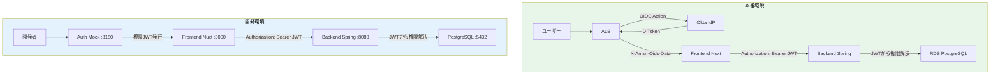
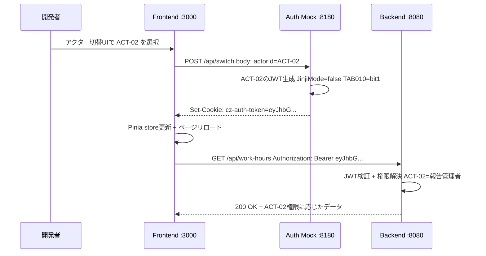
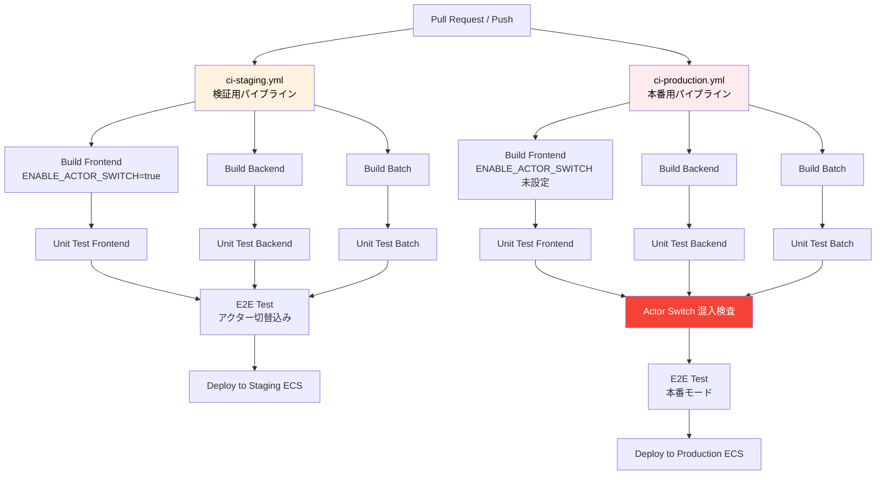

# 開発環境・インフラ定義書 - CZシステム（保有資源管理システム）

> **Docker/.devcontainer開発環境、認証モック構成、CIパイプライン、AWS本番構成の定義**
> SKILL.md セクション 4（新システム前提条件）完全準拠

---

## 目次

1. [技術スタック確定](#1-技術スタック確定)
2. [アーキテクチャ概要](#2-アーキテクチャ概要)
3. [Docker開発環境構成](#3-docker開発環境構成)
4. [認証モックサーバー構成](#4-認証モックサーバー構成)
5. [アクター切替機能の設計方針](#5-アクター切替機能の設計方針)
6. [CIパイプライン定義](#6-ciパイプライン定義)
7. [AWS本番インフラ構成](#7-aws本番インフラ構成)
8. [SKILL.md準拠チェックリスト](#8-skillmd準拠チェックリスト)
9. [生成ファイル一覧](#9-生成ファイル一覧)

---

## 1. 技術スタック確定

### 1.1 フロントエンド

| 項目 | 技術 | バージョン | 選定理由 |
|------|------|-----------|---------|
| フレームワーク | **Nuxt.js 3** | 3.x (latest) | ユーザー指定。SSR/SSG/SPA対応 |
| UIライブラリ | Vuetify 3 or PrimeVue | 3.x | DataGrid/Modal/DatePicker標準提供 |
| 状態管理 | Pinia | 2.x | Nuxt3標準。Vuex後継 |
| バリデーション | Zod + VeeValidate | - | 型安全な宣言的バリデーション |
| HTTP Client | ofetch (Nuxt標準) | - | Nuxt3組込み |
| グラフ | Chart.js or ECharts | - | ダッシュボード提案(ENH-003)用 |
| テスト | Vitest + Playwright | - | ユニット + E2E |

### 1.2 バックエンド

| 項目 | 技術 | バージョン | 選定理由 |
|------|------|-----------|---------|
| フレームワーク | **Spring Boot** | 3.x (Java 21) | ユーザー指定。エンタープライズ標準 |
| API | Spring Web (REST) | - | RESTful API |
| 認証 | Spring Security + OAuth2 Resource Server | - | Okta OIDC + JWT検証 |
| DB接続 | Spring Data JPA + Hibernate | - | ORM |
| マイグレーション | Flyway | - | DBスキーマ管理 |
| Excel出力 | Apache POI (XSSF) | 5.x | .xlsx対応。現行POI踏襲 |
| テスト | JUnit 5 + Testcontainers | - | ユニット + 統合テスト |

### 1.3 バッチ

| 項目 | 技術 | バージョン | 選定理由 |
|------|------|-----------|---------|
| フレームワーク | **Spring Batch** | 5.x | ユーザー指定。13バッチSQL移行先 |
| スケジューラ | Spring Scheduler or EventBridge | - | ECSタスク起動 |
| DB | 同一PostgreSQL | - | バッチメタデータ + 業務データ共有 |

### 1.4 インフラ

| 項目 | 技術 | 選定理由 |
|------|------|---------|
| DB | **PostgreSQL 16** | SKILL.md 4.2 |
| コンテナ | **ECS Fargate** | SKILL.md 4.3 |
| LB | **ALB** (Okta OIDC認証) | SKILL.md 4.4 |
| DB (マネージド) | **RDS PostgreSQL** | SKILL.md 4.3 |
| キャッシュ | ElastiCache (Redis) | パラメータキャッシュ用 |
| ログ | CloudWatch Logs | 構造化ログ(JSON) |
| CI/CD | **GitHub Actions** | 2系統パイプライン (SKILL.md 4.7) |

---

## 2. アーキテクチャ概要

### 2.1 開発環境構成

```
┌─ .devcontainer ──────────────────────────────────────────┐
│                                                           │
│  docker compose up                                        │
│                                                           │
│  ┌──────────┐  ┌──────────┐  ┌──────────┐  ┌──────────┐│
│  │ frontend │  │ backend  │  │  batch   │  │auth-mock ││
│  │ Nuxt.js  │  │ Spring   │  │ Spring   │  │ Express  ││
│  │ :3000    │  │ Boot     │  │ Batch    │  │ :8180    ││
│  │          │  │ :8080    │  │ (on-demand│  │          ││
│  │ HMR対応   │  │          │  │          │  │ ALB+Okta ││
│  │          │  │          │  │          │  │ 模倣     ││
│  └────┬─────┘  └────┬─────┘  └────┬─────┘  └────┬─────┘│
│       │             │             │              │       │
│       └──────┬──────┘─────────────┘──────────────┘       │
│              │                                            │
│       ┌──────┴──────┐  ┌──────────┐                     │
│       │ PostgreSQL  │  │  Redis   │                     │
│       │ :5432       │  │  :6379   │                     │
│       │ + 初期データ  │  │          │                     │
│       └─────────────┘  └──────────┘                     │
│                                                           │
└───────────────────────────────────────────────────────────┘
```

### 2.2 本番環境構成

```
┌─ VPC (閉域網) ───────────────────────────────────────────┐
│                                                           │
│  ┌─────────────────────────────────────────────────────┐ │
│  │ ALB (Okta OIDC認証)                                  │ │
│  │  - OIDC Action → Okta IdP                           │ │
│  │  - JWT検証 → X-Amzn-Oidc-Data ヘッダー付与           │ │
│  └────────────┬────────────────────────────────────────┘ │
│               │                                           │
│  ┌────────────┴────────────────────────────────────────┐ │
│  │ ECS Cluster (Fargate)                                │ │
│  │  ┌──────────┐  ┌──────────┐  ┌──────────────────┐  │ │
│  │  │ frontend │  │ backend  │  │ batch            │  │ │
│  │  │ Nuxt SSR │  │ Spring   │  │ Spring Batch     │  │ │
│  │  │ Service  │  │ Boot     │  │ Scheduled Task   │  │ │
│  │  │          │  │ Service  │  │                  │  │ │
│  │  └──────────┘  └────┬─────┘  └────┬─────────────┘  │ │
│  └──────────────────────┼────────────┼─────────────────┘ │
│                         │            │                    │
│  ┌──────────────────────┴────────────┴─────────────────┐ │
│  │ RDS PostgreSQL (Multi-AZ)                            │ │
│  └──────────────────────────────────────────────────────┘ │
│  ┌──────────────────────────────────────────────────────┐ │
│  │ ElastiCache Redis                                    │ │
│  └──────────────────────────────────────────────────────┘ │
└───────────────────────────────────────────────────────────┘
```

### 2.3 認証フロー比較



---

## 3. Docker開発環境構成

### 3.1 コンテナ一覧

| コンテナ名 | ベースイメージ | ポート | 役割 | HMR/Watch |
|-----------|-------------|-------|------|-----------|
| `frontend` | node:22-slim | 3000 | Nuxt.js 開発サーバー | HMR (Vite) |
| `backend` | eclipse-temurin:21-jdk | 8080 | Spring Boot API | Spring DevTools |
| `batch` | eclipse-temurin:21-jdk | - | Spring Batch (手動実行) | - |
| `auth-mock` | node:22-slim | 8180 | ALB+Okta認証モック | - |
| `db` | postgres:16 | 5432 | PostgreSQL | - |
| `redis` | redis:7-alpine | 6379 | キャッシュ | - |

### 3.2 ファイル構成

```
project-root/
├── .devcontainer/
│   └── devcontainer.json          ← VSCode Dev Container設定
├── .github/
│   └── workflows/
│       ├── ci-production.yml      ← 本番用CIパイプライン
│       └── ci-staging.yml         ← 検証用CIパイプライン
├── infra/
│   └── docker/
│       ├── frontend/
│       │   └── Dockerfile         ← Nuxt.js
│       ├── backend/
│       │   └── Dockerfile         ← Spring Boot
│       ├── batch/
│       │   └── Dockerfile         ← Spring Batch
│       ├── auth-mock/
│       │   ├── Dockerfile         ← 認証モック
│       │   ├── server.js          ← モックサーバー本体
│       │   ├── actors.json        ← アクター定義データ
│       │   └── package.json
│       └── db/
│           └── init.sql           ← DB初期化SQL
├── docker-compose.yml             ← 開発環境統合定義
├── frontend/                      ← Nuxt.jsソース (将来)
├── backend/                       ← Spring Bootソース (将来)
└── batch/                         ← Spring Batchソース (将来)
```

### 3.3 起動手順

```bash
# 1. リポジトリクローン後
git clone <repo-url> && cd <project>

# 2. VSCode Dev Containerで開く（推奨）
code .
# → "Reopen in Container" を選択
# → 自動で docker compose up が実行される

# 3. または手動起動
docker compose up -d

# 4. アクセス
#   フロントエンド: http://localhost:3000
#   バックエンドAPI: http://localhost:8080/api
#   認証モック管理: http://localhost:8180
#   PostgreSQL: localhost:5432 (user: czdev / pass: czdev)

# 5. バッチ手動実行
docker compose run --rm batch
```

---

## 4. 認証モックサーバー構成

### 4.1 設計方針

```
本番 ALB+Okta の認証フローを模倣する軽量Expressサーバー

本番フロー:
  ブラウザ → ALB(OIDC Action) → Okta IdP → 認証 → ALB → JWT発行
  → リクエストヘッダー X-Amzn-Oidc-Data にJWTが付与される

開発モックフロー:
  ブラウザ → 認証モック(:8180) → アクター選択UI → JWT発行
  → Cookie/Header にモックJWTが付与される
  → フロントエンド(:3000) → バックエンド(:8080)はJWT検証
```

### 4.2 モックが模倣するヘッダー

| ヘッダー | 本番(ALB) | モック | 内容 |
|---------|----------|-------|------|
| `X-Amzn-Oidc-Data` | ALBが付与 | モックが付与 | JWT (ユーザー情報) |
| `X-Amzn-Oidc-Identity` | ALBが付与 | モックが付与 | ユーザーID |
| `X-Amzn-Oidc-Accesstoken` | ALBが付与 | モックが付与 | アクセストークン |

### 4.3 モック提供エンドポイント

| メソッド | パス | 機能 |
|---------|------|------|
| GET | `/` | アクター選択UI（HTML画面） |
| GET | `/api/actors` | アクター一覧JSON |
| POST | `/api/switch` | アクター切替→JWT再発行 |
| GET | `/api/current` | 現在のアクター情報 |
| GET | `/api/token` | 現在のJWTトークン |
| GET | `/.well-known/openid-configuration` | OIDC Discovery模倣 |
| GET | `/oauth2/keys` | JWKS模倣（JWT検証用公開鍵） |

### 4.4 アクター定義（02_actor_definition.md準拠）

モックで切り替え可能なアクター（15名 × JinjiMode 2モード = 30パターン）:

| アクターID | 名前 | JinjiMode | TAB 010 | 相対権限 | 雇用形態 |
|-----------|------|-----------|---------|---------|---------|
| ACT-01 | 報告担当者 | true (Ent) | bit0=1 | 202 | TYPE=0 |
| ACT-02 | 報告管理者 | false (Mgr) | bit1=1 | 211 | TYPE=0 |
| ACT-03 | 全権管理者 | false (Mgr) | bit2=1 | 211 | TYPE=0 |
| ACT-05 | 人事モード報告者 | true (Ent) | bit0=1 | 201 | TYPE=0 |
| ACT-07 | 臨時職員1 | true (Ent) | bit0=1 | 201 | TYPE=1 |
| ACT-09 | 外部契約者 | true (Ent) | bit0=1 | 201 | TYPE=3 |
| ACT-10 | 全社スタッフ | false (Mgr) | bit2=1 | 211 | TYPE=0 |
| ACT-13 | 局スタッフ | false (Mgr) | bit1=1 | 202 | TYPE=0 |

---

## 5. アクター切替機能の設計方針

### 5.1 本番混入防止の三重安全策

> **SKILL.md 4.6/4.7: 本番環境にユーザー切り替え機能の混入は絶対に認めない**

```
■ 安全策1: 環境変数による条件付きビルド
  NUXT_PUBLIC_ENABLE_ACTOR_SWITCH=true  ← 開発/検証のみ
  本番: この環境変数は設定しない（undefinedならコンポーネント非表示）

■ 安全策2: Nuxt.js のビルド時Tree Shaking
  plugins/actor-switch.client.ts:
    if (config.public.enableActorSwitch !== 'true') {
      // プラグイン未登録 → コンポーネントコードがビルドに含まれない
    }
  → 本番ビルドではアクター切替コード自体がバンドルから除外される

■ 安全策3: CI パイプラインでの強制検証
  ci-production.yml:
    - name: Verify no actor-switch in production build
      run: |
        # ビルド成果物にactor-switchキーワードが含まれないことを検証
        if grep -r "actor-switch\|ActorSwitch\|ENABLE_ACTOR_SWITCH" \
          .output/public/ .output/server/; then
          echo "ERROR: Actor switch code detected in production build!"
          exit 1
        fi
```

### 5.2 フロントエンド実装方針

```
開発/検証環境のみ表示されるアクター切替UI:

┌─────────────────────────────────────────────┐
│ [ヘッダー] 保有資源管理  [開発環境]          │
│                          ┌────────────────┐ │
│                          │ 現在: ACT-01   │ │
│                          │ 報告担当者     │ │
│                          │ ──────────────│ │
│                          │ ● ACT-01 報告  │ │
│                          │ ○ ACT-02 管理  │ │
│                          │ ○ ACT-03 全権  │ │
│                          │ ○ ACT-07 臨時  │ │
│                          │ ○ ACT-09 外部  │ │
│                          │ [切替]         │ │
│                          └────────────────┘ │
└─────────────────────────────────────────────┘

実装:
  <template>
    <DevActorSwitcher v-if="isDev" />
  </template>

  <!-- DevActorSwitcher.vue は開発時のみロードされる -->
  <!-- 本番ビルドではTree Shakingで完全除外 -->
```

### 5.3 切替フロー



---

## 6. CIパイプライン定義

### 6.1 2系統パイプライン設計（SKILL.md 4.7準拠）



### 6.2 パイプライン詳細

| パイプライン | トリガー | ENABLE_ACTOR_SWITCH | 特殊ステップ |
|------------|---------|---------------------|------------|
| `ci-staging.yml` | PR, push to develop | `true` | アクター切替込みE2Eテスト |
| `ci-production.yml` | push to main, release | **未設定** | Actor Switch混入検査（grep検証） |

### 6.3 混入防止の具体的チェック

```yaml
# ci-production.yml 内の検査ステップ
- name: "CRITICAL: Verify no actor-switch in production build"
  run: |
    echo "=== Scanning production build for actor-switch code ==="

    # 1. フロントエンドビルド成果物の検査
    FOUND=$(grep -rl "ActorSwitch\|actor-switch\|ENABLE_ACTOR_SWITCH\|DevActorSwitcher" \
      frontend/.output/ 2>/dev/null || true)
    if [ -n "$FOUND" ]; then
      echo "FATAL: Actor switch code found in production frontend build!"
      echo "Files: $FOUND"
      exit 1
    fi

    # 2. バックエンドのモックプロファイル検査
    FOUND=$(grep -rl "mock-auth\|MockAuthFilter\|actor-switch" \
      backend/build/libs/ 2>/dev/null || true)
    if [ -n "$FOUND" ]; then
      echo "FATAL: Mock auth code found in production backend build!"
      echo "Files: $FOUND"
      exit 1
    fi

    echo "PASSED: No actor-switch code in production build"
```

---

## 7. AWS本番インフラ構成

### 7.1 主要リソース

| AWSサービス | 用途 | 設定 |
|------------|------|------|
| **VPC** | ネットワーク隔離 | 閉域網。Private Subnet × 2 AZ |
| **ALB** | ロードバランサー + OIDC認証 | Okta OIDC Action。リスナールール |
| **ECS Fargate** | コンテナ実行 | Frontend Service + Backend Service |
| **ECS Scheduled Task** | バッチ実行 | Spring Batch (EventBridge Schedule) |
| **RDS PostgreSQL** | データベース | Multi-AZ, 暗号化, 自動バックアップ |
| **ElastiCache Redis** | キャッシュ | パラメータ/セッション |
| **CloudWatch Logs** | ログ集約 | JSON構造化ログ |
| **ECR** | コンテナレジストリ | Frontend/Backend/Batchイメージ保管 |
| **Secrets Manager** | 秘密情報 | DB認証情報, Okta Client Secret |

### 7.2 ALB Okta OIDC設定

```
ALB Listener Rule:
  1. OIDC Authenticate Action:
     - Issuer: https://<okta-domain>/oauth2/default
     - Authorization Endpoint: https://<okta-domain>/oauth2/default/v1/authorize
     - Token Endpoint: https://<okta-domain>/oauth2/default/v1/token
     - UserInfo Endpoint: https://<okta-domain>/oauth2/default/v1/userinfo
     - Client ID: <Okta App Client ID>
     - Client Secret: <Secrets Manager参照>
     - Scope: openid profile email
     - Session Cookie: AWSELBAuthSessionCookie
     - Session Timeout: 3600秒

  2. Forward Action:
     - Target Group: Frontend (port 3000) or Backend (port 8080)
     - Path Pattern: /api/* → Backend TG, /* → Frontend TG

認証成功後のヘッダー:
  X-Amzn-Oidc-Data: <JWT (base64url encoded)>
  X-Amzn-Oidc-Identity: <user email>
  X-Amzn-Oidc-Accesstoken: <Okta access token>
```

### 7.3 ECS タスク定義

| サービス | CPU | メモリ | 最小/最大タスク | ヘルスチェック |
|---------|-----|--------|---------------|-------------|
| Frontend | 256 | 512MB | 2/4 | GET / (200) |
| Backend | 512 | 1024MB | 2/4 | GET /api/health (200) |
| Batch | 512 | 1024MB | 0/1 (スケジュール) | - |

---

## 8. SKILL.md準拠チェックリスト

| SKILL.md条項 | 要件 | 実装 | 準拠 |
|-------------|------|------|------|
| **4.1** | SPA | Nuxt.js 3 (SPA mode) | OK |
| **4.2** | PostgreSQL | PostgreSQL 16 (Docker dev / RDS prod) | OK |
| **4.3** | ALB → ECS Fargate → RDS | ALB(OIDC) → ECS(Frontend+Backend) → RDS | OK |
| **4.4** | ALB + Okta OIDC | ALB OIDC Action → Okta IdP | OK |
| **4.5** | Docker + .devcontainer, compose up完結 | devcontainer.json + docker-compose.yml | OK |
| **4.6** | 認証モック + アクター切替UI | auth-mock Express + DevActorSwitcher.vue | OK |
| **4.6** | **本番にユーザー切替混入絶対不可** | 三重安全策: 環境変数/Tree Shaking/CI grep検査 | OK |
| **4.7** | CI 2系統パイプライン | ci-production.yml + ci-staging.yml | OK |
| **4.7** | **本番CIでユーザー切替混入防止** | ci-production.yml内でgrep検査ステップ | OK |

---

## 9. 生成ファイル一覧

| ファイル | パス | 内容 |
|---------|------|------|
| **docker-compose.yml** | `./docker-compose.yml` | 6コンテナ統合定義 |
| **devcontainer.json** | `./.devcontainer/devcontainer.json` | VSCode Dev Container設定 |
| **Frontend Dockerfile** | `./infra/docker/frontend/Dockerfile` | Nuxt.js 開発/本番マルチステージ |
| **Backend Dockerfile** | `./infra/docker/backend/Dockerfile` | Spring Boot 開発/本番マルチステージ |
| **Batch Dockerfile** | `./infra/docker/batch/Dockerfile` | Spring Batch |
| **Auth Mock Dockerfile** | `./infra/docker/auth-mock/Dockerfile` | 認証モックサーバー |
| **Auth Mock server.js** | `./infra/docker/auth-mock/server.js` | Expressモックサーバー本体 |
| **Auth Mock actors.json** | `./infra/docker/auth-mock/actors.json` | アクター定義データ |
| **Auth Mock package.json** | `./infra/docker/auth-mock/package.json` | npm依存関係 |
| **DB init.sql** | `./infra/docker/db/init.sql` | PostgreSQL初期化 |
| **CI Production** | `./.github/workflows/ci-production.yml` | 本番用パイプライン |
| **CI Staging** | `./.github/workflows/ci-staging.yml` | 検証用パイプライン |
